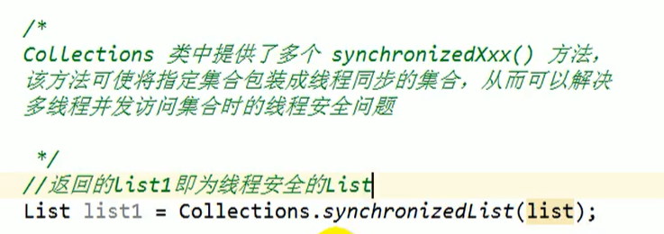

# List接口

存储有序的、可重复的数据，可当成动态数组，有三个实现类：

- ArrayList(JDK1.2)：作为List接口的主要实现类，线程不安全，效率高，底层使用Object[]存储
- LinkedList(JDK1.2)：底层使用双向链表存储，对于频繁的插入，删除操作，使用此类效率比ArrayList高
- Vector(JDK1.0)：作为List接口(JDK1.2)的古老实现类，线程安全，效率低，底层使用Object[]存储

面试题 三个类的异同：

- 三个类都实现了List接口，存储有序的，可重复的数据。
- 不同点见上。

# ArrayList源码分析

## jdk7

### 构造器

`ArrayList()`

底层创建了长度为10的Object数组elementData

### add

如果容量足够，就数组直接赋值，如果不够，需要扩容，默认情况下扩容为原来的1.5倍，同时需要将原有数组中的数据复制到新的数组中

所以开发中尽量使用`ArrayList(int capacity)`构造器

## jdk8

elementData初始化为{}，并没有创建长度

第一次调用add时，底层才创建了长度10的数组，后续添加和扩容与jdk7无异

## 小结

jdk7中的ArrayList的对象的创建类似于单例模式的饿汉式，而jdk8中的对象创建类似于单例模式的懒汉式，延迟了数组的创建，节省内存。

## 注意

重载了两个remove方法

`remove(int index)`

参数说明：index：要先移除的元素的索引。

`remove(Object o)`

参数说明：o：要先移除的元素。

# LinkedList源码分析

## 构造器

`LinkedList()`

内部声明了Node类型的first和last属性，默认为null

## add

将值封装进Node中，创建Node对象

其中Node定义为，双向链表


# Set接口

存储无序的，不可重复的数据

- HashSet：作为Set接口的主要实现类，线程不安全的，可以存储NULL
- LinkedHashSet：作为HashSet的子类，遍历其内部数据时，可以按照添加顺序遍历
- TreeSet：可以按照添加对象的指定属性进行排序

## 无序性和不可重复性

- 无序性：不等于随机性，存储的数据在底层数组中并非按照数组索引的顺序添加，而是根据数据的Hash值决定的。
- 不可重复性：保证添加的元素按照equals()判断时，不能返回true，即相同的元素只能添加一个。

## 添加元素的过程

以HashSet为例：**数组+链表**

我们向HashSet中添加元素a，首先调用元素a所在类的hashCode方法，计算元素a的哈希值，此哈希值接着通过某种算法计算出在HashSet底层数组中的存放位置，判断数组此位置上是否已经有元素：

​	|-----如果此位置没有其他元素，则a直接添加成功-------->情况1

​	|-----如果有其他元素b（或已经存在以链表形式存在的多个元素），则比较a和b的hash值

​			（注意存放位置相同不一定hash值相同）：

​		|-----如果hash值不相同，则元素a添加成功-------->情况2

​		|-----如果hash值不相同，进而需要调用元素a的equals方法：

​			|-----如果false，则添加成功-------->情况3

​			|-----如果true，则添加失败

对于情况2和3，元素a与已经存在指定索引位置上的数据以链表的方式存储。在jdk7中，元素a放到数组中，指向原来的元素，在jdk8中，原来的元素在数组中，指向元素a，总结为七上八下。

## 关于hashCode和equals


### 要求

- 向Set中添加的数据，其所在的类，一定要重写hashCode和euqals方法。
- 重写的hashCode和equals方法，尽量保证一致性。即相等的对象一定要有相同的散列码。

## LinkedHashSet

作为HashSet的子类，在添加数据的同时，每个数据还维护了两个引用，记录此数据前一个数据和后一个数据，对于比较频繁的遍历操作，使用LinkedHashSet效率更高。但是消耗空间。


# TreeSet


- 向TreeSet中添加的数据，要求是相同类的对象。

- 两种排序方式：自然排序（Comparable）和定制排序（Comparator）

## 自然排序

自然排序中，比较两个对象是否相同的标准为：compareTo方法返回0

TreeSet比较特殊，判断相同不在使用euqals方法，而是使用（重写的）compareTo方法。

## 定制排序

在定制排序中，比较两个对象是否相同的标准为：compare方法返回0

Comparator放入TreeSet构造器。

# Set练习

## 1


## 2

Person.java

```java
package com.xzc;

public class Person {
    public int id;
    public String name;
    public Person(int id,String name) {
        this.name = name;
        this.id = id;
    }
    @Override
    public String toString() {
        return "Person{" +
                "id=" + id +
                ", name='" + name + '\'' +
                '}';
    }
    @Override
    public boolean equals(Object o) {
        if (this == o) return true;
        if (o == null || getClass() != o.getClass()) return false;

        Person person = (Person) o;

        if (id != person.id) return false;
        return name != null ? name.equals(person.name) : person.name == null;
    }
    @Override
    public int hashCode() {
        int result = id;
        result = 31 * result + (name != null ? name.hashCode() : 0);
        return result;
    }
}

```

Test.java

```java
package com.xzc;

import java.util.HashSet;
import java.util.Set;

public class Test {
    public static void main(String[] args) {
        Person p1 = new Person(1001,"AA");
        Person p2 = new Person(1002,"BB");
        Set<Person> s = new HashSet<Person>();
        s.add(p1);
        s.add(p2);
        System.out.println(s);
        p1.name = "CC";
        s.remove(p1);
        System.out.println(s);
        s.add(new Person(1001,"CC"));
        System.out.println(s);
        s.add(new Person(1001,"AA"));
        System.out.println(s);
    }
}

```

### 结果


### 分析

1.首先放入了p1和p2

2.然后把p1的name改为CC，但是存储位置没变。

3.然后删除p1，此时根据p1的id为1001和name为CC算出hash值，肯定与最初根据1001和AA算出的hash值不同，根据新的name算出的hash值在数组中找，是空的，所以判定p1不存在，不作删除操作，所以还是打印两个元素。

4.然后添加1001和CC的一个人，类比第三步，根据这两个属性算出来的hash值，在数组中是空的，添加进去，所以打印出三个元素，其中有两个Person都是1001和CC。

5.最后添加属性为1001和AA的人，算出hash值后，发现这个位置有冲突，然后再比较equals，发现一个name是CC，一个name是AA，然后继续添加进去，链表链上。

### 结论

尽量不要修改已经在Set中的对象的属性。

# Map接口

和Collection接口并列


- HashMap（JDK1.2）：是Map的主要实现类，线程不安全，效率高，可以存储null的key和value。底层是数组+链表（jdk7及之前）或数组+链表+红黑树（jdk8及之后）。
- Hashtable（JDK1.0）：是Map（JDK1.2）的古老实现类，线程安全，效率低，不可以存储null的key和value
- TreeMap（JDK1.2）：保证按照添加的key-value进行排序，实现排序遍历，按照key来自然排序或定制排序。底层属于红黑树。
- LinkedHashMap（JDK1.4）：HashMap的子类。保证遍历Map元素时，可以按照添加元素顺序实现遍历，原因是在原有基础上添加了一对引用表明添加的先后顺序，前一个和后一个元素。对于频繁的遍历操作，效率更高。

- Properties常用来处理配置文件，是Hashtable的子类，key和value都是String类型。

## Map结构的理解

### key

无序的，不可重复的，使用Set存储所有的key。

HashMap下，key所在的类要重写euqals和hashCode方法。

### value

无序的，可重复的，使用Collection存储所有的value。

value所在的类要重写equals方法。因为hashCode主要是存的时候效率高。

### Entry

一个key-value构成一个Entry对象。

无序的，不可重复的，使用Set存储所有的Entry。

## 面试题

### HashMap的底层实现原理（见下）

### HashMap和Hashtable的异同（见上）

### ConcurrentHashMap与Hashtable的区别

1. 底层数据结构： JDK1.7的 ConcurrentHashMap 底层采用 分段的数组+链表 实现，JDK1.8 采用的数据结构跟HashMap1.8的结构一样，数组+链表/红黑二叉树。Hashtable 和 JDK1.8 之前的 HashMap 的底层数据结构类似都是采用 数组+链表 的形式，数组是 HashMap 的主体，链表则是主要为了解决哈希冲突而存在的；
2. 实现线程安全的方式（重要）： ① 在JDK1.7的时候，ConcurrentHashMap（分段锁） 对整个桶数组进行了分割分段(Segment)，每一把锁只锁容器其中一部分数据，多线程访问容器里不同数据段的数据，就不会存在锁竞争，提高并发访问率。（默认分配16个Segment，比Hashtable效率提高16倍。） 到了 JDK1.8 的时候已经摒弃了Segment的概念，而是直接用 Node 数组+链表+红黑树的数据结构来实现，并发控制使用 synchronized 和 CAS 来操作。（JDK1.6以后 对 synchronized锁做了很多优化） 整个看起来就像是优化过且线程安全的 HashMap，虽然在JDK1.8中还能看到 Segment 的数据结构，但是已经简化了属性，只是为了兼容旧版本；② Hashtable(同一把锁) :使用 synchronized 来保证线程安全，效率非常低下。当一个线程访问同步方法时，其他线程也访问同步方法，可能会进入阻塞或轮询状态，如使用 put 添加元素，另一个线程不能使用 put 添加元素，也不能使用 get，竞争会越来越激烈效率越低。

# HashMap在JDK7下的底层实现原理

`HashMap map = new HashMap()`

在实例化以后，底层创建了长度是16的一维数组Entry[] table。

...可能已经执行过多次put操作...

`map.put(key1,value1)`

首先，调用key1所在类的hashCode方法计算key1的哈希值，此哈希值经过某种算法计算以后，得到在Entry数组中的存放位置。

|-----如果此位置上数据为空，此时的key1-value1添加成功------情况1

|-----如果此位置上数据不为空，意味着此位置上存在一个或多个数据（以链表方式存在），比较key1和已经存在的一个或多个数据的哈希值（注意存放位置相同不一定hash值相同）：

​	|-----如果与已经存在的数据的哈希值都不相同，则key1-value1添加成功------情况2

​	|-----若和存在的某一个数据的哈希值相同，则调用key1所在类的equals方法比较

​		|-----若返回false，则添加成功------情况3

​		|-----若返回true，则用value1替换原来的value。

对于情况2和3，此时key1和value1和原来的数据以链表的形式存储。

在不断地添加过程中，会涉及到扩容的问题，当超出临界值时且要存放的位置非空时（看源码），默认的扩容方式是，扩容为原来容量的2倍，并将原来的数据复制过来。

# HashMap在JDK8下的底层实现原理

相较于jdk 7底层实现方面的不同：

1. new HashMap()：底层没有创建一个长度为16的数组

2. jdk 8底层的数组是Node[]，而非Entry[]
3. 首次调用put方法时，底层创建长度为16的数组
4. jdk 7底层结构只有数组+链表，jdk 8底层结构是数组+链表+红黑树。当数组的某一个索引位置上的元素以链表形式存在的数据个数 > 8 且当前数组的长度  >  64时，此时此索引位置上的所有数据改为使用红黑树存储。

# HashMap在JDK7下的底层源码分析


threshold = capacity * loadfactor

若容量是16，因子是0.75，则阈值为12.则数组在装12个的时候就进行扩容了，而不是全装满扩容，因为你是根据哈希算出来的数组存放位置索引，所以很可能有些位置一直空着。所以搞出一个阈值来保证及时扩容。提前扩容，也是为了让链表结构尽可能的少，所以加载因子可以自己设定，小一些，但是也要兼顾数组利用率，所以0.75最合适。

put方法下，通过右移，异或操作先算hash值


可以看到这里put，如果存在一个key，则替换后返回oldValue。


可以看到算出hash后用indexFor方法得到存放索引，可以看到是与方法，所以长度为2的幂的原因是只有当length是2的幂的时候，模length和与length-1相同。


addEntry方法 可以看到超过阈值和要放的地方非空 resize扩容两倍


最后添加链表元素


七上八下，新造一个对象，他的next指向原来数组上存的元素，然后新造的对象存入数组，就是链表的头插法。

# HashMap在JDK8下的底层源码分析

首先声明对象时 底层构造器并没有创建数组，只是赋值加载因子


其次Node本质上还是一个Entry


然后是put方法


重点是putVal

首次put，就造好Node类型数组。

如果不考虑红黑树，逻辑与jdk7的区别就是尾插。

当某一链表元素超过8（TREEIFY_THRESHOLD）时，变成树结构


而且在方法内部，当数组长度小于64，只是resize扩容，也不变树结构


# LinkedHashMap底层实现原理（了解）


# 再谈HashSet

从构造器看，new一个HashSet，其实就是new出HashMap


往set中add元素，就是往map里放元素，放入key


其value对应一个PRESENT，不声明为null，避免或许会有的空指针异常。其实是一个空的Object类，没有实际意义，所以声明为静态的，就这一个，对每一个key都指向这一个value，节省空间。


# TreeMap

- 向TreeMap中添加的数据key-value，要求key是相同类的对象。

- 两种排序方式：自然排序（Comparable）和定制排序（Comparator）

注意自然排序就是让key的类实现Comparable接口

定制排序，将Comparator放入TreeMap的构造器


# Properties


# Collections类


