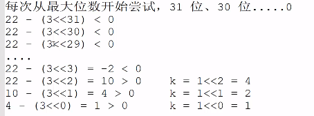
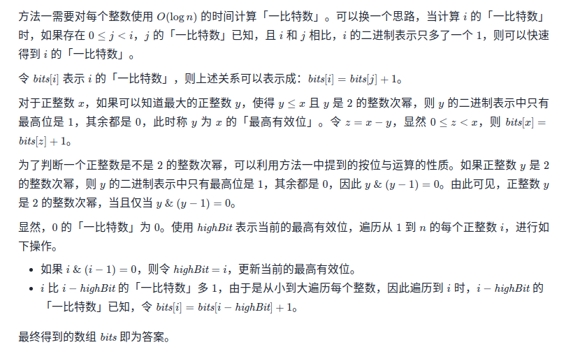
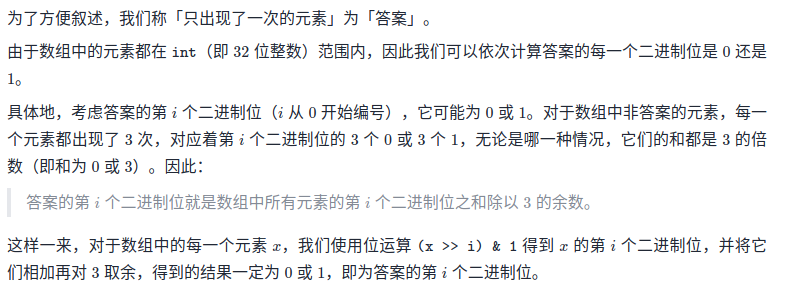
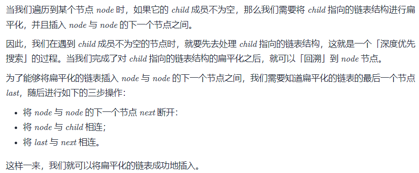
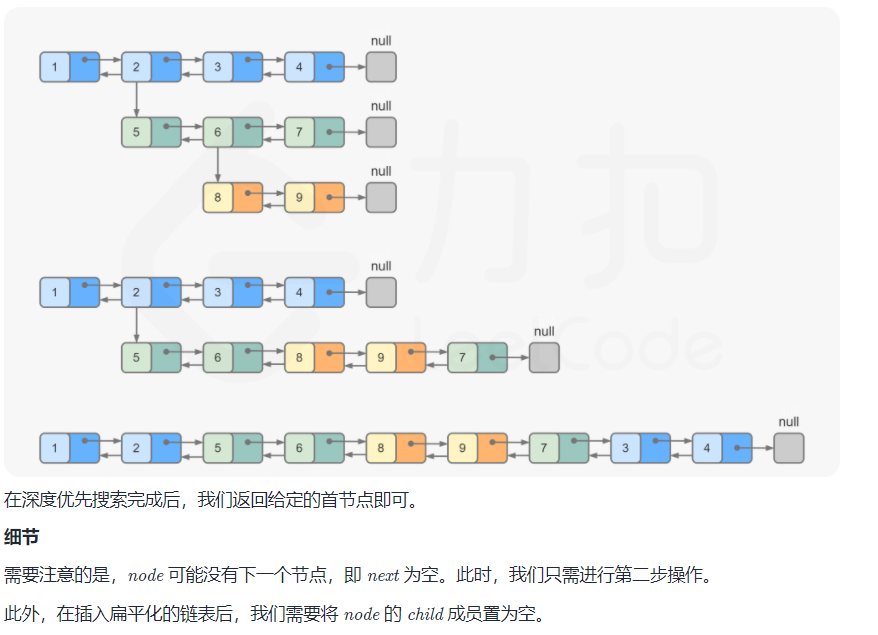
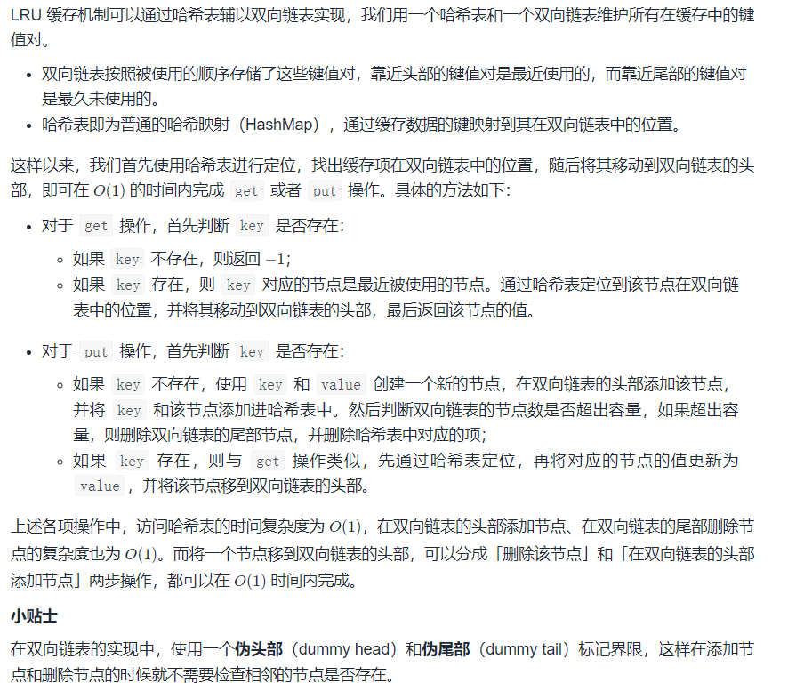
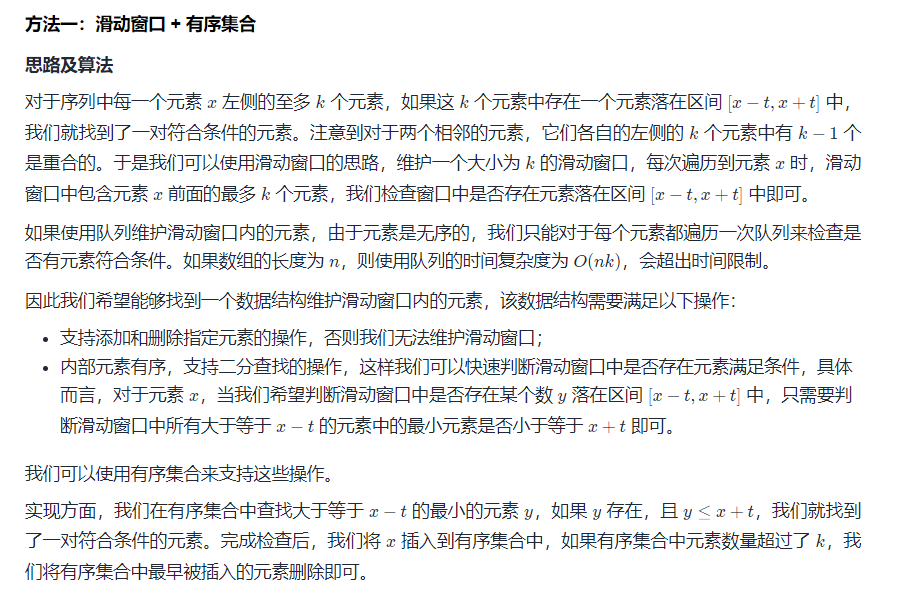
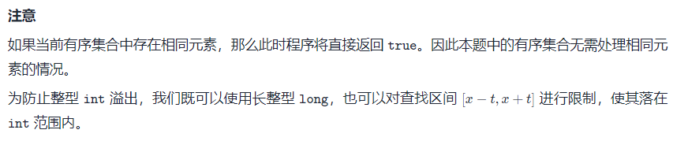

# 剑指Offer II 

# 整数

## 001.整数除法

> 给定两个整数 a 和 b ，求它们的除法的商 a/b ，要求不得使用乘号 '*'、除号 '/' 以及求余符号 '%' 。
>
> 注意：
>
> 整数除法的结果应当截去（truncate）其小数部分，例如：truncate(8.345) = 8 以及 truncate(-2.7335) = -2
> 假设我们的环境只能存储 32 位有符号整数，其数值范围是 [−2^31, 2^31−1]。本题中，如果除法结果溢出，则返回 2^31 − 1

使用位运算



把每个k累加起来。

```java
class Solution {
    // 时间复杂度：O(1)
    public int divide(int a, int b) {
        // 32 位最大值：2^31 - 1 = 2147483647
        // 32 位最小值：-2^31 = -2147483648
        // -2147483648 / (-1) = 2147483648 > 2147483647 越界了
        if (a == Integer.MIN_VALUE && b == -1) {
            return Integer.MAX_VALUE;
        }
        int sign = (a > 0) ^ (b > 0) ? -1 : 1;
        a = Math.abs(a);
        b = Math.abs(b);
        int res = 0;
        //从最大值开始
        for (int i = 31; i >= 0; i--) {
            // 首先，右移的话，再怎么着也不会越界
            // 其次，无符号右移的目的是：将 -2147483648 看成 2147483648
            // 注意，这里不能是 (a >>> i) >= b 而应该是 (a >>> i) - b >= 0
            // 这个也是为了避免 b = -2147483648，如果 b = -2147483648
            // 那么 (a >>> i) >= b 永远为 true，但是 (a >>> i) - b >= 0 为 false
            if ((a >>> i) - b >= 0) { // a >= (b << i)
                a -= (b << i);
                res += (1 << i);
            }
        }
        // bug 修复：因为不能使用乘号，所以将乘号换成三目运算符
        return sign == 1 ? res : -res;
    }
}
```

## 002.二进制加法

> 给定两个 01 字符串 `a` 和 `b` ，请计算它们的和，并以二进制字符串的形式输出。
>
> 输入为 **非空** 字符串且只包含数字 `1` 和 `0`。

从低位到高位模拟

```JAVA
class Solution {
    public String addBinary(String a, String b) {
        int i = a.length() - 1;
        int j = b.length() - 1;
        int c = 0;
        StringBuffer s = new StringBuffer();
        while (i >= 0 || j >= 0 || c != 0) {
            //遍历完了就补0
            int x = i >= 0 ? a.charAt(i) - '0' : 0;
            int y = j >= 0 ? b.charAt(j) - '0' : 0;
            int sum = x + y + c;
            c = sum >= 2 ? 1 : 0;
            sum = sum >= 2 ? sum - 2 : sum;
            s.append(sum);
            i--;
            j--;
        }
        return s.reverse().toString();
    }
}
```

## 003.前 n 个数字二进制中 1 的个数

> 给定一个非负整数 `n` ，请计算 `0` 到 `n` 之间的每个数字的二进制表示中 1 的个数，并输出一个数组。
>
> ```
> 输入: n = 2
> 输出: [0,1,1]
> 解释: 
> 0 --> 0
> 1 --> 1
> 2 --> 10
> ```

O（nlogn）的算法

令 `x=x&(x-1)`，该运算将 x 的二进制表示的最后一个 1 变成 0。因此，对 xx重复该操作，直到 x 变成 0。可以得到1的个数。

```JAVA
class Solution {
    public int countOfOne(int x){
        int cnt = 0;
        while (x > 0){
            x = x & (x - 1);
            cnt ++;
        }
        return cnt;
    }
    public int[] countBits(int n) {
        int[] ans = new int[n+1];
        for (int i = 0; i <= n; i++) {
            ans[i] = countOfOne(i);
        }
        return ans;
    }
}

```

实际上有内置API `Integer.bitCount(i)`返回1的个数。

动态规划解法：最高有效位（2的幂次）



```JAVA
class Solution {
    public int[] countBits(int n) {
        int[] bits = new int[n + 1];
        int highBit = 0;
        for (int i = 1; i <= n; i++) {
            if ((i & (i - 1)) == 0) {
                highBit = i;
            }
            bits[i] = bits[i - highBit] + 1;
        }
        return bits;
    }
}
```

## 004.只出现一次的数字

> 给你一个整数数组 `nums` ，除某个元素仅出现 **一次** 外，其余每个元素都恰出现 **三次 。**请你找出并返回那个只出现了一次的元素。



注意外层循环位数 内层循环数组 因为我们要计算每一位下数组的当前位`(num >> i) & 1`的和，对于一个出现三次的数，这个和要么是0要么是3,最后全部加起来模3如果不为0,则答案的当前位就为1,一位一位的还原。

```JAVA
class Solution {
    public int singleNumber(int[] nums) {
        int ans = 0;
        for (int i = 0; i < 32; i++) {
            int total = 0;
            for (int num : nums) {
                total += (num >> i) & 1;
            }
            if (total % 3 != 0) {
                ans |= (1 << i);
            }
        }
        return ans;
    }
}
```

## 005. 单词长度的最大乘积

> 给定一个字符串数组 words，请计算当两个字符串 words[i] 和 words[j] 不包含相同字符时，它们长度的乘积的最大值。假设字符串中只包含英语的小写字母。如果没有不包含相同字符的一对字符串，返回 0。

```JAVA
class Solution {
    public int maxProduct(String[] words) {
        int ans = 0;
        int n = words.length;
        for (int i = 0; i < n - 1; i++) {
            String s = words[i];
            for (int j = i + 1; j < n; j++) {
                if (!hasSameChar(s, words[j])) {
                    ans = Math.max(ans, s.length() * words[j].length());
                }
            }
        }
        return ans;
    }

    public boolean hasSameChar(String a, String b) {
        if (a == null || b == null) {
            return false;
        }
        Set<Character> s = new HashSet<>();
        for (char c : a.toCharArray()) {
            s.add(c);
        }
        for (char c : b.toCharArray()) {
            if (s.contains(c)) {
                return true;
            }
        }
        return false;
    }
}
```

## 006. 排序数组中两个数字之和

> 给定一个已按照 升序排列  的整数数组 numbers ，请你从数组中找出两个数满足相加之和等于目标数 target 。
>
> 函数应该以长度为 2 的整数数组的形式返回这两个数的下标值。numbers 的下标 从 0 开始计数 ，所以答案数组应当满足 0 <= answer[0] < answer[1] < numbers.length 。
>
> 假设数组中存在且只存在一对符合条件的数字，同时一个数字不能使用两次。

```JAVA
class Solution {
    public int[] twoSum(int[] numbers, int target) {
        int n = numbers.length,a = 0;
        int l = 0,r = n - 1;
        int[] ans = new int[2];
        while (l < r){
            a = numbers[l]+numbers[r];
            if (a == target){
                ans[0] = l;
                ans[1] = r;
                break;
            }else if (a < target){
                l++;
            }else{
                r--;
            }
        }
        return ans;
    }
}
```

# 数组

## 007. 数组中和为 0 的三个数

> 给定一个包含 n 个整数的数组 nums，判断 nums 中是否存在三个元素 a ，b ，c ，使得 a + b + c = 0 ？请找出所有和为 0 且 不重复 的三元组。

三数之和 枚举第一个数 后面两个数用两数之和 注意去重 

```java
class Solution {
    public List<List<Integer>> threeSum(int[] nums) {
        List<List<Integer>> ans = new ArrayList<>();
        if (nums == null || nums.length <= 2) {
            return ans;
        }
        int n = nums.length;
        Arrays.sort(nums); // O(nlogn)
        // O(n^2) i是第一个数
        for (int i = 0; i < nums.length - 2; i++) {
            //前3个数的和比0都大，则后续的i都没有解 break
            if (nums[i] + nums[i + 1] + nums[i + 2] > 0) {
                break;
            }
            // 当前的i和后面最大的2个数相加仍然小于0 则对于本个i没有解 continue
            if (nums[i] + nums[nums.length - 2] + nums[nums.length - 1] < 0) {
                continue;
            }
            //去重 如果有两个相邻的相等 取后面的
            if (i > 0 && nums[i] == nums[i - 1]) {
                continue;
            }
            // 0 - nums[i] 然后后面用两数之和
            int target = -nums[i];
            int left = i + 1, right = nums.length - 1;
            while (left < right) {
                if (nums[left] + nums[right] == target) {
                    ans.add(new ArrayList<>(Arrays.asList(nums[i], nums[left], nums[right])));
                    //首先无论如何先让指针移动 在i不变的情况下找下一组合适的left和right
                    left++;
                    right--;
                    //这里很容易漏掉 是去重 因为我们left自增和right自减后 仍然可能指向和原来一样的数
                    while (left < right && nums[left] == nums[left - 1]) {
                        left++;
                    }
                    while (left < right && nums[right] == nums[right + 1]) {
                        right--;
                    }
                } else if (nums[left] + nums[right] < target) {
                    left++;
                } else {
                    right--;
                }
            }
        }
        return ans;
    }
}
```

## 008. 和大于等于 target 的最短子数组

> 给定一个含有 n 个正整数的数组和一个正整数 target 。
>
> 找出该数组中满足其和 ≥ target 的长度最小的 连续子数组 [nums_l, nums_(l+1), ..., nums_(r-1), nums_r] ，并返回其长度。如果不存在符合条件的子数组，返回 0 。


双指针l和r组成滑动窗口，随时记录l到r之间的所有数的和，包括l和r，记录进s，判断若s>=target，则算出r-l+1和之前的ans取最小值，并让l往右移，减去移之前l指向的数，继续循环，若s<target，则让r往右移，如果没越界，则让s加上r此时指向的数

```java
class Solution {
    public long sum(int[] nums) {
        long ans = 0;
        for (int num : nums) {
            ans += num;
        }
        return ans;
    }

    public int minSubArrayLen(int target, int[] nums) {
        // 如果整个数组的和都没有>=target的，则返回0
        if (sum(nums) < target) {
            return 0;
        }
        int l = 0, r = 0, n = nums.length;
        int ans = Integer.MAX_VALUE;
        int s = nums[0];
        while (l <= r && r < n) {
            if (s >= target) {
                ans = Integer.min(ans, r - l + 1);
                s -= nums[l];
                l++;
            } else {
                r++;
                if (r < n) {
                    s += nums[r];
                }
            }
        }
        return ans;
    }
}
```

## 009. 乘积小于 K 的子数组

> 给定一个正整数数组 `nums`和整数 `k` ，请找出该数组内乘积小于 `k` 的连续的子数组的个数。

滑动窗口不难想，主要是如何计数。

比如某次遍历符合题意的子数组为 ABCX，那么在该条件下符合条件的有X，CX，BCX，ABCX共四个（可以进行多个例子，发现个数符合right-left+1）
我们可能会有疑问：AB，BC也算，为什么不算进去？
记住一点我们是以最右边的X为必要条件，进行计算符合条件的子数组，否则会出现重复的！
比如在X为右侧边界时（ABCX），我们把BC算进去了，可是我们在C为最右侧时（ABC），BC已经出现过，我们重复加了BC这个子数组两次！
换言之，我们拆分子数组时，让num[right]存在，能避免重复计算。

```java
class Solution {
    public int numSubarrayProductLessThanK(int[] nums, int k) {
        if(k <= 1){
            return 0;
        }
        int n = nums.length;
        int ans = 0;
        int start = 0,end = 0;
        int multi = 1;
        while (end < n) {
            multi *= nums[end];
            while (multi >= k) {
                multi /= nums[start++];
            }
            ans += end - start + 1;
            end++;
        }
        return ans;
    }
}
```

核心就在于**每次计数以右边结尾为计数点** `end - start + 1`

## 010. 和为 k 的子数组

> 给定一个整数数组和一个整数 `k` **，**请找到该数组中和为 `k` 的连续子数组的个数。
>
> 

枚举

```java
public class Solution {
    public int subarraySum(int[] nums, int k) {
        int count = 0;
        for (int start = 0; start < nums.length; ++start) {
            int sum = 0;
            for (int end = start; end >= 0; --end) {
                sum += nums[end];
                if (sum == k) {
                    count++;
                }
            }
        }
        return count;
    }
}

```


```java
public class Solution {
    public int subarraySum(int[] nums, int k) {
        int count = 0, pre = 0;	
        HashMap < Integer, Integer > mp = new HashMap < > ();
        mp.put(0, 1);
        for (int i = 0; i < nums.length; i++) {
            pre += nums[i];
            if (mp.containsKey(pre - k)) {
                count += mp.get(pre - k);
            }
            mp.put(pre, mp.getOrDefault(pre, 0) + 1);
        }
        return count;
    }
}

```


## 011. 0 和 1 个数相同的子数组

> 给定一个二进制数组 `nums` , 找到含有相同数量的 `0` 和 `1` 的最长连续子数组，并返回该子数组的长度。

由于「0 和 1 的数量相同」等价于「1 的数量减去 0 的数量等于 0」，我们可以将数组中的 0 视作 −1，则原问题转换成「求最长的连续子数组，其元素和为 0」。

```java
/**
     * 解题思路:
     * 本题的意思是找到具有相同数量 0，1 的最长连续子数组，也就是子数组中要同时具有 0 和 1，并且 0 和 1 的数量是相同的, 并且是最长
     * 的子数组(好像是废话...）。
     * <p>
     * 给出一组测试用例：[0,0,0,1,1,1,0,0,1], 用指针 i 扫描一遍数组, 来观察每个位置上的可能情况
     * [0,0,0,1,1,1,0,0,1]
     * -i                 不符合条件, 0 1 数量不同
     * [0,0,0,1,1,1,0,0,1]
     * -  i               不符合条件, 0 1 数量不同
     * [0,0,0,1,1,1,0,0,1]
     * -    i             不符合条件, 0 1 数量不同
     * [0,0,0,1,1,1,0,0,1]
     * -      i           此时与前一个 0 构成 [0,1] 满足条件, 此时的子数组长度为 2
     * [0,0,0,1,1,1,0,0,1]
     * -        i         此时 [1,4] 区间满足条件, 子数组长度为 4
     * [0,0,0,1,1,1,0,0,1]
     * -          i       此时 [0,5] 区间满足条件, 子数组长度为 5
     * [0,0,0,1,1,1,0,0,1]
     * -            i     不符合条件
     * [0,0,0,1,1,1,0,0,1]
     * -              i   此时 [0,7] 区间满足条件, 子数组长度为 8
     * [0,0,0,1,1,1,0,0,1]
     * -                ^ 不符合条件
     * <p>
     * 当遍历完整个数组后, 我们可以知到 [0, 7] 区间是符合条件的最长连续子数组。肉眼很容易辨别哪个区间为最长连续子数组, 但是计算机如
     * 何能知道？答案是计算区间和, 如果让 0 变为 -1, 那么当区间内 -1 和 1 的数量相同时, 这区间和就是 0 。如此, 似乎可以使用前缀和
     * 来解决这个问题, 当计算的前缀和为 0 时, 就说明[0,i] 区间是满足题目要求的一个子数组。不过这样肯定会出现错误, 因为最终的结果不
     * 一定是从 0 下标开始子数组。例如这个用例 [0,0,1,0,0,0,1,1], 答案应该是 nums[2,7]区间长度为6的数组, 可以用上面的方式进行计算
     * 前缀和：
     * -[0,0,1,0,0,0,1,1]
     * - i               preSum = -1, (用 -1 替换 0);
     * -[0,0,1,0,0,0,1,1]
     * -   i             preSum = -2
     * -[0,0,1,0,0,0,1,1]
     * -     i           preSum = -1
     * -[0,0,1,0,0,0,1,1]
     * -       i         preSum = -2
     * -[0,0,1,0,0,0,1,1]
     * -         i       preSum = -3
     * -[0,0,1,0,0,0,1,1]
     * -           i     preSum = -4
     * -[0,0,1,0,0,0,1,1]
     * -             i   preSum = -3
     * -[0,0,1,0,0,0,1,1]
     * -               i preSum = -2
     * 观察可以发现, 当前缀和相同时, 前一个 i1 后面一个位置开始一直到 i2 的区间是满足题目要求的子数组, 即 nums[i1+1...i2] 满足题
     * 目要求, 并且 i2 - i1 = 子数组长度, 所以我们只需要计算出 nums[0...n-1] 每一个位置的前缀和, 一旦发现当前的计算出的前缀和在
     * 之前已经出现过, 就用当前的索引 i2 - 之前的索引 i1 即可求出本次得到的子数组长度,。因为需要求得的是最长连续子数组，所以应用一
     * 个变量 maxLength 来保存每一次计算出的子数组长度, 取较大值。也因为, 我们需要保存每一个位置的前缀和, 并且还需要通过前缀和找到
     * 相应位置的索引, 所以，使用 HashMap 来存放 {前缀和:索引}, 在上面例子中我们通过观察得到了 i2 - i1 = 数组长度, 但是有一个很隐
     * 蔽的缺陷, 即当整个数组即为答案时, i2 = nums.length - 1, i1 = 0 此时得到的数组长度为 nums.length - 1 这显然是错误的。因此
     * , 为了避免这个错误, 我们初始将 Map 中添加一对 {前缀和:索引}, 即 put(0,-1), 0代表前一个不存在的元素前缀和为 0, -1 代表不存在元素的索引。
     * 当定义了这些条件后, 我们开始用指针 i 遍历数组nums[0...nums.length - 1] 位置上的每一个元素。
     * 一、用变量 sum 来纪录[0...i]区间的和:
     * -   1.当 nums[i] == 0 时, sum += -1
     * -   2.当 nums[i] == 1 时, sum += 1
     * 二、接着判断 sum 是否已经存在于 HashMap 中:
     * -   1. 如果存在, 则取出 sum 所对应的索引 j, 那么 nums[j+1,i] 就是一个满足答案的子区间, 用
     * -      maxLength = Math.max(maxLengnth, i - j); 来纪录最长子数组。
     * -   2. 如果不存在, 则将 {sum:i} 存放在 HashMap 中作为纪录。
     * 当数组遍历完毕时, maxLength 中保存的即为答案数组的长度。
     * <p>
     */
class Solution {
    public int findMaxLength(int[] nums) {
      HashMap<Integer, Integer> map = new HashMap<>();
        map.put(0, -1);
        int sum = 0, maxLength = 0;
        for (int i = 0; i < nums.length; i++) {
            sum += nums[i] == 0 ? -1 : nums[i];
            if (map.containsKey(sum)) {
                int j = map.get(sum);
                maxLength = Math.max(maxLength, i - j);
            } else {
                map.put(sum, i);
            }
        }
        return maxLength;      
    }
}
```

## 012. 左右两边子数组的和相等

> 给你一个整数数组 nums ，请计算数组的 中心下标 。
>
> 数组 中心下标 是数组的一个下标，其左侧所有元素相加的和等于右侧所有元素相加的和。
>
> 如果中心下标位于数组最左端，那么左侧数之和视为 0 ，因为在下标的左侧不存在元素。这一点对于中心下标位于数组最右端同样适用。
>
> 如果数组有多个中心下标，应该返回 最靠近左边 的那一个。如果数组不存在中心下标，返回 -1 。

前缀和

```java
class Solution {
    public int pivotIndex(int[] nums) {
        int n = nums.length;
        int[] sum = new int[n];
        sum[0] = nums[0];
        for (int i = 1; i < n; i++) {
            sum[i] = sum[i - 1] + nums[i];
        }
        if (sum[n - 1] - nums[0] == 0) {
            return 0;
        }
        int i = 1;
        while (i < n) {
            if (sum[i - 1] == sum[n - 1] - sum[i]) {
                return i;
            }
            i++;
        }
        return -1;
    }
}
```


## 013. 二维子矩阵的和


二维前缀和

```java
class NumMatrix {

    public int[][] matrix;
    // sum[i][j] 表示[0,0]到[i,j]的二维前缀和
    public int[][] sum;

    public NumMatrix(int[][] matrix) {
        this.matrix = matrix;
        int m = matrix.length, n = matrix[0].length;
        sum = new int[m + 1][n + 1];
        for (int i = 0; i < m; i++) {
            for (int j = 0; j < n; j++) {
                sum[i + 1][j + 1] = sum[i][j + 1] + sum[i + 1][j] - sum[i][j] + matrix[i][j];
            }
        }
    }

    public int sumRegion(int row1, int col1, int row2, int col2) {
        return sum[row2 + 1][col2 + 1] - sum[row1][col2 + 1] - sum[row2 + 1][col1] + sum[row1][col1];
    }
}
/**
 * Your NumMatrix object will be instantiated and called as such:
 * NumMatrix obj = new NumMatrix(matrix);
 * int param_1 = obj.sumRegion(row1,col1,row2,col2);
 */
```

# 字符串

## 014. 字符串中的变位词

> 给定两个字符串 `s1` 和 `s2`，写一个函数来判断 `s2` 是否包含 `s1` 的某个变位词。
>
> 换句话说，第一个字符串的排列之一是第二个字符串的 **子串** 。

滑动窗口 注意初始窗口大小的处理。

```java
class Solution {
    public boolean checkInclusion(String s1, String s2) {
        int size = s1.length(), n = s2.length();
        if (size > n) {
            return false;
        }
        int[] a1 = new int[26];
        int[] a2 = new int[26];
        for (int i = 0; i < size; i++) {
            a1[s1.charAt(i) - 'a']++;
        }
        int left = 0, right = 0;
        // 初始窗口
        while (right < left + size) {
            a2[s2.charAt(right++) - 'a']++;
        }
        // 此时窗口比size大1了 需要减回去。
        right--;
        while (right < n) {
            if (Arrays.equals(a1, a2)) {
                return true;
            }
            a2[s2.charAt(left++) - 'a']--;
            right++;
            if (right < n) {
                a2[s2.charAt(right) - 'a']++;
            }
        }
        return false;
    }
}
```


## 015. 字符串中的所有变位词

> 给定两个字符串 s 和 p，找到 s 中所有 p 的 变位词 的子串，返回这些子串的起始索引。不考虑答案输出的顺序。
>
> 变位词 指字母相同，但排列不同的字符串。

滑动窗口 注意初始窗口大小的处理。

```java
class Solution {
    public List<Integer> findAnagrams(String s, String p) {
        int size = p.length(), n = s.length();
        if (size > n) {
            return new ArrayList<Integer>();
        }
        int[] a1 = new int[26];
        int[] a2 = new int[26];
        for (int i = 0; i < size; i++) {
            a2[p.charAt(i) - 'a']++;
        }
        int left = 0, right = 0;
        // 初始窗口
        while (right - left < size) {
            a1[s.charAt(right++) - 'a']++;
        }
        List<Integer> ans = new ArrayList<Integer>();
        if (Arrays.equals(a1, a2)) {
            ans.add(0);
        }
        // 此时窗口比size大1了 需要减回去。
        right --;
        while (right < n) {
            a1[s.charAt(left++) - 'a']--;
            right++;
            if (right < n){
                a1[s.charAt(right) - 'a']++;
                if (Arrays.equals(a1, a2)) {
                    ans.add(left);
                }
            }
        }
        return ans;
    }
}
```

## 016. 不含重复字符的最长子字符串

> 给定一个字符串 `s` ，请你找出其中不含有重复字符的 **最长连续子字符串** 的长度。

滑动窗口。

```java
class Solution {
    public int lengthOfLongestSubstring(String s) {
        int n = s.length();
        int l = 0;
        // right pointer
        int right = -1;
        Set<Character> st = new HashSet<>();
        // left pointer
        for (int i = 0; i < n; i++) {
            if (i > 0) {
                // i = i + 1 means the left pointer moves to the right by 1 step
                st.remove(s.charAt(i - 1));
            }
            while (right < n - 1 && !st.contains(s.charAt(right + 1))) {
                st.add(s.charAt(right + 1));
                right++;
            }
            l = Math.max(l, right - i + 1);

        }
        return l;
    }
}
```

##  017. 含有所有字符的最短字符串

> 给定两个字符串 s 和 t 。返回 s 中包含 t 的所有字符的最短子字符串。如果 s 中不存在符合条件的子字符串，则返回空字符串 "" 。
>
> 如果 s 中存在多个符合条件的子字符串，返回任意一个。
>
> 注意： 对于 t 中重复字符，我们寻找的子字符串中该字符数量必须不少于 t 中该字符数量。

```java
class Solution {
    public String minWindow(String s, String t) {
        if (s == null || s == "" || t == null || t == "" || s.length() < t.length()) {
            return "";
        }
        //维护两个数组，记录已有字符串指定字符的出现次数，和目标字符串指定字符的出现次数
        //ASCII表总长128
        int[] need = new int[128];
        int[] have = new int[128];

        //将目标字符串指定字符的出现次数记录
        for (int i = 0; i < t.length(); i++) {
            need[t.charAt(i)]++;
        }

        //分别为左指针，右指针，最小长度(初始值为一定不可达到的长度)
        //已有字符串中目标字符串指定字符的出现总频次以及最小覆盖子串在原字符串中的起始位置
        int left = 0, right = 0, min = s.length() + 1, count = 0, start = 0;
        while (right < s.length()) {
            char r = s.charAt(right);
            //说明该字符不被目标字符串需要，此时有两种情况
            // 1.循环刚开始，那么直接移动右指针即可，不需要做多余判断
            // 2.循环已经开始一段时间，此处又有两种情况
            //  2.1 上一次条件不满足，已有字符串指定字符出现次数不满足目标字符串指定字符出现次数，那么此时
            //      如果该字符还不被目标字符串需要，就不需要进行多余判断，右指针移动即可
            //  2.2 左指针已经移动完毕，那么此时就相当于循环刚开始，同理直接移动右指针
            if (need[r] == 0) {
                right++;
                continue;
            }
            //当且仅当已有字符串目标字符出现的次数小于目标字符串字符的出现次数时，count才会+1
            //是为了后续能直接判断已有字符串是否已经包含了目标字符串的所有字符，不需要挨个比对字符出现的次数
            if (have[r] < need[r]) {
                count++;
            }
            //已有字符串中目标字符出现的次数+1
            have[r]++;
            //移动右指针
            right++;
            //当且仅当已有字符串已经包含了所有目标字符串的字符，且出现频次一定大于或等于指定频次
            while (count == t.length()) {
                //挡窗口的长度比已有的最短值小时，更改最小值，并记录起始位置
                if (right - left < min) {
                    min = right - left;
                    start = left;
                }
                char l = s.charAt(left);
                //如果左边即将要去掉的字符不被目标字符串需要，那么不需要多余判断，直接可以移动左指针
                if (need[l] == 0) {
                    left++;
                    continue;
                }
                //如果左边即将要去掉的字符被目标字符串需要，且出现的频次正好等于指定频次，那么如果去掉了这个字符，
                //就不满足覆盖子串的条件，此时要破坏循环条件跳出循环，即控制目标字符串指定字符的出现总频次(count）-1
                if (have[l] == need[l]) {
                    count--;
                }
                //已有字符串中目标字符出现的次数-1
                have[l]--;
                //移动左指针
                left++;
            }
        }
        //如果最小长度还为初始值，说明没有符合条件的子串
        if (min == s.length() + 1) {
            return "";
        }
        //返回的为以记录的起始位置为起点，记录的最短长度为距离的指定字符串中截取的子串
        return s.substring(start, start + min);
    }
}
```


## 018. 有效的回文

> 给定一个字符串 `s` ，验证 `s` 是否是 **回文串** ，只考虑字母和数字字符，可以忽略字母的大小写。
>
> 本题中，将空字符串定义为有效的 **回文串** 。

```java
class Solution {
    public boolean isLowerLetterOrDigit(char c) {
        return (c >= 'a' && c <= 'z')||(c >= '0' && c<= '9');
    }
    public String trim(String s) {
        StringBuilder sb = new StringBuilder();
        s = s.toLowerCase();
        for (int i = 0; i < s.length(); i++) {
            char c = s.charAt(i);
            if (c != ' ' && isLowerLetterOrDigit(c)) {
                sb.append(c);
            }
        }
        return sb.toString();
    }
    public boolean isPalindrome(String s) {
        String s1 = trim(s);
        StringBuilder sb = new StringBuilder(s1);
        return s1.equals(sb.reverse().toString());
    }
}
```

## 019. 最多删除一个字符得到回文

> 给定一个非空字符串 `s`，请判断如果 **最多** 从字符串中删除一个字符能否得到一个回文字符串。

此题和判断一个字符串是不是回文字符串只有一个差别：

是否有一次删除一个字符的机会。
所以，这道题我们依旧使用双指针法。

算法流程

设定左右指针，将二者分别指向字符串的两边。
依次比较左右指针对应的字符是否相等。
如果相等，继续比较剩下的字符。
如果不相等，则分两种情况，只要有一种情况是回文字符串即可：
删除左边的 left 指针指向的元素，判断 s[left+1, right] 是否回文。
删除右边的 right 指针指向的元素，判断 s[left, right-1] 是否回文。

代码

```java
class Solution {
    public boolean validPalindrome(String s) {
        for(int left = 0, right = s.length() - 1; left < right; left++, right--){
            // 如果不相等，则分两种情况：删除左边的元素，或者右边的元素，再判断各自是否回文，满足一种即可。
            if(s.charAt(left) != s.charAt(right)) 
                return isPalindrome(s, left+1, right) || isPalindrome(s, left, right - 1);
        }
        return true;
    }

    // 判断字符串 s 的 [left, right] 是否回文
    private boolean isPalindrome(String s, int left , int right){
        while (left < right){
            if (s.charAt(left++) != s.charAt(right--))
                return false;
        }
        return true;
    }
}

```


## 020. 回文子字符串的个数

> 给定一个字符串 `s` ，请计算这个字符串中有多少个回文子字符串。
>
> 具有不同开始位置或结束位置的子串，即使是由相同的字符组成，也会被视作不同的子串。


首先这一题可以使用动态规划来进行解决：

状态：dp[i] [j] 表示字符串s在[i,j]区间的子串是否是一个回文串。
状态转移方程：当 s[i] == s[j] && (j - i < 2 || dp [i + 1] [j - 1]) 时，dp[i] [j]=true，否则为false
这个状态转移方程是什么意思呢？

当只有一个字符时，比如 a 自然是一个回文串。
当有两个字符时，如果是相等的，比如 aa，也是一个回文串。
当有三个及以上字符时，比如 ababa 这个字符记作串 1，把两边的 a 去掉，也就是 bab 记作串 2，可以看出只要串2是一个回文串，那么左右各多了一个 a 的串 1 必定也是回文串。所以当 s[i]==s[j] 时，自然要看 dp[i+1 ] [j-1] 是不是一个回文串。

```java

class Solution {
    public int countSubstrings(String s) {
        int n = s.length();
        int cnt = 0;
        // dp[i][j]表示s[i.....j]是否回文
        boolean[][] dp = new boolean[n][n];
        for (int i = 0; i < n; i++) {
            dp[i][i] = true;
            cnt++;
        }
        for (int i = 0; i < n - 1; i++) {
            if (s.charAt(i) == s.charAt(i + 1)) {
                dp[i][i + 1] = true;
                cnt++;
            }
        }
        for (int j = 0; j < n; j++) {
            for (int i = 0; i <= j; i++) {
                if (s.charAt(j) == s.charAt(i) && (j - i >= 2) && dp[i + 1][j - 1]) {
                    dp[i][j] = true;
                    cnt++;
                }
            }
        }

        return cnt;
    }
}
```

# 链表

## 021. 删除链表的倒数第 n 个结点

> 给定一个链表，删除链表的倒数第 `n` 个结点，并且返回链表的头结点。

```java
/**
 * Definition for singly-linked list.
 * public class ListNode {
 *     int val;
 *     ListNode next;
 *     ListNode() {}
 *     ListNode(int val) { this.val = val; }
 *     ListNode(int val, ListNode next) { this.val = val; this.next = next; }
 * }
 */
class Solution {
    int lengthOfList(ListNode head){
        int cnt = 0;
        ListNode l = head;
        while(l != null){
            cnt++;
            l = l.next;
        }
        return cnt;
    }
    public ListNode removeNthFromEnd(ListNode head, int n) {
        int len = lengthOfList(head);
        int k = len - n + 1;
        int cnt = 1;
        ListNode l = new ListNode(0);
        l.next = head;
        ListNode ret = l;
        while(cnt < k){
            l = l.next;
            cnt++;
        }
        l.next = l.next.next;
        return ret.next;
    }
}
```

## 022. 链表中环的入口节点

> 给定一个链表，返回链表开始入环的第一个节点。 从链表的头节点开始沿着 next 指针进入环的第一个节点为环的入口节点。如果链表无环，则返回 null。
>
> 为了表示给定链表中的环，我们使用整数 pos 来表示链表尾连接到链表中的位置（索引从 0 开始）。 如果 pos 是 -1，则在该链表中没有环。注意，pos 仅仅是用于标识环的情况，并不会作为参数传递到函数中。
>
> 说明：不允许修改给定的链表。

```java
public class Solution {
    public ListNode detectCycle(ListNode head) {
        Set<ListNode> nodes = new HashSet<>();
        ListNode l = head;
        while (l != null) {
            if (nodes.contains(l)) {
                return l;
            }else{
                nodes.add(l);
                l = l.next;
            }
        }
        return null;
    }
}
```

## 023. 两个链表的第一个重合节点

>  给定两个单链表的头节点 headA 和 headB ，请找出并返回两个单链表相交的起始节点。如果两个链表没有交点，返回 null 。
>
> 图示两个链表在节点 c1 开始相交：
>
> 
>
> 题目数据 保证 整个链式结构中不存在环。
>
> 注意，函数返回结果后，链表必须 保持其原始结构 。

```java
public class Solution {
    public ListNode getIntersectionNode(ListNode headA, ListNode headB) {
        if (headA == null || headB == null){
            return null;
        }
        Set<ListNode> nodes = new HashSet<ListNode>();
        ListNode a = headA;
        while(a != null){
            nodes.add(a);
            a = a.next;
        }
        ListNode b = headB;
        while(b != null){
            if (nodes.contains(b)){
                return b;
            }
            b = b.next;
        }
        return null;
    }
}
```

## 024. 反转链表

> 给定单链表的头节点 `head` ，请反转链表，并返回反转后的链表的头节点。

```java
class Solution {
    public ListNode reverseList(ListNode head) {
        ListNode myHead = new ListNode(0);
        ListNode newHead = new ListNode(0);
        myHead.next = head;
        myHead = head;
        while (myHead != null) {
            ListNode n = new ListNode(myHead.val);
            n.next = newHead.next;
            newHead.next = n;
            myHead = myHead.next;
        }
        return newHead.next;
    }
}
```

## 025. 链表中的两数相加

> 给定两个 非空链表 l1和 l2 来代表两个非负整数。数字最高位位于链表开始位置。它们的每个节点只存储一位数字。将这两数相加会返回一个新的链表。
>
> 可以假设除了数字 0 之外，这两个数字都不会以零开头。

先逆置链表，在模拟加法和进位，再逆置回去。

```java
/**
 * Definition for singly-linked list.
 * public class ListNode {
 *     int val;
 *     ListNode next;
 *     ListNode() {}
 *     ListNode(int val) { this.val = val; }
 *     ListNode(int val, ListNode next) { this.val = val; this.next = next; }
 * }
 */
class Solution {
    public ListNode reverseList(ListNode head) {
        ListNode myHead = new ListNode(0);
        ListNode newHead = new ListNode(0);
        myHead.next = head;
        myHead = head;
        while (myHead != null) {
            ListNode n = new ListNode(myHead.val);
            n.next = newHead.next;
            newHead.next = n;
            myHead = myHead.next;
        }
        return newHead.next;
    }

    public ListNode addTwoNumbers(ListNode l1, ListNode l2) {
        ListNode r1 = reverseList(l1);
        ListNode r2 = reverseList(l2);
        ListNode p1 = r1, p2 = r2;
        ListNode head = new ListNode(0);
        ListNode ans = head;
        int c = 0;
        while (p1 != null || p2 != null || c != 0) {
            if (p1 == null && p2 != null) {
                int sum = p2.val + c;
                if (sum >= 10) {
                    sum -= 10;
                    c = 1;
                } else {
                    c = 0;
                }
                head.next = new ListNode(sum);
                head = head.next;
                p2 = p2.next;
            } else if (p2 == null && p1 != null) {
                int sum = p1.val + c;
                if (sum >= 10) {
                    sum -= 10;
                    c = 1;
                } else {
                    c = 0;
                }
                head.next = new ListNode(sum);
                head = head.next;
                p1 = p1.next;
            } else if (p1 != null && p2 != null) {
                int sum = p1.val + p2.val + c;
                if (sum >= 10) {
                    sum -= 10;
                    c = 1;
                } else {
                    c = 0;
                }
                head.next = new ListNode(sum);
                head = head.next;
                p1 = p1.next;
                p2 = p2.next;
            } else {
                int sum = c;
                c = 0;
                head.next = new ListNode(sum);
                head = head.next;
            }
        }
        ans = reverseList(ans.next);
        return ans;
    }
}
```

## 026. 重排链表

> 给定一个单链表 L 的头节点 head ，单链表 L 表示为：
>
>  L0 → L1 → … → Ln-1 → Ln 
> 请将其重新排列后变为：
>
> L0 → Ln → L1 → Ln-1 → L2 → Ln-2 → …
>
> 不能只是单纯的改变节点内部的值，而是需要实际的进行节点交换。

利用线性表存储，既有位置也有节点引用，方便随时拿。

```java
/**
 * Definition for singly-linked list.
 * public class ListNode {
 *     int val;
 *     ListNode next;
 *     ListNode() {}
 *     ListNode(int val) { this.val = val; }
 *     ListNode(int val, ListNode next) { this.val = val; this.next = next; }
 * }
 */
class Solution {
    public void reorderList(ListNode head) {
        if (head == null) {
            return;
        }
        List<ListNode> list = new ArrayList<ListNode>();
        ListNode node = head;
        while (node != null) {
            list.add(node);
            node = node.next;
        }
        int i = 0, j = list.size() - 1;
        while (i < j) {
            list.get(i).next = list.get(j);
            i++;
            if (i == j) {
                break;
            }
            list.get(j).next = list.get(i);
            j--;
        }
        list.get(i).next = null;
    }
}
```

## 027. 回文链表

> 给定一个链表的 **头节点** `head` **，**请判断其是否为回文链表。
>
> 如果一个链表是回文，那么链表节点序列从前往后看和从后往前看是相同的。

反转链表，比较相等

```java
/**
 * Definition for singly-linked list.
 * public class ListNode {
 *     int val;
 *     ListNode next;
 *     ListNode() {}
 *     ListNode(int val) { this.val = val; }
 *     ListNode(int val, ListNode next) { this.val = val; this.next = next; }
 * }
 */
class Solution {
    public int length(ListNode head) {
        ListNode h = head;
        int cnt = 0;
        while (h != null) {
            cnt++;
            h = h.next;
        }
        return cnt;
    }

    public boolean equals(ListNode h1, ListNode h2) {
        ListNode l1 = h1, l2 = h2;
        if (length(l1) != length(l2)) {
            return false;
        }
        while (l1 != null) {
            if (l1.val != l2.val) {
                return false;
            }
            l1 = l1.next;
            l2 = l2.next;
        }
        return true;
    }

    public ListNode reverseList(ListNode head) {
        ListNode myHead = new ListNode(0);
        ListNode newHead = new ListNode(0);
        myHead.next = head;
        myHead = head;
        while (myHead != null) {
            ListNode n = new ListNode(myHead.val);
            n.next = newHead.next;
            newHead.next = n;
            myHead = myHead.next;
        }
        return newHead.next;
    }

    public boolean isPalindrome(ListNode head) {
        ListNode h1 = head, h2 = reverseList(head);
        return equals(h1, h2);
    }
}
```

## 028. 展平多级双向链表

> 多级双向链表中，除了指向下一个节点和前一个节点指针之外，它还有一个子链表指针，可能指向单独的双向链表。这些子列表也可能会有一个或多个自己的子项，依此类推，生成多级数据结构，如下面的示例所示。
>
> 给定位于列表第一级的头节点，请扁平化列表，即将这样的多级双向链表展平成普通的双向链表，使所有结点出现在单级双链表中。





```java
/*
// Definition for a Node.
class Node {
    public int val;
    public Node prev;
    public Node next;
    public Node child;
};
*/

class Solution {
    public Node flatten(Node head) {
        dfs(head);
        return head;
    }

    public Node dfs(Node node) {
        Node cur = node;
        // 记录链表的最后一个节点
        Node last = null;

        while (cur != null) {
            Node next = cur.next;
            //  如果有子节点，那么首先处理子节点
            if (cur.child != null) {
                Node childLast = dfs(cur.child);
                next = cur.next;
                //  将 node 与 child 相连
                cur.next = cur.child;
                cur.child.prev = cur;

                //  如果 next 不为空，就将 last 与 next 相连
                if (next != null) {
                    childLast.next = next;
                    next.prev = childLast;
                }

                // 将 child 置为空
                cur.child = null;
                last = childLast;
            } else {
                last = cur;
            }
            cur = next;
        }
        return last;
    }
}
```

## 029. 排序的循环链表

> 给定循环单调非递减列表中的一个点，写一个函数向这个列表中插入一个新元素 insertVal ，使这个列表仍然是循环升序的。
>
> 给定的可以是这个列表中任意一个顶点的指针，并不一定是这个列表中最小元素的指针。
>
> 如果有多个满足条件的插入位置，可以选择任意一个位置插入新的值，插入后整个列表仍然保持有序。
>
> 如果列表为空（给定的节点是 null），需要创建一个循环有序列表并返回这个节点。否则。请返回原先给定的节点。

其实就三种情况，

- 在中间能够找到一个节点cur，满足`cur.val<=val<=cur.next.val`，直接插入即可

- 找不到，则一定是所有的值都比它小或大，其实都会插入到边界跳跃点

  即找到cur，满足`val<=cur.next.val<cur.val`(比最小的还小）或`cur.next.val<cur.val<=val`（比最大的还大）

因此其实就三个不等式，`cur.val<=val`, `cur.next.val>=val`, `cur.next.val>=cur.val`，三个式子中满足一个或三个时，cur即为插入点。

```java
/*
// Definition for a Node.
class Node {
    public int val;
    public Node next;

    public Node() {}

    public Node(int _val) {
        val = _val;
    }

    public Node(int _val, Node _next) {
        val = _val;
        next = _next;
    }
};
*/

class Solution {
    public Node insert(Node head, int x) {
        if (head == null) {
            head = new Node(x);
            head.next = head;
            return head;
        }
        Node cur = head;
        while (cur.next != head) {
            // cur 为循环边界跳越点
            if (cur.next.val < cur.val) {
                if (x >= cur.val) {
                    break;// x比最大值都大
                }
                if (x <= cur.next.val) {
                    break;// x比最小值都小
                }
            }
            // 顺序插入x中升序序列中
            if (x >= cur.val && x <= cur.next.val) {
                break;
            }
            cur = cur.next;
        }
        // 将x插入到cur与cur.next之间
        cur.next = new Node(x, cur.next);
        return head;
    }
}
```

# 哈希表

## 030. 插入、删除和随机访问都是 O(1) 的容器

> 设计一个支持在平均 时间复杂度 O(1) 下，执行以下操作的数据结构：
>
> - insert(val)：当元素 val 不存在时返回 true ，并向集合中插入该项，否则返回 false 。
> - remove(val)：当元素 val 存在时返回 true ，并从集合中移除该项，否则返回 false 。
> - getRandom：随机返回现有集合中的一项。每个元素应该有 相同的概率 被返回。

```java
class RandomizedSet {
    Set<Integer> set;
    List<Integer> list;
    Random r;
    public RandomizedSet() {
        set = new HashSet<Integer>();
    }

    public boolean insert(int val) {
        if (set.contains(val)) {
            return false;
        }else{
            set.add(val);
            return true;
        }
    }

    public boolean remove(int val) {
        if (set.contains(val)) {
            set.remove(val);
            return true;
        }else{
            return false;
        }
    }

    public int getRandom() {
        list = new ArrayList<Integer>(set);
        r = new Random();
        int index = r.nextInt(list.size());
        return list.get(index);
    }
}

/**
 * Your RandomizedSet object will be instantiated and called as such:
 * RandomizedSet obj = new RandomizedSet();
 * boolean param_1 = obj.insert(val);
 * boolean param_2 = obj.remove(val);
 * int param_3 = obj.getRandom();
 */
```

如果不使用API， 关键就在于怎么在数组中实现 O(1) 复杂度的删除，解决方法是将要删除的数据替换至数组末尾

```java
class RandomizedSet {
  Map<Integer, Integer> dict;
  List<Integer> list;
  Random rand = new Random();

  /** Initialize your data structure here. */
  public RandomizedSet() {
    dict = new HashMap();
    list = new ArrayList();
  }

  /** Inserts a value to the set. Returns true if the set did not already contain the specified element. */
  public boolean insert(int val) {
    if (dict.containsKey(val)) return false;

    dict.put(val, list.size());
    list.add(list.size(), val);
    return true;
  }

  /** Removes a value from the set. Returns true if the set contained the specified element. */
  public boolean remove(int val) {
    if (! dict.containsKey(val)) return false;

    // move the last element to the place idx of the element to delete
    int lastElement = list.get(list.size() - 1);
    int idx = dict.get(val);
    list.set(idx, lastElement);
    dict.put(lastElement, idx);
    // delete the last element
    list.remove(list.size() - 1);
    dict.remove(val);
    return true;
  }

  /** Get a random element from the set. */
  public int getRandom() {
    return list.get(rand.nextInt(list.size()));
  }
}
```

## 031. 最近最少使用缓存

> 运用所掌握的数据结构，设计和实现一个  LRU (Least Recently Used，最近最少使用) 缓存机制 。
>
> 实现 LRUCache 类：
>
> - LRUCache(int capacity) 以正整数作为容量 capacity 初始化 LRU 缓存
> - int get(int key) 如果关键字 key 存在于缓存中，则返回关键字的值，否则返回 -1 。
> - void put(int key, int value) 如果关键字已经存在，则变更其数据值；如果关键字不存在，则插入该组「关键字-值」。当缓存容量达到上限时，它应该在写入新数据之前删除最久未使用的数据值，从而为新的数据值留出空间。

Java中已经实现，是LinkedHashMap，重写removeEldestEntry方法即可。

```java
class LRUCache extends LinkedHashMap<Integer, Integer> {
    private int capacity;

    public LRUCache(int capacity) {
        super(capacity, 0.75F, true);
        this.capacity = capacity;
    }

    public int get(int key) {
        return super.getOrDefault(key, -1);
    }

    public void put(int key, int value) {
        super.put(key, value);
    }

    @Override
    protected boolean removeEldestEntry(Map.Entry<Integer, Integer> eldest) {
        return size() > capacity;
    }
}
```

不使用LinkedHashMap

哈希表 + 双向链表



```java
public class LRUCache {
    class DLinkedNode {
        int key;
        int value;
        DLinkedNode prev;
        DLinkedNode next;
        public DLinkedNode() {}
        public DLinkedNode(int _key, int _value) {key = _key; value = _value;}
    }

    private Map<Integer, DLinkedNode> cache = new HashMap<Integer, DLinkedNode>();
    private int size;
    private int capacity;
    private DLinkedNode head, tail;

    public LRUCache(int capacity) {
        this.size = 0;
        this.capacity = capacity;
        // 使用伪头部和伪尾部节点
        head = new DLinkedNode();
        tail = new DLinkedNode();
        head.next = tail;
        tail.prev = head;
    }

    public int get(int key) {
        DLinkedNode node = cache.get(key);
        if (node == null) {
            return -1;
        }
        // 如果 key 存在，先通过哈希表定位，再移到头部
        moveToHead(node);
        return node.value;
    }

    public void put(int key, int value) {
        DLinkedNode node = cache.get(key);
        if (node == null) {
            // 如果 key 不存在，创建一个新的节点
            DLinkedNode newNode = new DLinkedNode(key, value);
            // 添加进哈希表
            cache.put(key, newNode);
            // 添加至双向链表的头部
            addToHead(newNode);
            ++size;
            if (size > capacity) {
                // 如果超出容量，删除双向链表的尾部节点
                DLinkedNode tail = removeTail();
                // 删除哈希表中对应的项
                cache.remove(tail.key);
                --size;
            }
        }
        else {
            // 如果 key 存在，先通过哈希表定位，再修改 value，并移到头部
            node.value = value;
            moveToHead(node);
        }
    }

    private void addToHead(DLinkedNode node) {
        node.prev = head;
        node.next = head.next;
        head.next.prev = node;
        head.next = node;
    }

    private void removeNode(DLinkedNode node) {
        node.prev.next = node.next;
        node.next.prev = node.prev;
    }

    private void moveToHead(DLinkedNode node) {
        removeNode(node);
        addToHead(node);
    }

    private DLinkedNode removeTail() {
        DLinkedNode res = tail.prev;
        removeNode(res);
        return res;
    }
}

```

## 032. 有效的变位词

> 给定两个字符串 s 和 t ，编写一个函数来判断它们是不是一组变位词（字母异位词）。
>
> 注意：若 s 和 t 中每个字符出现的次数都相同且字符顺序不完全相同，则称 s 和 t 互为变位词（字母异位词）。

```java
class Solution {
    public boolean isAnagram(String s, String t) {
        if (s.length() != t.length()) {
            return false;
        }
        int[] c1 = new int[26];
        int[] c2 = new int[26];
        for (char c : s.toCharArray()) {
            c1[c-'a']++;
        }
        for (char c : t.toCharArray()) {
            c2[c-'a']++;
        }
        return Arrays.equals(c1, c2) && !s.equals(t);
    }
}
```

## 033. 变位词组

> 给定一个字符串数组 `strs` ，将 **变位词** 组合在一起。 可以按任意顺序返回结果列表。
>
> **注意：**若两个字符串中每个字符出现的次数都相同，则称它们互为变位词。

暴力

```java
class Solution {
    public boolean judge(String s1, String s2) {
        if (s1.length() != s2.length()) {
            return false;
        }
        int[] c1 = new int[26];
        int[] c2 = new int[26];
        for (int i = 0; i < s1.length(); i++) {
            c1[s1.charAt(i) - 'a']++;
        }
        for (int i = 0; i < s2.length(); i++) {
            c2[s2.charAt(i) - 'a']++;
        }
        return Arrays.equals(c1, c2);
    }

    public List<List<String>> groupAnagrams(String[] strs) {
        List<String> s = new ArrayList<String>(Arrays.asList(strs));
        List<List<String>> list = new ArrayList<List<String>>();
        int i = 0;
        while (s.size() > 0) {
            List<String> t = new ArrayList<String>();
            String cur = s.get(i);
            t.add(cur);
            s.remove(i);
            int j = i;
            while (j < s.size()) {
                if (judge(s.get(j), cur)) {
                    t.add(s.get(j));
                    s.remove(j);
                } else {
                    j++;
                }
            }
            list.add(t);
        }
        return list;
    }
}
```

## 034. 外星语言是否排序

> 某种外星语也使用英文小写字母，但可能顺序 order 不同。字母表的顺序（order）是一些小写字母的排列。
>
> 给定一组用外星语书写的单词 words，以及其字母表的顺序 order，只有当给定的单词在这种外星语中按字典序排列时，返回 true；否则，返回 false。
>
> 示例 1：
>
> 输入：words = ["hello","leetcode"], order = "hlabcdefgijkmnopqrstuvwxyz"
> 输出：true
> 解释：在该语言的字母表中，'h' 位于 'l' 之前，所以单词序列是按字典序排列的。

首先将order按顺序存储到HashMap或者数组中,再通过一一遍历words[i-1]与words[i]，在遍历时比较同一位下标的字符映射到HashMap或者数组中的顺序值，可得出
`若words[i-1] < words[i] 且words[i] < words[i+1], 即words[i-1] < words[i] < words[i+1]`

```java
class Solution {
    public boolean isAlienSorted(String[] words, String order) {
        int[] arr = new int[26];
        for(int i = 0; i < 26; i++) {
            arr[order.charAt(i) - 'a'] = i;
        }
        for(int i = 1; i < words.length; i++) {
            String str1 = words[i - 1];
            String str2 = words[i];
            int len1 = str1.length();
            int len2 = str2.length();
            for(int j = 0; j < Math.max(len1, len2); j++) {
                int idx1 = j < len1 ? arr[str1.charAt(j) - 'a'] : -1;
                int idx2 = j < len2 ? arr[str2.charAt(j) - 'a'] : -1;
                if(idx1 < idx2) break;
                if(idx1 > idx2) return false;
            }
        }
        return true;
    }
}
```

## 035. 最小时间差

> 给定一个 24 小时制（小时:分钟 **"HH:MM"**）的时间列表，找出列表中任意两个时间的最小时间差并以分钟数表示。

排序，注意末尾和第二天的时间差即可。

```java
class Solution {
    public int timeToInt(String s) {
        int h = (s.charAt(0) - '0') * 10 + (s.charAt(1) - '0');
        int m = (s.charAt(3) - '0') * 10 + (s.charAt(4) - '0');
        return h * 60 + m;
    }

    public int findMinDifference(List<String> timePoints) {
        // 排除相等的
        for (String s : timePoints) {
            if (timePoints.indexOf(s) != timePoints.lastIndexOf(s)) {
                return 0;
            }
        }
        Collections.sort(timePoints, Comparator.comparingInt(this::timeToInt));
        int sub = Integer.MAX_VALUE, n = timePoints.size();
        for (int i = 1; i < n; i++) {
            int a = timeToInt(timePoints.get(i));
            int b = timeToInt(timePoints.get(i - 1));
            sub = Integer.min(a - b, sub);
        }
        int c = timeToInt(timePoints.get(0));
        int d = timeToInt(timePoints.get(n - 1));
        int minus = c + 24 * 60 - d;
        return Integer.min(minus, sub);
    }
}
```

# 栈

## 036. 后缀表达式

> 根据 逆波兰表示法，求该后缀表达式的计算结果。
>
> 有效的算符包括 +、-、*、/ 。每个运算对象可以是整数，也可以是另一个逆波兰表达式。
>
> 说明：
>
> 整数除法只保留整数部分。
> 给定逆波兰表达式总是有效的。换句话说，表达式总会得出有效数值且不存在除数为 0 的情况。

```java
class Solution {
    public int evalRPN(String[] tokens) {
        Deque<Integer> stack = new ArrayDeque<Integer>();
        int n = tokens.length;
        for (int i = 0; i < n; i++) {
            String token = tokens[i];
            if (isNumber(token)) {
                stack.push(Integer.parseInt(token));
            } else {
                int num2 = stack.pop();
                int num1 = stack.pop();
                switch (token) {
                    case "+":
                        stack.push(num1 + num2);
                        break;
                    case "-":
                        stack.push(num1 - num2);
                        break;
                    case "*":
                        stack.push(num1 * num2);
                        break;
                    case "/":
                        stack.push(num1 / num2);
                        break;
                    default:
                }
            }
        }
        return stack.pop();
    }

    public boolean isNumber(String token) {
        return !("+".equals(token) || "-".equals(token) || "*".equals(token) || "/".equals(token));
    }
}
```

## 037. 小行星碰撞

> 给定一个整数数组 asteroids，表示在同一行的小行星。
>
> 对于数组中的每一个元素，其绝对值表示小行星的大小，正负表示小行星的移动方向（正表示向右移动，负表示向左移动）。每一颗小行星以相同的速度移动。
>
> 找出碰撞后剩下的所有小行星。碰撞规则：两个行星相互碰撞，较小的行星会爆炸。如果两颗行星大小相同，则两颗行星都会爆炸。两颗移动方向相同的行星，永远不会发生碰撞。

注意负数向左移 正数向右移 已经入栈的负数再无爆炸可能

```java
class Solution {
    public int[] asteroidCollision(int[] asteroids) {
        Deque<Integer> stack = new ArrayDeque<Integer>();// 栈的实现 推荐Deque
        int idx = 0, n = asteroids.length;// idx代表索引 
        while(idx<n){// 栈不为空 判断栈顶行星和idx位置的行星 是否满足相撞条件
            if(!stack.isEmpty()  && stack.peek()>0 && asteroids[idx]<0){
                // 如果满足条件 有三种情况
                if(stack.peek() < -asteroids[idx]){// 左边行星质量小 爆炸
                    stack.pop();
                }else if(stack.peek() > -asteroids[idx]){// 右边行星质量小  爆炸
                    ++idx;
                }else{// 行星质量一样 都会爆炸
                    stack.pop();
                    ++idx;
                }
            }else{// 如果栈为空 或者 栈顶的行星 和 idx位置的行星 不符合相撞条件 直接push
                stack.push(asteroids[idx]);
                ++idx;
            }
        }
        int[] res = new int[stack.size()];
        int idx2 = 0;
        while(!stack.isEmpty()){
            res[idx2++] = stack.removeLast();// stack 是一个双端队列 可以从底部取值。
        }
        return res;
    }
}
```

## 038. 每日温度

> 请根据每日 气温 列表 temperatures ，重新生成一个列表，要求其对应位置的输出为：要想观测到更高的气温，至少需要等待的天数。如果气温在这之后都不会升高，请在该位置用 0 来代替。

单调栈 nextBigger

```java
class Solution {
    public int[] dailyTemperatures(int[] temperatures) {
        int n = temperatures.length;
        Deque<Integer> s = new ArrayDeque<>();
        //存索引
        int[] nextBigger = new int[n];
        for (int i = n - 1; i >= 0; i--) {
            int a = temperatures[i];
            if (s.isEmpty()) {
                nextBigger[i] = -1;
                s.addLast(i);
            } else {
                int idx = s.peekLast();
                if (temperatures[idx] > a) {
                    nextBigger[i] = idx;
                    s.addLast(i);
                } else {
                    while (!s.isEmpty()&&temperatures[s.peekLast()] <= a) {
                        s.pollLast();
                    }
                    if (s.isEmpty()) {
                        nextBigger[i] = -1;
                        s.addLast(i);
                    }else{
                        idx = s.peekLast();
                        nextBigger[i] = idx;
                        s.addLast(i);
                    }
                }
            }
        }
        int[] ans = new int[n];
        for (int i = 0; i < n; i++) {
            if (nextBigger[i] == -1){
                ans[i] = 0;
            }else{
                ans[i] = nextBigger[i] - i;
            }

        }
        return ans;
    }
}
```

## 039. 直方图最大矩形面积

> 给定非负整数数组 heights ，数组中的数字用来表示柱状图中各个柱子的高度。每个柱子彼此相邻，且宽度为 1 。
>
> 求在该柱状图中，能够勾勒出来的矩形的最大面积。

```java
class Solution {
    public int largestRectangleArea(int[] heights) {
       // 创建一个栈存放递增的柱子
        Deque<Integer> stack = new LinkedList<>();
        // 压入一个-1的下标，用来处理栈顶左侧没有柱子的情况
        stack.push(-1);
        // 记录最大矩形面积
        int maxArea = 0;
        // 遍历数组
        for (int i = 0; i < heights.length; i++) {
            // 若栈有柱子元素(-1是想象虚拟的柱子)，并且栈顶元素大于当前遍历的柱子高度执行逻辑
            while (stack.peek() != -1 && heights[stack.peek()] >= heights[i]) {
                // 弹出栈顶元素，计算栈顶元素的最大矩形面积
                int height = heights[stack.pop()];
                int width = i - stack.peek() - 1;
                maxArea = Math.max(height * width, maxArea);
            }
            stack.push(i);
        }
        // 遍历完数组后，栈可能还有柱子的执行逻辑
        while (stack.peek() != -1) {
            int height = heights[stack.pop()];
            int width = heights.length - stack.peek() - 1;
            maxArea = Math.max(height * width, maxArea);
        }
        return maxArea;
    }
}

```

## 040. 矩阵中最大的矩形

> 给定一个由 `0` 和 `1` 组成的矩阵 `matrix` ，找出只包含 `1` 的最大矩形，并返回其面积。
>
> **注意：**此题 `matrix` 输入格式为一维 `01` 字符串数组。

```java
class Solution
{
    public int maximalRectangle(String[] matrix) 
    {
        int Row = matrix.length;
        if (Row == 0)
            return 0;
        int Col = matrix[0].length();
    
        int res = 0;
        int [] height = new int [Col];
        for (int r = 0; r < Row; r ++)
        {
            for (int c = 0; c < Col; c ++)
            {
                if (matrix[r].charAt(c) == '1')
                    height[c] ++;
                else
                    height[c] = 0;
            }
            res = Math.max(res, get_max_rectangle_area(height));
        }

        return res;
    }


    public int get_max_rectangle_area(int [] heights)
    {
        int n = heights.length;

        int [] left_less = new int [n];
        Deque<Integer> stk = new LinkedList<>();
        for (int i = 0; i < n; i ++)
        {
            int x = heights[i];
            while (!stk.isEmpty() && heights[stk.peekLast()] >= x)
                stk.pollLast();
            left_less[i] = !stk.isEmpty() ? stk.peekLast() : -1;
            stk.addLast(i);
        }

        int [] right_less = new int [n];
        while (!stk.isEmpty())
            stk.pollLast();
        for (int i = n - 1; i > -1; i --)
        {
            int x = heights[i];
            while (!stk.isEmpty() && heights[stk.peekLast()] >= x)
                stk.pollLast();
            right_less[i] = !stk.isEmpty() ? stk.peekLast() : n;
            stk.addLast(i);
        }

        int res = 0;
        for (int i = 0; i < n; i ++)
        {
            int cur = (right_less[i] - left_less[i] - 1) * heights[i];
            res = Math.max(res, cur);
        }
        return res;
    }
}

```

# 队列

## 041. 滑动窗口的平均值

> 给定一个整数数据流和一个窗口大小，根据该滑动窗口的大小，计算滑动窗口里所有数字的平均值。
>
> 实现 MovingAverage 类：
>
> - MovingAverage(int size) 用窗口大小 size 初始化对象。
> - double next(int val) 成员函数 next 每次调用的时候都会往滑动窗口增加一个整数，请计算并返回数据流中最后 size 个值的移动平均值，即滑动窗口里所有数字的平均值。
>
>
> 

队列

```java
class MovingAverage {

    private final int size;
    private double avg;
    private final Deque<Integer> q;

    /**
     * Initialize your data structure here.
     */
    public MovingAverage(int size) {
        this.size = size;
        this.avg = 0.0;
        q = new ArrayDeque<Integer>();
    }

    public double next(int val) {
        int count = q.size();
        if (count < size) {
            q.addLast(val);
            avg = (avg * count + val) / (count + 1);
        } else {
            int a = q.pollFirst();
            q.addLast(val);
            avg = (avg * count - a + val) / count;
        }
        return avg;
    }
}
```

##  042. 最近请求次数

> 写一个 RecentCounter 类来计算特定时间范围内最近的请求。
>
> 请实现 RecentCounter 类：
>
> - RecentCounter() 初始化计数器，请求数为 0 。
> - int ping(int t) 在时间 t 添加一个新请求，其中 t 表示以毫秒为单位的某个时间，并返回过去 3000 毫秒内发生的所有请求数（包括新请求）。确切地说，返回在 [t-3000, t] 内发生的请求数。
>   保证 每次对 ping 的调用都使用比之前更大的 t 值。
>
> 输入：
> inputs = ["RecentCounter", "ping", "ping", "ping", "ping"]
> inputs = [[], [1], [100], [3001], [3002]]
> 输出：
> [null, 1, 2, 3, 3]
>
> 解释：
> RecentCounter recentCounter = new RecentCounter();
> recentCounter.ping(1);     // requests = [1]，范围是 [-2999,1]，返回 1
> recentCounter.ping(100);   // requests = [1, 100]，范围是 [-2900,100]，返回 2
> recentCounter.ping(3001);  // requests = [1, 100, 3001]，范围是 [1,3001]，返回 3
> recentCounter.ping(3002);  // requests = [1, 100, 3001, 3002]，范围是 [2,3002]，返回 3
>
> 

```java
class RecentCounter {
    private final Deque<Integer> q;
    int left = 0,right = 0;
    public RecentCounter() {
        q = new ArrayDeque<Integer>();
    }

    public int ping(int t) {
        q.addLast(t);
        right = t;
        int interval = 3000;
        left = right - interval;
        while (!q.isEmpty()){
            int a = q.pollFirst();
            if (a >= left && a <= right){
                q.addFirst(a);
                break;
            }
        }
        return q.size();
    }
}

/**
 * Your RecentCounter object will be instantiated and called as such:
 * RecentCounter obj = new RecentCounter();
 * int param_1 = obj.ping(t);
 */
```

## 043. 往完全二叉树添加节点

> 完全二叉树是每一层（除最后一层外）都是完全填充（即，节点数达到最大，第 n 层有 2n-1 个节点）的，并且所有的节点都尽可能地集中在左侧。
>
> 设计一个用完全二叉树初始化的数据结构 CBTInserter，它支持以下几种操作：
>
> - CBTInserter(TreeNode root) 使用根节点为 root 的给定树初始化该数据结构；
> - CBTInserter.insert(int v)  向树中插入一个新节点，节点类型为 TreeNode，值为 v 。使树保持完全二叉树的状态，并返回插入的新节点的父节点的值；
> - CBTInserter.get_root() 将返回树的根节点。
>
>
> 

```java
class CBTInserter {
    TreeNode root;
    Deque<TreeNode> deque;
    public CBTInserter(TreeNode root) {
        this.root = root;
        deque = new LinkedList();
        Queue<TreeNode> queue = new LinkedList();
        queue.offer(root);

        // BFS to populate deque
        while (!queue.isEmpty()) {
            TreeNode node = queue.poll();
            if (node.left == null || node.right == null)
                deque.offerLast(node);
            if (node.left != null)
                queue.offer(node.left);
            if (node.right != null)
                queue.offer(node.right);
        }
    }

    public int insert(int v) {
        TreeNode node = deque.peekFirst();
        deque.offerLast(new TreeNode(v));
        if (node.left == null)
            node.left = deque.peekLast();
        else {
            node.right = deque.peekLast();
            deque.pollFirst();
        }

        return node.val;
    }

    public TreeNode get_root() {
        return root;
    }
}

```

## 044. 二叉树每层的最大值

> 给定一棵二叉树的根节点 `root` ，请找出该二叉树中每一层的最大值。

层序遍历

```java
class Solution {
    public List<Integer> largestValues(TreeNode root) {
        if (root == null) return new ArrayList<>();
        Deque<TreeNode> q = new ArrayDeque<>();
        List<Integer> ans = new ArrayList<Integer>();
        q.addLast(root);
        while (!q.isEmpty()) {
            int size = q.size();
            int max = Integer.MIN_VALUE;
            for (int i = 0; i < size; i++) {
                TreeNode a = q.pollFirst();
                max = Math.max(max, a.val);
                if (a.left != null) q.addLast(a.left);
                if (a.right != null) q.addLast(a.right);
            }
            ans.add(max);
        }
        return ans;
    }
}
```

## 045. 二叉树最底层最左边的值

> 给定一个二叉树的 **根节点** `root`，请找出该二叉树的 **最底层 最左边** 节点的值。
>
> 假设二叉树中至少有一个节点。

层序遍历

```java
class Solution {
    public int findBottomLeftValue(TreeNode root) {
        Deque<TreeNode> q = new ArrayDeque<>();
        List<List<Integer>> l = new ArrayList<>();
        q.addLast(root);
        while (!q.isEmpty()) {
            int size = q.size();
            List<Integer> values = new ArrayList<>();
            for (int i = 0; i < size; i++) {
                TreeNode a = q.pollFirst();
                values.add(a.val);
                if (a.left != null) q.addLast(a.left);
                if (a.right != null) q.addLast(a.right);
            }
            l.add(values);
        }
        return l.get(l.size() - 1).get(0);
    }
}
```

## 046. 二叉树的右侧视图

> 给定一个二叉树的 **根节点** `root`，想象自己站在它的右侧，按照从顶部到底部的顺序，返回从右侧所能看到的节点值

层序遍历

```java
class Solution {
    public List<Integer> rightSideView(TreeNode root) {
        if (root == null) return new ArrayList<Integer>();
        Deque<TreeNode> q = new ArrayDeque<>();

        List<Integer> r = new ArrayList<>();
        q.addLast(root);
        while (!q.isEmpty()) {
            int size = q.size();
            List<Integer> values = new ArrayList<>();
            for (int i = 0; i < size; i++) {
                TreeNode a = q.pollFirst();
                if (a.left != null) q.addLast(a.left);
                if (a.right != null) q.addLast(a.right);
                if (i == size - 1) r.add(a.val);
            }
        }
        return r;
    }
}
```

# 树

## 047. 二叉树剪枝

> 给定一个二叉树 根节点 root ，树的每个节点的值要么是 0，要么是 1。请剪除该二叉树中所有节点的值为 0 的子树。
>
> 节点 node 的子树为 node 本身，以及所有 node 的后代。

```java
class Solution {
    public TreeNode pruneTree(TreeNode root) {
        if( root == null) {
            return root;
        }
        root.left = pruneTree(root.left);
        root.right = pruneTree(root.right);
        if (root.val == 0 && root.left == null && root.right == null){
            root = null;
        }
        return root;
    }
}

```


## 048. 序列化与反序列化二叉树

> 序列化是将一个数据结构或者对象转换为连续的比特位的操作，进而可以将转换后的数据存储在一个文件或者内存中，同时也可以通过网络传输到另一个计算机环境，采取相反方式重构得到原数据。
>
> 请设计一个算法来实现二叉树的序列化与反序列化。这里不限定你的序列 / 反序列化算法执行逻辑，只需要保证一个二叉树可以被序列化为一个字符串并且将这个字符串反序列化为原始的树结构。

```java
public class Codec {
    public String serialize(TreeNode root) {
        return rserialize(root, "");
    }
  
    public TreeNode deserialize(String data) {
        String[] dataArray = data.split(",");
        List<String> dataList = new LinkedList<String>(Arrays.asList(dataArray));
        return rdeserialize(dataList);
    }

    public String rserialize(TreeNode root, String str) {
        if (root == null) {
            str += "None,";
        } else {
            str += str.valueOf(root.val) + ",";
            str = rserialize(root.left, str);
            str = rserialize(root.right, str);
        }
        return str;
    }
  
    public TreeNode rdeserialize(List<String> dataList) {
        if (dataList.get(0).equals("None")) {
            dataList.remove(0);
            return null;
        }
  
        TreeNode root = new TreeNode(Integer.valueOf(dataList.get(0)));
        dataList.remove(0);
        root.left = rdeserialize(dataList);
        root.right = rdeserialize(dataList);
    
        return root;
    }
}

```


## 049. 从根节点到叶节点的路径数字之和

> 给定一个二叉树的根节点 root ，树中每个节点都存放有一个 0 到 9 之间的数字。
>
> 每条从根节点到叶节点的路径都代表一个数字：
>
> 例如，从根节点到叶节点的路径 1 -> 2 -> 3 表示数字 123 。
> 计算从根节点到叶节点生成的 所有数字之和 。
>
> 叶节点 是指没有子节点的节点。

```java
class Solution {
    public int sumNumbers(TreeNode root) {
        return dfs(root, 0);
    }

    public int dfs(TreeNode root, int prevSum) {
        if (root == null) {
            return 0;
        }
        int sum = prevSum * 10 + root.val;
        if (root.left == null && root.right == null) {
            return sum;
        } else {
            return dfs(root.left, sum) + dfs(root.right, sum);
        }
    }
}
```

## 050. 向下的路径节点之和

> 给定一个二叉树的根节点 root ，和一个整数 targetSum ，求该二叉树里节点值之和等于 targetSum 的 路径 的数目。
>
> 路径 不需要从根节点开始，也不需要在叶子节点结束，但是路径方向必须是向下的（只能从父节点到子节点）。

```java
class Solution {
    public int pathSum(TreeNode root, int targetSum) {
        if (root == null) {
            return 0;
        }

        int ret = rootSum(root, targetSum);
        ret += pathSum(root.left, targetSum);
        ret += pathSum(root.right, targetSum);
        return ret;
    }

    public int rootSum(TreeNode root, int targetSum) {
        int ret = 0;

        if (root == null) {
            return 0;
        }
        int val = root.val;
        if (val == targetSum) {
            ret++;
        } 

        ret += rootSum(root.left, targetSum - val);
        ret += rootSum(root.right, targetSum - val);
        return ret;
    }
}

```

## 051. 节点之和最大的路径

> 路径 被定义为一条从树中任意节点出发，沿父节点-子节点连接，达到任意节点的序列。同一个节点在一条路径序列中 至多出现一次 。该路径 至少包含一个 节点，且不一定经过根节点。
>
> 路径和 是路径中各节点值的总和。
>
> 给定一个二叉树的根节点 root ，返回其 最大路径和，即所有路径上节点值之和的最大值。


```java
class Solution {
    int res = Integer.MIN_VALUE;
    public int maxPathSum(TreeNode root) {
        postOrder(root,null);
        return res;
    }

    private int postOrder(TreeNode root,TreeNode fa) {
        if(root==null) return 0;
        int a = postOrder(root.left,root);
        int b = postOrder(root.right,root);
        int maxWithCurNode = Math.max(a+root.val+b,Math.max(a+root.val,Math.max(root.val,b+root.val)));

        if(root.left==null&&root.right==null) {
            res = Math.max(res,maxWithCurNode);
        }
        else if(root.left!=null&&root.right==null) {
            res = Math.max(res,Math.max(maxWithCurNode,a));
        }
        else if(root.left==null&&root.right!=null) {
            res = Math.max(res,Math.max(maxWithCurNode,b));
        } else {
            res = Math.max(res,Math.max(maxWithCurNode,Math.max(a,b)));
        }

        if(fa!=null) {
            maxWithCurNode = Math.max(a+root.val,Math.max(root.val,b+root.val));
        }
        return maxWithCurNode;
    }
}

```

## 052. 展平二叉搜索树

> 给你一棵二叉搜索树，请 **按中序遍历** 将其重新排列为一棵递增顺序搜索树，使树中最左边的节点成为树的根节点，并且每个节点没有左子节点，只有一个右子节点。

```java
class Solution {
    public TreeNode increasingBST(TreeNode root) {
        List<Integer> res = new ArrayList<Integer>();
        inorder(root, res);

        TreeNode dummyNode = new TreeNode(-1);
        TreeNode currNode = dummyNode;
        for (int value : res) {
            currNode.right = new TreeNode(value);
            currNode = currNode.right;
        }
        return dummyNode.right;
    }

    public void inorder(TreeNode node, List<Integer> res) {
        if (node == null) {
            return;
        }
        inorder(node.left, res);
        res.add(node.val);
        inorder(node.right, res);
    }
}

```

## 053. 二叉搜索树中的中序后继

> 给定一棵二叉搜索树和其中的一个节点 p ，找到该节点在树中的中序后继。如果节点没有中序后继，请返回 null 。
>
> 节点 p 的后继是值比 p.val 大的节点中键值最小的节点，即按中序遍历的顺序节点 p 的下一个节点。

```java
class Solution {
    public void inOrder(TreeNode root, List<TreeNode> ans) {
        if (root == null) return;
        inOrder(root.left, ans);
        ans.add(root);
        inOrder(root.right, ans);
    }

    public TreeNode inorderSuccessor(TreeNode root, TreeNode p) {
        List<TreeNode> ans = new ArrayList<>();
        inOrder(root, ans);
        for (int i = 0; i < ans.size(); i++) {
            if (ans.get(i).equals(p)) {
                if (i == ans.size() - 1) {
                    return null;
                } else {
                    return ans.get(i + 1);
                }
            }
        }
        return null;
    }
}
```

## 054. 所有大于等于节点的值之和

> 给定一个二叉搜索树，请将它的每个节点的值替换成树中大于或者等于该节点值的所有节点值之和。
>
> 

采用逆向中序遍历回溯的思想（右根左）

先访问最大的那个元素的值，因为没有比它更大元素，所以它的值不用变，把sum的值变成它；
第二大的元素的值则需要变成 自己的值 + sum（所有比它大的元素的值之和） 的值，并把sum的值变成这个修改后的值；
逐步递归修改结点值

```java

class Solution {
    int sum = 0;
    public TreeNode convertBST(TreeNode root) {
        if (root == null) return null;
        convertBST(root.right);
        root.val = root.val + sum;
        sum = root.val;
        convertBST(root.left);
        return root;
    }
}
```

## 055. 二叉搜索树迭代器

> 实现一个二叉搜索树迭代器类BSTIterator ，表示一个按中序遍历二叉搜索树（BST）的迭代器：
>
> - BSTIterator(TreeNode root) 初始化 BSTIterator 类的一个对象。BST 的根节点 root 会作为构造函数的一部分给出。指针应初始化为一个不存在于 BST 中的数字，且该数字小于 BST 中的任何元素。
>
> - boolean hasNext() 如果向指针右侧遍历存在数字，则返回 true ；否则返回 false 。
>
> - int next()将指针向右移动，然后返回指针处的数字。
>
>   
>
>   注意，指针初始化为一个不存在于 BST 中的数字，所以对 next() 的首次调用将返回 BST 中的最小元素。
>
> 可以假设 next() 调用总是有效的，也就是说，当调用 next() 时，BST 的中序遍历中至少存在一个下一个数字。

我们可以直接对二叉搜索树做一次完全的递归遍历，获取中序遍历的全部结果并保存在数组中。随后，我们利用得到的数组本身来实现迭代器。

```java
class BSTIterator {
    private int idx;
    private List<Integer> arr;

    public BSTIterator(TreeNode root) {
        idx = 0;
        arr = new ArrayList<Integer>();
        inorderTraversal(root, arr);
    }

    public int next() {
        return arr.get(idx++);
    }

    public boolean hasNext() {
        return idx < arr.size();
    }

    private void inorderTraversal(TreeNode root, List<Integer> arr) {
        if (root == null) {
            return;
        }
        inorderTraversal(root.left, arr);
        arr.add(root.val);
        inorderTraversal(root.right, arr);
    }
}


```

## 056. 二叉搜索树中两个节点之和

> 给定一个二叉搜索树的 **根节点** `root` 和一个整数 `k` , 请判断该二叉搜索树中是否存在两个节点它们的值之和等于 `k` 。假设二叉搜索树中节点的值均唯一。

本题如果是一棵普通的树，我们可以使用“哈希表”+“DFS”来解决。

哈希表：存放每次遍历的节点。
DFS：对树进行中序遍历（其他遍历方式也一样），每遍历一个节点，就判断哈希表中是否存在 k - val，如果存在则返回true, 不存在则将 val 放入哈希表中，继续遍历，直至遍历完所有的节点。

```java
class Solution {
    public boolean findTarget (TreeNode root, int k){
        // 创建一个哈希表：存放已经遍历过的节点值
        HashSet<Integer> set = new HashSet<>();
        // 辅助栈：辅助进行中序遍历
        Deque<TreeNode> stack = new ArrayDeque<>();
        // 进行中序遍历
        while (root != null || !stack.isEmpty()){
            while (root != null){
                stack.push(root);
                root = root.left;
            }
            TreeNode node = stack.pop();
            // 判断哈希表中是否存在 `k - val`
            if(set.contains(k - node.val))
                return true;
            set.add(node.val);

            root = node.right;
        }
        return false;
    }
}

```

## 057. 值和下标之差都在给定的范围内

> 给你一个整数数组 nums 和两个整数 k 和 t 。请你判断是否存在 两个不同下标 i 和 j，使得 abs(nums[i] - nums[j]) <= t ，同时又满足 abs(i - j) <= k 。
>
> 如果存在则返回 true，不存在返回 false





```java
class Solution {
    public boolean containsNearbyAlmostDuplicate(int[] nums, int k, int t) {
        int n = nums.length;
        TreeSet<Long> set = new TreeSet<Long>();
        for (int i = 0; i < n; i++) {
            Long ceiling = set.ceiling((long) nums[i] - (long) t);
            if (ceiling != null && ceiling <= (long) nums[i] + (long) t) {
                return true;
            }
            set.add((long) nums[i]);
            if (i >= k) {
                set.remove((long) nums[i - k]);
            }
        }
        return false;
    }
}

```

## 058. 日程表

> 请实现一个 MyCalendar 类来存放你的日程安排。如果要添加的时间内没有其他安排，则可以存储这个新的日程安排。
>
> MyCalendar 有一个 book(int start, int end)方法。它意味着在 start 到 end 时间内增加一个日程安排，注意，这里的时间是半开区间，即 [start, end), 实数 x 的范围为，  start <= x < end。
>
> 当两个日程安排有一些时间上的交叉时（例如两个日程安排都在同一时间内），就会产生重复预订。
>
> 每次调用 MyCalendar.book方法时，如果可以将日程安排成功添加到日历中而不会导致重复预订，返回 true。否则，返回 false 并且不要将该日程安排添加到日历中。
>
> 请按照以下步骤调用 MyCalendar 类: MyCalendar cal = new MyCalendar(); MyCalendar.book(start, end)

解题思路
本题的难点主要是容器的选择，这个先不说，我们先说说解题思路：

假设我们有一个容器，用来保存时间段<start,end>。
每当要预定一个时间段<start,end>的时候，先到容器中查找两段时间。
floorPeriod： 比当前预定时间段前的最近一段时间。
ceilPeriod：比当前预定时间段后的最近一段时间。
如果 floorPeriod 的结束时间 <= start && end <= ceilPeriod 的开始时间，则可以预定，否则不能预定。
此题的思路是不是很简单呀，这道题难的其实是下面这个容器的选择，容器需要具备以下的功能：

存储 <start, end> 时间段。
能够快速地在容器中找到比 特定时间 小或者大的时间段。
满足以上要求的容器就是红黑树，Java 中的 TreeMap 就是红黑树实现的 。

```java
class MyCalendar {
    // 用红黑树存储时间段<start,end>，根据时间 start 进行排序
    private TreeMap<Integer,Integer> timeMap;
    // 初始化
    public MyCalendar() {
        timeMap = new TreeMap<>();
    }
    
    public boolean book(int start, int end) {
        // 获取比当前时间段前的最接近的时间
        Map.Entry<Integer, Integer> floorPeriod = timeMap.floorEntry(start);
        // 获取比当前时间段后的最接近的时间
        Map.Entry<Integer, Integer> ceilPeriod = timeMap.ceilingEntry(start);
        // 记录 "比当前时间段前的最近时间" 的 "结束时间"
        int lastEnd = Integer.MIN_VALUE;
        // 记录 "比当前时间段后的最近时间" 的 "开始时间"
        int nextStart = Integer.MAX_VALUE;
        if(floorPeriod != null){
            lastEnd = floorPeriod.getValue();
        }
        if(ceilPeriod != null){
            nextStart = ceilPeriod.getKey();
        }
        // 如果当前开始时间比 最近上一段时间的结束时间 晚，又比 最近下一段时间的开始时间 早，则可以预定
        if(lastEnd <= start && end <= nextStart){
            timeMap.put(start,end);
            return true;
        }
        return false;
    }
}

```

