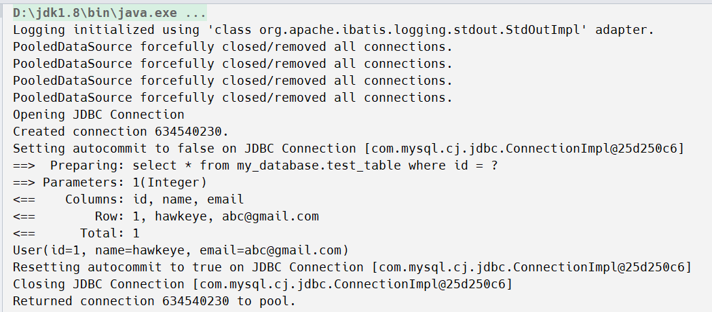

# 第一个mybatis程序

## 第一步：配置maven

`pom.xml`

```xml
<?xml version="1.0" encoding="UTF-8"?>
<project xmlns="http://maven.apache.org/POM/4.0.0"
         xmlns:xsi="http://www.w3.org/2001/XMLSchema-instance"
         xsi:schemaLocation="http://maven.apache.org/POM/4.0.0 http://maven.apache.org/xsd/maven-4.0.0.xsd">
    <modelVersion>4.0.0</modelVersion>

    <groupId>org.example</groupId>
    <artifactId>mybatis</artifactId>
    <packaging>pom</packaging>
    <version>1.0-SNAPSHOT</version>
    <modules>
        <module>mybatis-01</module>
    </modules>
    <dependencies>
        <!-- https://mvnrepository.com/artifact/org.mybatis/mybatis -->
        <dependency>
            <groupId>org.mybatis</groupId>
            <artifactId>mybatis</artifactId>
            <version>3.5.7</version>
        </dependency>
        <dependency>
            <groupId>org.projectlombok</groupId>
            <artifactId>lombok</artifactId>
            <version>1.18.20</version>
        </dependency>
        <dependency>
            <groupId>junit</groupId>
            <artifactId>junit</artifactId>
            <version>4.12</version>
            <scope>test</scope>
        </dependency>
        <dependency>
            <groupId>mysql</groupId>
            <artifactId>mysql-connector-java</artifactId>
            <version>8.0.25</version>
        </dependency>

    </dependencies>
    <build>
        <resources>
            <resource>
                <directory>src/main/resources</directory>
                <includes>
                    <include>**/*.properties</include>
                    <include>**/*.xml</include>
                </includes>
                <filtering>true</filtering>
            </resource>
            <resource>
                <directory>src/main/java</directory>
                <includes>
                    <include>**/*.properties</include>
                    <include>**/*.xml</include>
                </includes>
                <filtering>true</filtering>
            </resource>
        </resources>
    </build>


</project>
```

这里导入依赖如下：

- mybatis
- lombok
- junit
- mysql-connector-java

除此之外，因为我们的UserMapper.xml文件在main/java下不在main/resource下，需要额外配置build。

只要我们要用的xml或properties文件在main/java下 就要配置这个build，推荐所有的maven直接就配。

```xml
<build>
        <resources>
            <resource>
                <directory>src/main/resources</directory>
                <includes>
                    <include>**/*.properties</include>
                    <include>**/*.xml</include>
                </includes>
                <filtering>true</filtering>
            </resource>
            <resource>
                <directory>src/main/java</directory>
                <includes>
                    <include>**/*.properties</include>
                    <include>**/*.xml</include>
                </includes>
                <filtering>true</filtering>
            </resource>
        </resources>
    </build>
```

## 第二步：编写mybatis工具类

`MybatisUtils.java`

```java
package com.xzc.utils;

import org.apache.ibatis.io.Resources;
import org.apache.ibatis.session.SqlSession;
import org.apache.ibatis.session.SqlSessionFactory;
import org.apache.ibatis.session.SqlSessionFactoryBuilder;

import java.io.IOException;
import java.io.InputStream;

public class MybatisUtils {
    private static SqlSessionFactory sqlSessionFactory;
    static {
        {
            try {
                String resource = "mybatis-config.xml";
                InputStream inputStream = Resources.getResourceAsStream(resource);
                sqlSessionFactory = new SqlSessionFactoryBuilder().build(inputStream);
            } catch (IOException e) {
                e.printStackTrace();
            }
        }

    }

    public static SqlSession getSqlSession(){
        return sqlSessionFactory.openSession();
    }

}

```

这里注意核心就是获取`sqlSessionFactory`，然后用`openSession`方法返回一个`SqlSession`。

## 第三步：编写实体类

`User.java`

```java
package com.xzc.pojo;


import lombok.AllArgsConstructor;
import lombok.Data;
import lombok.NoArgsConstructor;

@Data
@AllArgsConstructor
@NoArgsConstructor
public class User {
    private int id;
    private String name;
    private String password;
}
```

## 第四步：编写接口

`UserDao.java`

```java
package com.xzc.dao;

import com.xzc.pojo.User;

import java.util.List;

public interface UserDao {
    List<User> getUserList();
}

```

## 第五步：编写实现类（配置）

`UserMapper.xml`

```xml
<?xml version="1.0" encoding="UTF-8" ?>
<!DOCTYPE mapper
        PUBLIC "-//mybatis.org//DTD Mapper 3.0//EN"
        "http://mybatis.org/dtd/mybatis-3-mapper.dtd">
<mapper namespace="com.xzc.dao.UserDao">
    <select id="getUserList" resultType="com.xzc.pojo.User">
        select * from mybatis.users
    </select>
</mapper>
```

这里注意id就是我们接口中的方法名，resultType是我们的实体类（**一定要写全限定类名**）。虽然返回的是User的List，但是返回类型依然写User。

namespace的值也应和接口名一样。（**一定要写全限定类名**）

## 第六步：配置Mybatis

`mybatis-config.xml`

```xml
<?xml version="1.0" encoding="UTF-8" ?>
<!DOCTYPE configuration
        PUBLIC "-//mybatis.org//DTD Config 3.0//EN"
        "http://mybatis.org/dtd/mybatis-3-config.dtd">
<configuration>
    <environments default="development">
        <environment id="development">
            <transactionManager type="JDBC"/>
            <dataSource type="POOLED">
                <property name="driver" value="com.mysql.cj.jdbc.Driver"/>
                <property name="url" value="jdbc:mysql://localhost:3306/mybatis"/>
                <property name="username" value="root"/>
                <property name="password" value="010208"/>
            </dataSource>
        </environment>
    </environments>
    <mappers>
        <mapper resource="com/xzc/dao/UserMapper.xml"/>
    </mappers>
</configuration>
```

这里注意上面是连接数据库，下面mappers配置是注册我们刚才编写的mapper，**里面的resource一定要用'/'而不能用'.'**。

## 第七步：编写测试类

`UserDaoTest.java`

```java
package com.xzc.dao;

import com.xzc.pojo.User;
import com.xzc.utils.MybatisUtils;
import org.apache.ibatis.session.SqlSession;
import org.junit.Test;

import java.util.List;

public class UserDaoTest {
    @Test
    public void test(){
        try (SqlSession sqlSession = MybatisUtils.getSqlSession()){
            UserDao mapper = sqlSession.getMapper(UserDao.class);
            List<User> userList = mapper.getUserList();
            for (User user : userList) {
                System.out.println(user);
            }
        }

    }
}

```

这里因为我们的`sqlSession`需要关闭，所以最好用`try-with-resources`语句。

就是用我们编写的工具类的`get`方法，得到一个`sqlSession`，然后用其中的`getMapper`方法返回一个`UserDao`的实现类，再调用实现类实现的`get`方法，就可以拿到我们的userList。

结果：


# 增删改查

此时我们根据mybatis习惯将UserDao改为UserMapper

## 根据ID查询User

- 先在UserMapper接口中写getUserById方法。

```java
/**
     * 根据id查询用户
     * @param id
     * @return
     */
    User getUserById(int id);
```


- 再在UserMapper.xml中写sql语句。

```xml
<select id="getUserById" resultType="com.xzc.pojo.User" parameterType="int">
        select * from mybatis.users where id = #{id}
    </select>
```


这里` parameterType`是参数类型 很明显是int 而我们传进来的形参叫id 直接用#{}括起来id进行使用即可。

- 测试方法

```java
@Test
    public void test2(){
        try (SqlSession sqlSession = MybatisUtils.getSqlSession()){
            UserMapper mapper = sqlSession.getMapper(UserMapper.class);
            User user = mapper.getUserById(2);
            System.out.println(user);
        }
    }
```


## 插入一条数据

- 在UserMapper接口中写addUser方法。

```java
/**
     * 插入一个用户
     * @param user
     * @return
     */
    int addUser(User user);
```

- 在UserMapper.xml中写sql语句。

```xml
<insert id="addUser" parameterType="com.xzc.pojo.User">
        insert into mybatis.users (id, name ,password) values (#{id},#{name},#{password})
    </insert>
```

注意插入用insert，参数类型是User要写全限定类名，而我们#{}中的内容，是User实体类中的属性名，因为我们传进来的参数是User类型。


- 编写测试方法

```java
//增删改需要提交事务！
    @Test
    public void test3(){
        try (SqlSession sqlSession = MybatisUtils.getSqlSession()){
            UserMapper mapper = sqlSession.getMapper(UserMapper.class);
            int res = mapper.addUser(new User(4, "Haha", "456789"));
            //用sqlSession提交事务！
            sqlSession.commit();
        }
    }
```

结果：


**这里一定要注意，增删改需要提交事务，用`sqlSession`的`commit`方法提交！**（mybatis默认开启事务）

## 更新一条数据

```java
/**
     * 更新一个用户的数据
     * @param user
     * @return
     */
    int updateUser(User user);
```


```xml
<update id="updateUser" parameterType="com.xzc.pojo.User">
        update mybatis.users set name = #{name},password = #{password} where id = #{id};
    </update>
```

根据id来进行更新。

```java
@Test
    public void test4(){
        try (SqlSession sqlSession = MybatisUtils.getSqlSession()) {
            UserMapper mapper = sqlSession.getMapper(UserMapper.class);
            int res = mapper.updateUser(new User(4,"new","newpwd"));
            sqlSession.commit();
        }
    }
```

结果：


## 删除一条数据

```java
/**
     * 删除一个用户的数据
     * @param id
     * @return
     */
    int deleteUser(int id);
```


```xml
<delete id="deleteUser" parameterType="int">
        delete from mybatis.users where id = #{id}
    </delete>
```

```java
@Test
    public void test5(){
        try (SqlSession sqlSession = MybatisUtils.getSqlSession()){
            UserMapper mapper = sqlSession.getMapper(UserMapper.class);
            int res = mapper.deleteUser(4);
            sqlSession.commit();
        }
    }
```

结果：


## 总结

无论是增删改查，都只遵循以下三步：

- 在UserMapper接口中，定义要进行的操作。
- 在UserMapper实现类（xml）中，写入对应的sql语句，同时注意id是接口中的方法名，注意返回类型和传入参数类型。
- 编写测试方法，也是固定用法，用`try-with-resources`，传入`SqlSession`，这个`SqlSession`是通过之前的`MybatisUtils`得到的，然后通过`getMapper`方法得到一个`UserMapper`的实现类的实例`mapper`，然后调用对应的方法，最后如果是增删改，记得用`SqlSession`的`commit`方法提交事务！

# Map和模糊查询拓展

## Map

假如我们的实体类字段过多，我们应当考虑使用Map。


```java
@Test
    public void test(){
        try (SqlSession sqlSession = MyBatisUtil.getSqlSession()){
            UserMapper mapper = sqlSession.getMapper(UserMapper.class);
            Map<String, Object> m = new HashMap<>();
            m.put("id",1);
            m.put("name","hawkeye");
            mapper.updateUser2(m);
            //用sqlSession提交事务！
            sqlSession.commit();
        }

    }
```


这样我们只用传自己想传的参数而不用造一个User对象。而且map中的键我们可以随意定，在xml记得对应即可。

查询的时候，多个参数用Map，或者注解。

## 模糊查询

传入通配符即可。


```java
@Test
    public void test(){
        try (SqlSession sqlSession = MyBatisUtil.getSqlSession()){
            UserMapper mapper = sqlSession.getMapper(UserMapper.class);
            List<User> l = mapper.getUsersLike("hawk%");
            System.out.println(l);
        }
    }
```


**通配符最好写在方法参数中 不写在sql语句中**

# 配置解析

- mybatis-config.xml

## 环境配置（environments）

MyBatis 可以配置成适应多种环境，这种机制有助于将 SQL 映射应用于多种数据库之中， 现实情况下有多种理由需要这么做。例如，开发、测试和生产环境需要有不同的配置；或者想在具有相同 Schema 的多个生产数据库中使用相同的 SQL 映射。还有许多类似的使用场景。

**不过要记住：尽管可以配置多个环境，但每个 SqlSessionFactory 实例只能选择一种环境。**

### **事务管理器（transactionManager）**

**默认是JDBC**

在 MyBatis 中有两种类型的事务管理器（也就是 type="[JDBC|MANAGED]"）：

- JDBC – 这个配置直接使用了 JDBC 的提交和回滚设施，它依赖从数据源获得的连接来管理事务作用域。
- MANAGED – 这个配置几乎没做什么。它从不提交或回滚一个连接，而是让容器来管理事务的整个生命周期（比如 JEE 应用服务器的上下文）。 默认情况下它会关闭连接。然而一些容器并不希望连接被关闭，因此需要将 closeConnection 属性设置为 false 来阻止默认的关闭行为。

### **数据源（dataSource）**

**默认是POOLED**

dataSource 元素使用标准的 JDBC 数据源接口来配置 JDBC 连接对象的资源。

- 大多数 MyBatis 应用程序会按示例中的例子来配置数据源。虽然数据源配置是可选的，但如果要启用延迟加载特性，就必须配置数据源。

有三种内建的数据源类型（也就是 type="[UNPOOLED|POOLED|JNDI]"）：

**UNPOOLED**– 这个数据源的实现会每次请求时打开和关闭连接。虽然有点慢，但对那些数据库连接可用性要求不高的简单应用程序来说，是一个很好的选择。 性能表现则依赖于使用的数据库，对某些数据库来说，使用连接池并不重要，这个配置就很适合这种情形。UNPOOLED 类型的数据源仅仅需要配置以下 5 种属性：

- `driver` – 这是 JDBC 驱动的 Java 类全限定名（并不是 JDBC 驱动中可能包含的数据源类）。
- `url` – 这是数据库的 JDBC URL 地址。
- `username` – 登录数据库的用户名。
- `password` – 登录数据库的密码。
- `defaultTransactionIsolationLevel` – 默认的连接事务隔离级别。
- `defaultNetworkTimeout` – 等待数据库操作完成的默认网络超时时间（单位：毫秒）。查看 `java.sql.Connection#setNetworkTimeout()` 的 API 文档以获取更多信息。

作为可选项，你也可以传递属性给数据库驱动。只需在属性名加上“driver.”前缀即可，例如：

- `driver.encoding=UTF8`

这将通过 DriverManager.getConnection(url, driverProperties) 方法传递值为 `UTF8` 的 `encoding` 属性给数据库驱动。

**POOLED**– 这种数据源的实现利用“池”的概念将 JDBC 连接对象组织起来，避免了创建新的连接实例时所必需的初始化和认证时间。 这种处理方式很流行，能使并发 Web 应用快速响应请求。

除了上述提到 UNPOOLED 下的属性外，还有更多属性用来配置 POOLED 的数据源：

- `poolMaximumActiveConnections` – 在任意时间可存在的活动（正在使用）连接数量，默认值：10
- `poolMaximumIdleConnections` – 任意时间可能存在的空闲连接数。
- `poolMaximumCheckoutTime` – 在被强制返回之前，池中连接被检出（checked out）时间，默认值：20000 毫秒（即 20 秒）
- `poolTimeToWait` – 这是一个底层设置，如果获取连接花费了相当长的时间，连接池会打印状态日志并重新尝试获取一个连接（避免在误配置的情况下一直失败且不打印日志），默认值：20000 毫秒（即 20 秒）。
- `poolMaximumLocalBadConnectionTolerance` – 这是一个关于坏连接容忍度的底层设置， 作用于每一个尝试从缓存池获取连接的线程。 如果这个线程获取到的是一个坏的连接，那么这个数据源允许这个线程尝试重新获取一个新的连接，但是这个重新尝试的次数不应该超过 `poolMaximumIdleConnections` 与 `poolMaximumLocalBadConnectionTolerance` 之和。 默认值：3（新增于 3.4.5）
- `poolPingQuery` – 发送到数据库的侦测查询，用来检验连接是否正常工作并准备接受请求。默认是“NO PING QUERY SET”，这会导致多数数据库驱动出错时返回恰当的错误消息。
- `poolPingEnabled` – 是否启用侦测查询。若开启，需要设置 `poolPingQuery` 属性为一个可执行的 SQL 语句（最好是一个速度非常快的 SQL 语句），默认值：false。
- `poolPingConnectionsNotUsedFor` – 配置 poolPingQuery 的频率。可以被设置为和数据库连接超时时间一样，来避免不必要的侦测，默认值：0（即所有连接每一时刻都被侦测 — 当然仅当 poolPingEnabled 为 true 时适用）。

**JNDI** – 这个数据源实现是为了能在如 EJB 或应用服务器这类容器中使用，容器可以集中或在外部配置数据源，然后放置一个 JNDI 上下文的数据源引用。这种数据源配置只需要两个属性：

- `initial_context` – 这个属性用来在 InitialContext 中寻找上下文（即，initialContext.lookup(initial_context)）。这是个可选属性，如果忽略，那么将会直接从 InitialContext 中寻找 data_source 属性。
- `data_source` – 这是引用数据源实例位置的上下文路径。提供了 initial_context 配置时会在其返回的上下文中进行查找，没有提供时则直接在 InitialContext 中查找。

和其他数据源配置类似，可以通过添加前缀“env.”直接把属性传递给 InitialContext。比如：

- `env.encoding=UTF8`

这就会在 InitialContext 实例化时往它的构造方法传递值为 `UTF8` 的 `encoding` 属性。

你可以通过实现接口 `org.apache.ibatis.datasource.DataSourceFactory` 来使用第三方数据源实现：

```java
public interface DataSourceFactory {
  void setProperties(Properties props);
  DataSource getDataSource();
}
```

`org.apache.ibatis.datasource.unpooled.UnpooledDataSourceFactory` 可被用作父类来构建新的数据源适配器，比如下面这段插入 C3P0 数据源所必需的代码：

```java
import org.apache.ibatis.datasource.unpooled.UnpooledDataSourceFactory;
import com.mchange.v2.c3p0.ComboPooledDataSource;

public class C3P0DataSourceFactory extends UnpooledDataSourceFactory {

  public C3P0DataSourceFactory() {
    this.dataSource = new ComboPooledDataSource();
  }
}
```

为了令其工作，记得在配置文件中为每个希望 MyBatis 调用的 setter 方法增加对应的属性。 下面是一个可以连接至 PostgreSQL 数据库的例子：

```xml
<dataSource type="org.myproject.C3P0DataSourceFactory">
  <property name="driver" value="org.postgresql.Driver"/>
  <property name="url" value="jdbc:postgresql:mydb"/>
  <property name="username" value="postgres"/>
  <property name="password" value="root"/>
</dataSource>
```

## 属性（properties）

这些属性可以在外部进行配置，并可以进行动态替换。你既可以在典型的 Java 属性文件中配置这些属性，也可以在 properties 元素的子元素中设置。

db.properties

```properties
driver=com.mysql.cj.jdbc.Driver
url=jdbc:mysql://*
username=root
password=*
```

在核心配置文件中引入（注意xml中标签有顺序）


- 可以引入外部文件
- 可以自己在其中增加一些属性配置
- 对于同一个字段，优先使用外部文件的

## 类型别名（typeAliases）

类型别名可为 Java 类型设置一个缩写名字。 它仅用于 XML 配置，意在降低冗余的全限定类名书写。例如：

```xml
<typeAliases>
  <typeAlias alias="Author" type="domain.blog.Author"/>
  <typeAlias alias="Blog" type="domain.blog.Blog"/>
  <typeAlias alias="Comment" type="domain.blog.Comment"/>
  <typeAlias alias="Post" type="domain.blog.Post"/>
  <typeAlias alias="Section" type="domain.blog.Section"/>
  <typeAlias alias="Tag" type="domain.blog.Tag"/>
</typeAliases>
```

当这样配置时，`Blog` 可以用在任何使用 `domain.blog.Blog` 的地方。

注意xml中标签是有顺序的 不能乱写位置。


也可以指定一个包名，MyBatis 会在包名下面搜索需要的 Java Bean，比如：

```xml
<typeAliases>
  <package name="domain.blog"/>
</typeAliases>
```

每一个在包 `domain.blog` 中的 Java Bean，在没有注解的情况下，会使用 Bean 的首字母小写的非限定类名来作为它的别名。 比如 `domain.blog.Author` 的别名为 `author`；若有注解，则别名为其注解值。见下面的例子：

```java
@Alias("author")
public class Author {
    ...
}
```

```xml
<typeAliases>
  <package name="com.xzc.entity"/>
</typeAliases>
```

若改成上述xml配置，也能正常运行，但是建议User改成user，虽然两个都能正常识别，但是官方推荐此时类型首字母小写。

- 实体类很少的时候，推荐第一种优化
- 实体类很多的时候，推荐第二种优化

- 第一种可以自定义别名，第二种可以通过注解起别名。

## 设置（settings）

这是 MyBatis 中极为重要的调整设置，它们会改变 MyBatis 的运行时行为。 下表描述了设置中各项设置的含义、默认值等。

| 设置名                           | 描述                                                         | 有效值                                                       | 默认值                                                |
| :------------------------------- | :----------------------------------------------------------- | :----------------------------------------------------------- | :---------------------------------------------------- |
| cacheEnabled                     | 全局性地开启或关闭所有映射器配置文件中已配置的任何缓存。     | true \| false                                                | true                                                  |
| lazyLoadingEnabled               | 延迟加载的全局开关。当开启时，所有关联对象都会延迟加载。 特定关联关系中可通过设置 `fetchType` 属性来覆盖该项的开关状态。 | true \| false                                                | false                                                 |
| aggressiveLazyLoading            | 开启时，任一方法的调用都会加载该对象的所有延迟加载属性。 否则，每个延迟加载属性会按需加载（参考 `lazyLoadTriggerMethods`)。 | true \| false                                                | false （在 3.4.1 及之前的版本中默认为 true）          |
| multipleResultSetsEnabled        | 是否允许单个语句返回多结果集（需要数据库驱动支持）。         | true \| false                                                | true                                                  |
| useColumnLabel                   | 使用列标签代替列名。实际表现依赖于数据库驱动，具体可参考数据库驱动的相关文档，或通过对比测试来观察。 | true \| false                                                | true                                                  |
| useGeneratedKeys                 | 允许 JDBC 支持自动生成主键，需要数据库驱动支持。如果设置为 true，将强制使用自动生成主键。尽管一些数据库驱动不支持此特性，但仍可正常工作（如 Derby）。 | true \| false                                                | False                                                 |
| autoMappingBehavior              | 指定 MyBatis 应如何自动映射列到字段或属性。 NONE 表示关闭自动映射；PARTIAL 只会自动映射没有定义嵌套结果映射的字段。 FULL 会自动映射任何复杂的结果集（无论是否嵌套）。 | NONE, PARTIAL, FULL                                          | PARTIAL                                               |
| autoMappingUnknownColumnBehavior | 指定发现自动映射目标未知列（或未知属性类型）的行为。`NONE`: 不做任何反应`WARNING`: 输出警告日志（`'org.apache.ibatis.session.AutoMappingUnknownColumnBehavior'` 的日志等级必须设置为 `WARN`）`FAILING`: 映射失败 (抛出 `SqlSessionException`) | NONE, WARNING, FAILING                                       | NONE                                                  |
| defaultExecutorType              | 配置默认的执行器。SIMPLE 就是普通的执行器；REUSE 执行器会重用预处理语句（PreparedStatement）； BATCH 执行器不仅重用语句还会执行批量更新。 | SIMPLE REUSE BATCH                                           | SIMPLE                                                |
| defaultStatementTimeout          | 设置超时时间，它决定数据库驱动等待数据库响应的秒数。         | 任意正整数                                                   | 未设置 (null)                                         |
| defaultFetchSize                 | 为驱动的结果集获取数量（fetchSize）设置一个建议值。此参数只可以在查询设置中被覆盖。 | 任意正整数                                                   | 未设置 (null)                                         |
| defaultResultSetType             | 指定语句默认的滚动策略。（新增于 3.5.2）                     | FORWARD_ONLY \| SCROLL_SENSITIVE \| SCROLL_INSENSITIVE \| DEFAULT（等同于未设置） | 未设置 (null)                                         |
| safeRowBoundsEnabled             | 是否允许在嵌套语句中使用分页（RowBounds）。如果允许使用则设置为 false。 | true \| false                                                | False                                                 |
| safeResultHandlerEnabled         | 是否允许在嵌套语句中使用结果处理器（ResultHandler）。如果允许使用则设置为 false。 | true \| false                                                | True                                                  |
| mapUnderscoreToCamelCase         | 是否开启驼峰命名自动映射，即从经典数据库列名 A_COLUMN 映射到经典 Java 属性名 aColumn。 | true \| false                                                | False                                                 |
| localCacheScope                  | MyBatis 利用本地缓存机制（Local Cache）防止循环引用和加速重复的嵌套查询。 默认值为 SESSION，会缓存一个会话中执行的所有查询。 若设置值为 STATEMENT，本地缓存将仅用于执行语句，对相同 SqlSession 的不同查询将不会进行缓存。 | SESSION \| STATEMENT                                         | SESSION                                               |
| jdbcTypeForNull                  | 当没有为参数指定特定的 JDBC 类型时，空值的默认 JDBC 类型。 某些数据库驱动需要指定列的 JDBC 类型，多数情况直接用一般类型即可，比如 NULL、VARCHAR 或 OTHER。 | JdbcType 常量，常用值：NULL、VARCHAR 或 OTHER。              | OTHER                                                 |
| lazyLoadTriggerMethods           | 指定对象的哪些方法触发一次延迟加载。                         | 用逗号分隔的方法列表。                                       | equals,clone,hashCode,toString                        |
| defaultScriptingLanguage         | 指定动态 SQL 生成使用的默认脚本语言。                        | 一个类型别名或全限定类名。                                   | org.apache.ibatis.scripting.xmltags.XMLLanguageDriver |
| defaultEnumTypeHandler           | 指定 Enum 使用的默认 `TypeHandler` 。（新增于 3.4.5）        | 一个类型别名或全限定类名。                                   | org.apache.ibatis.type.EnumTypeHandler                |
| callSettersOnNulls               | 指定当结果集中值为 null 的时候是否调用映射对象的 setter（map 对象时为 put）方法，这在依赖于 Map.keySet() 或 null 值进行初始化时比较有用。注意基本类型（int、boolean 等）是不能设置成 null 的。 | true \| false                                                | false                                                 |
| returnInstanceForEmptyRow        | 当返回行的所有列都是空时，MyBatis默认返回 `null`。 当开启这个设置时，MyBatis会返回一个空实例。 请注意，它也适用于嵌套的结果集（如集合或关联）。（新增于 3.4.2） | true \| false                                                | false                                                 |
| logPrefix                        | 指定 MyBatis 增加到日志名称的前缀。                          | 任何字符串                                                   | 未设置                                                |
| logImpl                          | 指定 MyBatis 所用日志的具体实现，未指定时将自动查找。        | SLF4J \| LOG4J \| LOG4J2 \| JDK_LOGGING \| COMMONS_LOGGING \| STDOUT_LOGGING \| NO_LOGGING | 未设置                                                |
| proxyFactory                     | 指定 Mybatis 创建可延迟加载对象所用到的代理工具。            | CGLIB \| JAVASSIST                                           | JAVASSIST （MyBatis 3.3 以上）                        |
| vfsImpl                          | 指定 VFS 的实现                                              | 自定义 VFS 的实现的类全限定名，以逗号分隔。                  | 未设置                                                |
| useActualParamName               | 允许使用方法签名中的名称作为语句参数名称。 为了使用该特性，你的项目必须采用 Java 8 编译，并且加上 `-parameters` 选项。（新增于 3.4.1） | true \| false                                                | true                                                  |
| configurationFactory             | 指定一个提供 `Configuration` 实例的类。 这个被返回的 Configuration 实例用来加载被反序列化对象的延迟加载属性值。 这个类必须包含一个签名为`static Configuration getConfiguration()` 的方法。（新增于 3.2.3） | 一个类型别名或完全限定类名。                                 | 未设置                                                |

一个配置完整的 settings 元素的示例如下：

```xml
<settings>
  <setting name="cacheEnabled" value="true"/>
  <setting name="lazyLoadingEnabled" value="true"/>
  <setting name="multipleResultSetsEnabled" value="true"/>
  <setting name="useColumnLabel" value="true"/>
  <setting name="useGeneratedKeys" value="false"/>
  <setting name="autoMappingBehavior" value="PARTIAL"/>
  <setting name="autoMappingUnknownColumnBehavior" value="WARNING"/>
  <setting name="defaultExecutorType" value="SIMPLE"/>
  <setting name="defaultStatementTimeout" value="25"/>
  <setting name="defaultFetchSize" value="100"/>
  <setting name="safeRowBoundsEnabled" value="false"/>
  <setting name="mapUnderscoreToCamelCase" value="false"/>
  <setting name="localCacheScope" value="SESSION"/>
  <setting name="jdbcTypeForNull" value="OTHER"/>
  <setting name="lazyLoadTriggerMethods" value="equals,clone,hashCode,toString"/>
</settings>
```

比较常用的如下

比如，开启驼峰命名映射，把mapUnderscoreToCamelCase设为true。数据库通常不用驼峰，用下划线。

注意，logImpl指定 MyBatis 所用日志的具体实现，未指定时将自动查找。

以及cacheEnabled和lazyLoadingEnabled。

# 插件

- Mybatis Generator

- Mybatis Plus

# 映射器

**注册绑定我们的Mapper**

既然 MyBatis 的行为已经由上述元素配置完了，我们现在就要来定义 SQL 映射语句了。 但首先，我们需要告诉 MyBatis 到哪里去找到这些语句。 在自动查找资源方面，Java 并没有提供一个很好的解决方案，所以最好的办法是直接告诉 MyBatis 到哪里去找映射文件。 你可以使用相对于类路径的资源引用，或完全限定资源定位符（包括 `file:///` 形式的 URL），或类名和包名等。例如：

```xml
<!-- 使用相对于类路径的资源引用 -->
<mappers>
  <mapper resource="org/mybatis/builder/AuthorMapper.xml"/>
  <mapper resource="org/mybatis/builder/BlogMapper.xml"/>
  <mapper resource="org/mybatis/builder/PostMapper.xml"/>
</mappers>
<!-- 使用完全限定资源定位符（URL） -->
<mappers>
  <mapper url="file:///var/mappers/AuthorMapper.xml"/>
  <mapper url="file:///var/mappers/BlogMapper.xml"/>
  <mapper url="file:///var/mappers/PostMapper.xml"/>
</mappers>
<!-- 使用映射器接口实现类的完全限定类名 -->
<mappers>
  <mapper class="org.mybatis.builder.AuthorMapper"/>
  <mapper class="org.mybatis.builder.BlogMapper"/>
  <mapper class="org.mybatis.builder.PostMapper"/>
</mappers>
<!-- 将包内的映射器接口实现全部注册为映射器 -->
<mappers>
  <package name="org.mybatis.builder"/>
</mappers>
```

## 方式一（推荐）

```xml
<mappers>
        <mapper resource="com/xzc/mapper/UserMapper.xml"/>
</mappers>
```

## 方式二

```xml
<mappers>
    <mapper class="com.xzc.mapper.UserMapper"/>
</mappers>
```

- 接口和对应Mapper必须同名
- 接口和对应Mapper必须在同一个包下

## 方式三

```xml
<mappers>
        <package name="com.xzc.mapper"/>
</mappers>
```

- 接口和对应Mapper必须同名
- 接口和对应Mapper必须在同一个包下


# 生命周期和作用域

生命周期类别是至关重要的，因为错误的使用会导致非常严重的并发问题。


## SqlSessionFactoryBuilder

- 一旦创建了SqlSessionFactory，就不再需要了
- 局部变量

## SqlSessionFactory

- 可以理解为数据库连接池
- SqlSessionFactory 一旦被创建就应该在应用的运行期间一直存在，没有任何理由丢弃它或重新创建另一个实例。多次重建 SqlSessionFactory 被视为一种代码“坏习惯”
-  SqlSessionFactory 的最佳作用域是应用作用域。
- 最简单的就是使用单例模式或者静态单例模式。

## SqlSession


这里面的每一个Mapper就代表一个具体的业务。

- 连接到连接池的一个请求
- SqlSession 的实例不是线程安全的，因此是不能被共享的，所以它的最佳的作用域是请求或方法作用域。
- 用完之后需要关闭，否则资源被占用
- 一般用try-with-resource

```java
try (SqlSession session = sqlSessionFactory.openSession()) {
  // 你的应用逻辑代码
}
```

在所有代码中都遵循这种使用模式，可以保证所有数据库资源都能被正确地关闭。

## 映射器实例

映射器是一些绑定映射语句的接口。映射器接口的实例是从 SqlSession 中获得的。虽然从技术层面上来讲，任何映射器实例的最大作用域与请求它们的 SqlSession 相同。但方法作用域才是映射器实例的最合适的作用域。 也就是说，映射器实例应该在调用它们的方法中被获取，使用完毕之后即可丢弃。 映射器实例并不需要被显式地关闭。尽管在整个请求作用域保留映射器实例不会有什么问题，但是你很快会发现，在这个作用域上管理太多像 SqlSession 的资源会让你忙不过来。 因此，最好将映射器放在方法作用域内。就像下面的例子一样：

```java
try (SqlSession session = sqlSessionFactory.openSession()) {
  BlogMapper mapper = session.getMapper(BlogMapper.class);
  // 你的应用逻辑代码
}
```

# ResultMap

`resultMap` 元素是 MyBatis 中最重要最强大的元素。

如果实体类中的属性名和数据库中的列名不一致，查询会出一些问题，比如如果我的User类里有一个email，而数据库列名是em，那么在getUserById时，我们得到的User的email就会是null。

**这时候我们就需要结果集映射**

| 属性          | 描述                                                         |
| :------------ | :----------------------------------------------------------- |
| `id`          | 当前命名空间中的一个唯一标识，用于标识一个结果映射。         |
| `type`        | 类的完全限定名, 或者一个类型别名（关于内置的类型别名，可以参考上面的表格）。 |
| `autoMapping` | 如果设置这个属性，MyBatis 将会为本结果映射开启或者关闭自动映射。 这个属性会覆盖全局的属性 autoMappingBehavior。默认值：未设置（unset）。 |

解决方法：

- 起别名（不推荐）

```XML
<select id="getUserById" resultType="User" parameterType="int">
         select id,name,em as email from my_database.test_table where id = #{id}
</select>
```

- resultMap

column是数据库列，property是实体类属性

```xml
<resultMap id="UserMap" type="User">
        <result column="email" property="em"/>
        <result column="name" property="name"/>
        <result column="id" property="id"/>
</resultMap>
<select id="getUserById" resultMap="UserMap" parameterType="int">
        select * from my_database.test_table where id = #{id}
</select>
```

事实上，我们数据库用下划线分割，类用驼峰命名，在settings中开启驼峰下划线映射最方便。

# 日志

## 日志工厂

如果一个操作，出现了异常，需要排错，就需要日志。

重点关注mybatis设置里logImpl的STDOUT_LOGGING和LOG4J

在mybatis中具体使用哪个日志，在设置中设定。

STDOUT_LOGGING是标准日志输出。

```xml
 <settings>
        <setting name="logImpl" value="STDOUT_LOGGING"/>
</settings>
```



## log4j

Log4j是Apache的一个开源项目，通过使用Log4j，我们可以控制日志信息输送的目的地是控制台、文件、GUI组件，甚至是套接口服务器、NT的事件记录器、UNIX Syslog守护进程等；我们也可以控制每一条日志的输出格式；通过定义每一条日志信息的级别，我们能够更加细致地控制日志的生成过程。最令人感兴趣的就是，这些可以通过一个配置文件来灵活地进行配置，而不需要修改应用的代码。


先导入log4j依赖

```xml
<!-- https://mvnrepository.com/artifact/log4j/log4j -->
        <dependency>
            <groupId>log4j</groupId>
            <artifactId>log4j</artifactId>
            <version>1.2.17</version>
        </dependency>
```

配置log4j

```properties
# Global logging configuration
# 设置日志输出级别以及输出目的地，可以设置多个输出目的地，开发环境下，日志级别要设置成DEBUG或者ERROR
# 前面写日志级别，逗号后面写输出目的地：我自己下面设置的目的地相对应，以逗号分开
# log4j.rootLogger = [level],appenderName1,appenderName2,…
log4j.rootLogger=DEBUG,CONSOLE,LOGFILE

#### 控制台输出 ####
log4j.appender.CONSOLE=org.apache.log4j.ConsoleAppender
# 输出到控制台
log4j.appender.CONSOLE.Target = System.out
# 指定控制台输出日志级别
log4j.appender.CONSOLE.Threshold = DEBUG
# 默认值是 true, 表示是否立即输出
log4j.appender.CONSOLE.ImmediateFlush = true
# 设置编码方式
log4j.appender.CONSOLE.Encoding = UTF-8
# 日志输出布局
log4j.appender.CONSOLE.layout=org.apache.log4j.PatternLayout
# 如果日志输出布局为PatternLayout 自定义级别，需要使用ConversionPattern指定输出格式
log4j.appender.CONSOLE.layout.ConversionPattern=[%c] - %m%n

#### 输出错误信息到文件 ####
log4j.appender.LOGFILE=org.apache.log4j.RollingFileAppender
# 指定输出文件路径
log4j.appender.LOGFILE.File =./logs/error.log

log4j.appender.LOGFILE.MaxFileSize=10mb
#日志输出到文件，默认为true
log4j.appender.LOGFILE.Append = true
# 指定输出日志级别
log4j.appender.LOGFILE.Threshold = DEBUG
# 是否立即输出，默认值是 true,
log4j.appender.LOGFILE.ImmediateFlush = true
# 设置编码方式
log4j.appender.LOGFILE.Encoding = UTF-8
# 日志输出布局
log4j.appender.LOGFILE.layout = org.apache.log4j.PatternLayout
# 如果日志输出布局为PatternLayout 自定义级别，需要使用ConversionPattern指定输出格式
log4j.appender.LOGFILE.layout.ConversionPattern = %-d{yyyy-MM-dd HH:mm:ss}  [ %t:%r ] - [ %p ]  %m%n

#日志输出级别
log4j.logger.org.mybatis=DEBUG
log4j.logger.java.sql=DEBUG
log4j.logger.java.sql.Statement=DEBUG
log4j.logger.java.sql.ResultSet=DEBUG
log4j.logger.java.sql.PreparedStatement=DEBUG# Global logging configuration
# 设置日志输出级别以及输出目的地，可以设置多个输出目的地，开发环境下，日志级别要设置成DEBUG或者ERROR
# 前面写日志级别，逗号后面写输出目的地：我自己下面设置的目的地相对应，以逗号分开
# log4j.rootLogger = [level],appenderName1,appenderName2,…
log4j.rootLogger=DEBUG,CONSOLE,LOGFILE

#### 控制台输出 ####
log4j.appender.CONSOLE=org.apache.log4j.ConsoleAppender
# 输出到控制台
log4j.appender.CONSOLE.Target = System.out
# 指定控制台输出日志级别
log4j.appender.CONSOLE.Threshold = DEBUG
# 默认值是 true, 表示是否立即输出
log4j.appender.CONSOLE.ImmediateFlush = true
# 设置编码方式
log4j.appender.CONSOLE.Encoding = UTF-8
# 日志输出布局
log4j.appender.CONSOLE.layout=org.apache.log4j.PatternLayout
# 如果日志输出布局为PatternLayout 自定义级别，需要使用ConversionPattern指定输出格式
log4j.appender.CONSOLE.layout.ConversionPattern=[%c] - %m%n

#### 输出错误信息到文件 ####
log4j.appender.LOGFILE=org.apache.log4j.RollingFileAppender
# 指定输出文件路径
log4j.appender.LOGFILE.File =./logs/error.log

log4j.appender.LOGFILE.MaxFileSize=10mb
#日志输出到文件，默认为true
log4j.appender.LOGFILE.Append = true
# 指定输出日志级别
log4j.appender.LOGFILE.Threshold = DEBUG
# 是否立即输出，默认值是 true,
log4j.appender.LOGFILE.ImmediateFlush = true
# 设置编码方式
log4j.appender.LOGFILE.Encoding = UTF-8
# 日志输出布局
log4j.appender.LOGFILE.layout = org.apache.log4j.PatternLayout
# 如果日志输出布局为PatternLayout 自定义级别，需要使用ConversionPattern指定输出格式
log4j.appender.LOGFILE.layout.ConversionPattern = %-d{yyyy-MM-dd HH:mm:ss}  [ %t:%r ] - [ %p ]  %m%n

#日志输出级别
log4j.logger.org.mybatis=DEBUG
log4j.logger.java.sql=DEBUG
log4j.logger.java.sql.Statement=DEBUG
log4j.logger.java.sql.ResultSet=DEBUG
log4j.logger.java.sql.PreparedStatement=DEBUG
```


使用：

- 在要使用log4j的类中导入包

- 用反射生成日志对象
- 调用对象方法

```java
package com.xzc;


import com.xzc.entity.User;
import com.xzc.mapper.UserMapper;
import com.xzc.utils.MyBatisUtil;
import org.apache.ibatis.session.SqlSession;
import org.apache.log4j.Logger;
import org.junit.Test;

public class MyTest {
    static Logger logger = Logger.getLogger(MyTest.class);
    @Test
    public void test(){

        try (SqlSession sqlSession = MyBatisUtil.getSqlSession()){
            UserMapper mapper = sqlSession.getMapper(UserMapper.class);
            User userById = mapper.getUserById(1);
            logger.info(userById);
        }

    }
}
```

常用三个级别

- info
- debug
- error

# 分页

## limit（核心）

语法

```sql
select * from table limit startIndex,pageSize

select * from table limit 0,2

```


```java
package com.xzc;
import com.xzc.entity.User;
import com.xzc.mapper.UserMapper;
import com.xzc.utils.MyBatisUtil;
import org.apache.ibatis.session.SqlSession;
import org.apache.log4j.Logger;
import org.junit.Test;
import java.util.HashMap;
import java.util.List;
import java.util.Map;
public class MyTest {
    static Logger logger = Logger.getLogger(MyTest.class);
    @Test
    public void test(){
        try (SqlSession sqlSession = MyBatisUtil.getSqlSession()){
            UserMapper mapper = sqlSession.getMapper(UserMapper.class);
            Map<String,Object> map = new HashMap<>();
            map.put("startIndex",2);
            map.put("pageSize",2);
            List<User> usersByLimit = mapper.getUsersByLimit(map);
            logger.info(usersByLimit);
        }

    }
}
```

结果：


## RowBounds

从java代码层面实现分页。


```java
package com.xzc;


import com.xzc.entity.User;
import com.xzc.mapper.UserMapper;
import com.xzc.utils.MyBatisUtil;
import org.apache.ibatis.session.RowBounds;
import org.apache.ibatis.session.SqlSession;
import org.apache.log4j.Logger;
import org.junit.Test;

import java.util.HashMap;
import java.util.List;
import java.util.Map;

public class MyTest {
    static Logger logger = Logger.getLogger(MyTest.class);
    @Test
    public void test(){
        RowBounds rowBounds = new RowBounds(1, 2);
        try (SqlSession sqlSession = MyBatisUtil.getSqlSession()){
            UserMapper mapper = sqlSession.getMapper(UserMapper.class);
            List<User> list = sqlSession.selectList("com.xzc.mapper.UserMapper.getUsersByRowBounds", null, rowBounds);
            logger.info(list);
        }

    }
}
```

``sqlSession.selectList``有个构造器三个参数，第一个参数是全限定类名，第二个参数是RowBounds对象。


## PageHelper

官网：[MyBatis 分页插件 PageHelper](https://pagehelper.github.io/)

# 使用注解开发

对于像 BlogMapper 这样的映射器类来说，还有另一种方法来完成语句映射。 它们映射的语句可以不用 XML 来配置，而可以使用 Java 注解来配置。比如：

```java
package org.mybatis.example;
public interface BlogMapper {
  @Select("SELECT * FROM blog WHERE id = #{id}")
  Blog selectBlog(int id);
}
```

使用注解来映射简单语句会使代码显得更加简洁，但对于稍微复杂一点的语句，Java 注解不仅力不从心，还会让你本就复杂的 SQL 语句更加混乱不堪。 **因此，如果你需要做一些很复杂的操作，最好用 XML 来映射语句**。

选择何种方式来配置映射，以及认为是否应该要统一映射语句定义的形式，完全取决于你和你的团队。 换句话说，永远不要拘泥于一种方式，你可以很轻松的在基于注解和 XML 的语句映射方式间自由移植和切换。

1.注解在接口上实现

```java
@Select("select * from `user`")
List<User> getUsers();
```

2.需要在核心配置文件中绑定接口

```xml
<mappers>    
    <mapper class="com.guan.dao.UserMapper"></mapper>
</mappers>
```

- 本质：反射机制实现
- 底层：动态代理


# Mybatis执行流程剖析


# 注解增删改查

我们可以在工具类创建的时候实现自动提交事务

```java
public static SqlSession getSqlSession() { 
    return sqlSessionFactory.openSession(true); 
}
```

1.编写接口，增加注释，记得接口注册绑定到核心配置文件

```java
@Select("select * from `user`")
List<User> getUsers();
@Insert("insert into `user` values(#{id},#{name},#{pwd})")
void insertUser(@Param("id") int id,@Param("name") String name,@Param("pwd") String pwd);@Insert("insert into `user` values(#{id},#{name},#{pwd})")
void insertUser(User user);
```

2.测试

**关于[@Param](https://github.com/Param)()注解**

- 基本类型的参数或者String类型，需要加上
- 引用类型不需要加
- 如果只有一个基本类型，可以忽略，但是建议都加上
- 在SQL中引用的是[@Param](https://github.com/Param)()中设定的属性名

**#{}和${}区别**
preparedStatement和Statement的区别，#{}可以防止sql注入

# 复杂查询

**对象使用association 集合使用collection**

## 配置环境

创建数据库

```sql
CREATE TABLE `teacher` (
  `id` INT(10) NOT NULL,
  `name` VARCHAR(30) DEFAULT NULL,
  PRIMARY KEY (`id`)
) ENGINE=INNODB DEFAULT CHARSET=utf8
INSERT INTO teacher(`id`, `name`) VALUES (1, '老师'); 
CREATE TABLE `student` (
  `id` INT(10) NOT NULL,
  `name` VARCHAR(30) DEFAULT NULL,
  `tid` INT(10) DEFAULT NULL,
  PRIMARY KEY (`id`),
  KEY `fktid` (`tid`),
  CONSTRAINT `fktid` FOREIGN KEY (`tid`) REFERENCES `teacher` (`id`)
) ENGINE=INNODB DEFAULT CHARSET=utf8
INSERT INTO `student` (`id`, `name`, `tid`) VALUES (1, '小明', 1); 
INSERT INTO `student` (`id`, `name`, `tid`) VALUES (2, '小红', 1); 
INSERT INTO `student` (`id`, `name`, `tid`) VALUES (3, '小张', 1); 
INSERT INTO `student` (`id`, `name`, `tid`) VALUES (4, '小李', 1); 
INSERT INTO `student` (`id`, `name`, `tid`) VALUES (5, '小王', 1);
```

测试环境搭建
1.导入lombok
2.新建实体类Teacher，Student

```java
package com.xzc.entity;
import lombok.AllArgsConstructor;
import lombok.Data;
import lombok.NoArgsConstructor;
@Data
@NoArgsConstructor
@AllArgsConstructor
public class Student {
    private int id;

    private String name;
    /**
     *学生关联一个老师
     */
    private Teacher teacher;
}
```

```java
package com.xzc.entity;

import lombok.AllArgsConstructor;
import lombok.Data;
import lombok.NoArgsConstructor;

@Data
@AllArgsConstructor
@NoArgsConstructor
public class Teacher {
    private int id;

    private String name;
}
```

3.建立Mapper接口

```java
package com.xzc.mapper;

import com.xzc.entity.Teacher;
import org.apache.ibatis.annotations.Param;
import org.apache.ibatis.annotations.Select;

public interface TeacherMapper {
    //已经连接数据库了直接写表名即可
    @Select("select * from teacher where id = #{tid}")
    Teacher getTeacherById(@Param("tid") int id);
}

```

4.建立Mapper.xml文件


5.在核心配置文件中绑定注册Mapper接口或文件

```xml
<mappers>
        <mapper class="com.xzc.mapper.StudentMapper"/>
        <mapper class="com.xzc.mapper.TeacherMapper"/>
    </mappers>
```

6.测试查询是否成功


## 多对一

注意

- javaType是指定属性的类型
- ofType是集合中的泛型信息获取

### 按照查询嵌套

```xml
<resultMap id="st" type="Student">
        <result property="id" column="id"/>
        <result property="name" column="name"/>
        <association property="teacher" column="tid" javaType="Teacher" select="getTeacher"/>
    </resultMap>
    <select id="getStudents" resultMap="st">
        select * from student
    </select>
    <select id="getTeacher" resultType="Teacher" parameterType="int">
        select * from teacher where id = #{id}
    </select>
```

> 这里我们每个学生（Student）都有一个属性（property）叫teacher，类型（javaType）是“Teacher”，对应数据库的列（column）是“tid”，通过tid得到一个Teacher类的查询（select）语句的id是“getTeacher”，就这样联系起来，实现联结。

这里我们使用结果集映射，将tid映射成Teacher类，而Teacher类本身需要tid去查询。

测试：

```java
package com.xzc;


import com.xzc.entity.Student;
import com.xzc.entity.Teacher;
import com.xzc.mapper.StudentMapper;
import com.xzc.mapper.TeacherMapper;
import com.xzc.utils.MyBatisUtil;
import org.apache.ibatis.session.SqlSession;
import org.apache.log4j.Logger;
import org.junit.Test;

import java.util.List;

public class MyTest {
    static Logger logger = Logger.getLogger(MyTest.class);
    @Test
    public void test(){

        try (SqlSession sqlSession = MyBatisUtil.getSqlSession()){
            StudentMapper mapper = sqlSession.getMapper(StudentMapper.class);
            List<Student> students = mapper.getStudents();
            for(Student s : students){
                System.out.println(s);
            }
        }

    }
}
```


### 按照结果嵌套

```xml
<select id="getStudent" resultMap="myMap">
    select s.id sid,s.name sname,t.name tname
    from `student` as s,`teacher` as t
    where s.tid = t.id;
</select>
<resultMap id="myMap" type="Student">
    <result property="id" column="sid"></result>
    <result property="name" column="sname"/>
    <association property="teacher" javaType="Teacher">
        <result property="name" column="tname"/>
    </association>
</resultMap>
```

## 一对多

将Student类中的Teacher类换成int类型的tid

Teacher类：

```java
package com.xzc.entity;

import lombok.AllArgsConstructor;
import lombok.Data;
import lombok.NoArgsConstructor;

import java.util.List;

@Data
@AllArgsConstructor
@NoArgsConstructor
public class Teacher {
    private int id;

    private String name;
    /**
     * 一个老师拥有多个学生
     */
    private List<Student> students;
}

```

### 按照查询嵌套

这里我们collection标签中的column是teacher表中的列名，所以是id，而不是tid，我们可以理解为需要一个值作为参数从当前select传入子查询select，也就是通过在student表通过tid查学生，那么这个tid对应的需要teacher表中的id。（当然注意我们在写Mapper使用了注解规定了参数名为tid，两者不是一个，容易混淆，不建议这样使用）

```XML
<?xml version="1.0" encoding="UTF-8" ?>
<!DOCTYPE mapper
        PUBLIC "-//mybatis.org//DTD Mapper 3.0//EN"
        "http://mybatis.org/dtd/mybatis-3-mapper.dtd">
<mapper namespace="com.xzc.mapper.TeacherMapper">

    <resultMap id="myMap" type="Teacher">
        <result property="id" column="id"/>
        <result property="name" column="name"/>
        <collection property="students" javaType="ArrayList" ofType="Student" select="getStudentByTid" column="id"/>
    </resultMap>
    <select id="getTeacherById" resultMap="myMap" parameterType="int">
        select * from teacher where id = #{tid}
    </select>
    <select id="getStudentByTid" resultType="Student" parameterType="int">
        select * from student where tid = #{id}
    </select>
</mapper>
```

测试：

```java
package com.xzc;


import com.xzc.entity.Student;
import com.xzc.entity.Teacher;
import com.xzc.mapper.StudentMapper;
import com.xzc.mapper.TeacherMapper;
import com.xzc.utils.MyBatisUtil;
import org.apache.ibatis.session.SqlSession;
import org.apache.log4j.Logger;
import org.junit.Test;

import java.util.List;

public class MyTest {
    static Logger logger = Logger.getLogger(MyTest.class);
    @Test
    public void test(){

        try (SqlSession sqlSession = MyBatisUtil.getSqlSession()){
            TeacherMapper mapper = sqlSession.getMapper(TeacherMapper.class);
            Teacher t = mapper.getTeacherById(1);
            System.out.println(t.getId());
            System.out.println(t.getName());
            for(Student s:t.getStudents()){
                System.out.println(s);
            }
        }

    }
}
```


### 按照结果嵌套

```xml
<?xml version="1.0" encoding="UTF-8" ?>
<!DOCTYPE mapper
        PUBLIC "-//mybatis.org//DTD Mapper 3.0//EN"
        "http://mybatis.org/dtd/mybatis-3-mapper.dtd">
<mapper namespace="com.xzc.mapper.TeacherMapper">
    <resultMap id="myMap" type="Teacher">
        <result property="id" column="tid"/>
        <result property="name" column="tname"/>
        <collection property="students" ofType="Student">
            <result property="id" column="sid"/>
            <result property="name" column="sname"/>
            <result property="tid" column="tid"/>
        </collection>
    </resultMap>
    <select id="getTeacherById" resultMap="myMap" parameterType="int">
        select s.id sid,s.name sname,t.name tname,t.id tid
        from `teacher` t,`student` s
        where t.id = s.tid and t.id = #{tid};
    </select>
</mapper>
```

测试


## 小结

- 关联-association
- 集合-collection
- javaType是指定实体类中属性的类型
- ofType是集合泛型约束类型

# 动态SQL

## 搭建环境

```SQL
CREATE TABLE `blog`(
`id` VARCHAR(50) NOT NULL COMMENT '博客id',
`title` VARCHAR(100) NOT NULL COMMENT '博客标题',
`author` VARCHAR(30) NOT NULL COMMENT '博客作者',
`create_time` DATETIME NOT NULL COMMENT '创建时间',
`views` INT(30) NOT NULL COMMENT '浏览量'
)ENGINE=INNODB DEFAULT CHARSET=utf8
```

```java
package com.xzc.entity;

import lombok.AllArgsConstructor;
import lombok.Data;
import lombok.NoArgsConstructor;

import java.util.Date;

@Data
@AllArgsConstructor
@NoArgsConstructor
public class Blog {
    private int id;
    private String title;
    private String author;
    private Date createTime;
    private int views;
}

```


## if

if拼接

```xml
<?xml version="1.0" encoding="UTF-8" ?>
<!DOCTYPE mapper
        PUBLIC "-//mybatis.org//DTD Mapper 3.0//EN"
        "http://mybatis.org/dtd/mybatis-3-mapper.dtd">
<mapper namespace="com.xzc.mapper.BlogMapper">
    <insert id="addBlog" parameterType="Blog">
        insert into blog (id,title,author,create_time,views)
        values (#{id},#{title},#{author},#{createTime},#{views});
    </insert>
    <select id="getBlogIF" parameterType="map" resultType="blog">
        select * from blog where 1 = 1
        <if test="title != null">
            and title = #{title}
        </if>
        <if test="author != null">
            and author = #{author}
        </if>
    </select>
</mapper>
```

```java
package com.xzc;


import com.xzc.entity.Blog;
import com.xzc.mapper.BlogMapper;
import com.xzc.utils.MyBatisUtil;
import org.apache.ibatis.session.SqlSession;
import org.apache.log4j.Logger;
import org.junit.Test;
import java.util.HashMap;
import java.util.List;
import java.util.Map;

public class MyTest {
    static Logger logger = Logger.getLogger(MyTest.class);
    @Test
    public void test(){

        try (SqlSession sqlSession = MyBatisUtil.getSqlSession()){
            BlogMapper mapper = sqlSession.getMapper(BlogMapper.class);
            Map<String,Object> m = new HashMap<>();
            List<Blog> blogIF = mapper.getBlogIF(m);
            for (Blog b :blogIF){
                System.out.println(b);
            }
        }

    }
}
```


若添加`m.put("title","java");`


可以看到通过动态SQL的IF+MAP实现了灵活查询

## trim、where、set

*where* 元素只会在子元素返回任何内容的情况下才插入 “WHERE” 子句。而且，若子句的开头为 “AND” 或 “OR”，*where* 元素也会将它们去除。

用where改造if

```xml
<select id="getBlogChoose" parameterType="map" resultType="blog">
        select * from blog
        <where>
            <if test="title != null">
                title = #{title}
            </if>
            <if test="author != null">
                and author = #{author}
            </if>
        </where>
    </select>
```

所以要用where标签 不要用sql中的where

set用法，用于动态更新语句的类似解决方案叫做 *set*。*set* 元素可以用于动态包含需要更新的列，忽略其它不更新的列

```xml
<update id="updateBlog" parameterType="map">
    update `mybatis`.blog
    <set>
        <if test="title != null">
            title = #{title},
        </if>
        <if test="author != null">
            author = #{author}
        </if>
    </set>
    where id = #{id};
</update>
```

trim可以自定义where和set的功能，一般不常见

## choose、when、otherwise

有时候，我们不想使用所有的条件，而只是想从多个条件中选择一个使用。针对这种情况，MyBatis 提供了 choose 元素，它有点像 Java 中的 switch 语句。

传入了 “title” 就按 “title” 查找，传入了 “author” 就按 “author” 查找的情形。若两者都没有传入，就返回标记为 views 的 BLOG（默认views一定传）

```xml
<select id="queryBlogChoose" resultType="Blog" parameterType="map">
    select *
    from `mybatis`.blog
    <where>
        <choose>
            <when test="title != null">
                and title = #{title}
            </when>
            <when test="author != null">
                and author = #{author}
            </when>
            <otherwise>
                and views = #{views}
            </otherwise>
        </choose>
    </where>
</select>
```

## SQL片段

有的时候，我们可能会讲一些功能抽取出来，方便复用
1.使用SQL标签抽取公共的部分

```xml
<sql id="if-title-test">
    <if test="title != null">
        and title = #{title};
    </if>
    <if test="author != null">
        and author = #{author};
    </if>
    <if test="views != null">
        and views > #{views};
    </if>
</sql>
```

2.在需要使用的地方使用include标签引用

```XML
<select id="queryBlogIf" resultType="Blog" parameterType="map">
    select *
    from `mybatis`.`blog`
    <where>
        <include refid="if-title-test"></include>
    </where>
</select>
```

注意事项

- 最好基于单表来定义SQL片段
- 不要存在where标签

## foreach

动态 SQL 的另一个常见使用场景是对集合进行遍历（尤其是在构建 IN 条件语句的时候）。比如：

```xml
<select id="selectPostIn" resultType="domain.blog.Post">
  SELECT *
  FROM POST P
  WHERE ID in
  <foreach item="item" index="index" collection="list"
      open="(" separator="," close=")">
        #{item}
  </foreach>
</select>
```

*foreach* 元素的功能非常强大，它允许你指定一个集合，声明可以在元素体内使用的集合项（item）和索引（index）变量。它也允许你指定开头与结尾的字符串以及集合项迭代之间的分隔符。这个元素也不会错误地添加多余的分隔符.

```XML
<select id="queryBlogForeach" parameterType="map" resultType="Blog">
    ##select * from `mybatis`.blog where 1=1 and (id=1 or id=2 or id=3)
    select *
    from `mybatis`.blog
    <where>
        <foreach collection="ids" item="id" open="and (" close=")" separator="or">
            id = #{id}
        </foreach>
    </where>
</select>
```

# 缓存

## 简介

查询：连接数据库，消耗资源！

- 一次查询的结果，暂存在一个可以直接取到的地方！—> 内存：缓存
- 再次查询相同数据的时候，直接走缓存，不用走数据库

1.什么是缓存？

- 存在内存中的临时数据
- 将用户经常查询的数据放在缓存(内存)中，用户去查询数据就不用从磁盘上(关系型数据库数据文件)查询，而是从缓存中查询，从而提高了查询效率，解决了高并发系统的性能问题。
  2.为什么使用缓存
- 减少和数据库的交互次数，减少系统开销，提高系统效率
  3.什么样的数据能使用缓存？
- 经常查询而且不经常改变的数据

## Mybatis缓存

- MyBatis包含一个非常强大的查询缓存特性，它可以非常方便地定制和配置缓存。缓存可以极大的提升查询效率

- MyBatis系统中默认定了了两级缓存：

  一级缓存和二级缓存

  - 默认情况下，只有一级缓存开启(SqlSession级别的缓存，也成为本地缓存)
  - 二级缓存需要手动开启和配置，居于namespace级别的缓存
  - 为了提高扩展性，MyBatis定义了缓存接口Cache。我们可以通过实现Cache接口来定义二级缓存

## 一级缓存

- 一级缓存也叫本地缓存：SqlSession
  - 与数据库同义词会话期间查询到的数据会放在本地缓存中。
  - 以后如果需要获取相同的数据，直接从缓存中拿，没必要再去查询数据库

测试步骤：
1.开启日志
2.测试在一个Session中查询两次相同记录

缓存失效情况：
1.查询不同记录
2.增删改操作，可能改变原来数据，必定会刷新缓存
3.手动清理缓存

## 二级缓存

- 二级缓存也叫全局缓存，一级缓存作用域太低了，所以诞生了二级缓存
- 基于namespace级别的缓存，一个命名空间，对应一个二级缓存；
- 工作机制
  - 一个会话查询一条数据，这个数据就会被放在当前会话的以及缓存中
  - 如果当前会话关闭了，这个会话对应的一级缓存就没了；但是我们想要的是，会话关闭了，一级缓存尺寸中的数据被保存到二级缓存中
  - 新的会话查询信息，就可以从耳机缓存中获取内容
  - 不同的mapper查处的数据会放在自己对应的缓存(map)中

步骤：
1.开启缓存

```xml
<setting name="cacheEnable" value="true"/>
```

2.在要使用二级缓存的Mapper中开启

```xml
<cache    
       eviction="FIFO"    
       flushInterval="60000"    
       size="512"    
       readOnly="true"/>
```

3.测试

小结

- 只要开启了二级缓存，在同一个Mapper下就有效
- 所有的数据到会先放在一级缓存中
- 只有当会话提交，或者关闭的时候，才会提交到二级缓存中

## Mybatis缓存原理


## 自定义缓存Ehcache

Ehcache是一种广泛使用的开源Java分布式缓存，主要面向通用缓存
要在程序中使用ehcacche，要先导包

```xml
<dependency>    
 <groupId>org.mybatis.caches</groupId>    
    <artifactId>mybatis-ehcache</artifactId>   
    <version>1.2.1</version>
</dependency>
```

ehcache.xml

```XML
<?xml version="1.0" encoding="UTF-8" ?>
<ehcache xmlns:xsi="http://www.w3.org/2001/XMLSchema-instance"
        xsi:noNamespaceSchemaLocation="http://ehcache.org/ehcache.xsd"
        updateCheck="false">
    <diskStore path="./tmpdir/Tmp_EhCache"/>
    <defaultCache
        eternal="false"
        maxElementsInMemory="10000"
        overflowToDisk="false"
        diskPersistent="false"
        timeToIdleSeconds="1800"
        timeToLiveSeconds="259200"
        memoryStoreEvictionPolicy="LRU"/>
    <cache
        name="cloud_user"
        eternal="false"
        maxElementsInMemory="5000"
        overflowToDisk="false"
        diskPersistent="false"
        timeToIdleSeconds="1800"
        timeToLiveSeconds="1800"
        memoryStoreEvictionPolicy="LRU"/>
</ehcache>
```

