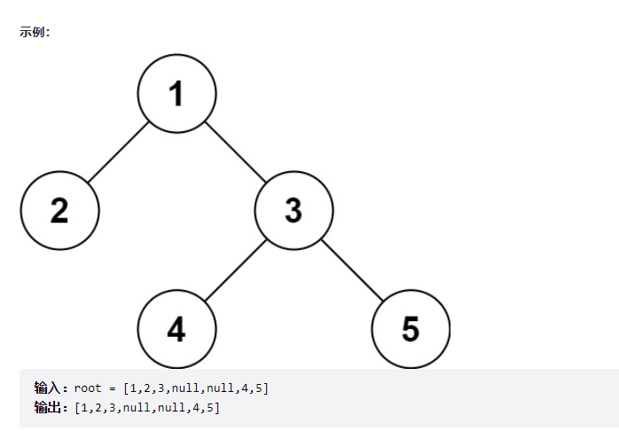
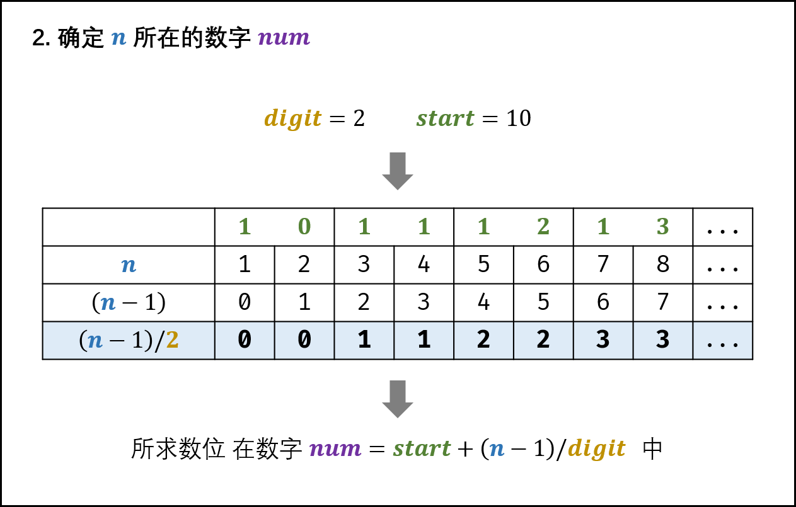

# 剑指Offer（第二版）刷题记录

# 栈与队列

## 9.用两个栈实现队列

> 用两个栈实现一个队列。队列的声明如下，请实现它的两个函数 appendTail 和 deleteHead ，分别完成在队列尾部插入整数和在队列头部删除整数的功能。(若队列中没有元素，deleteHead 操作返回 -1 )

思路是添加的时候往stack1中添加，如果要弹出，分三种情况，若stack2不空，就把stack2弹出，若stack2空但stack1不空，就把stack1的元素全部弹出到stack2，然后把stack2弹出一个，若都空，则返回-1。

```JAVA
class CQueue {

    private Deque<Integer> stack1;
    private Deque<Integer> stack2;
    public CQueue() {
        stack1 = new ArrayDeque<>();
        stack2 = new ArrayDeque<>();
    }

    public void appendTail(int value) {
        stack1.push(value);
    }

    public int deleteHead() {
        if (!stack2.isEmpty()){
            return stack2.pop();
        }else if (!stack1.isEmpty()){
            while (!stack1.isEmpty()){
                stack2.push(stack1.pop());
            }
            return stack2.pop();
        }else {
            return -1;
        }
    }
}
/**
 * Your CQueue object will be instantiated and called as such:
 * CQueue obj = new CQueue();
 * obj.appendTail(value);
 * int param_2 = obj.deleteHead();
 */
```

## 30.包含min函数的栈

> 定义栈的数据结构，请在该类型中实现一个能够得到栈的最小元素的 min 函数在该栈中，调用 min、push 及 pop 的时间复杂度都是 O(1)。


```JAVA
class MinStack {

    private Deque<Integer> stack;
    private Deque<Integer> helper;
    /** initialize your data structure here. */
    public MinStack() {
        stack = new ArrayDeque<>();
        helper = new ArrayDeque<>();
    }

    public void push(int x) {
        stack.push(x);
        if (helper.isEmpty()||helper.peek() >= x) {
            helper.push(x);
        }
    }

    public void pop() {
        if (stack.pop().equals(helper.peek())){
            helper.pop();
        }
    }

    public int top() {
        return stack.peek();
    }

    public int min() {
        return helper.peek();
    }
}

/**
 * Your MinStack object will be instantiated and called as such:
 * MinStack obj = new MinStack();
 * obj.push(x);
 * obj.pop();
 * int param_3 = obj.top();
 * int param_4 = obj.min();
 */
```

本题主要在辅助栈的设计。

注意：

> 此题如果用==将会无法通过 Integer的equals重写过，比较的是内部value的值， ==如果在[-128,127]会被cache缓存,超过这个范围则比较的是对象是否相同

## 59 - I. 滑动窗口的最大值

> 给定一个数组 nums 和滑动窗口的大小 k，请找出所有滑动窗口里的最大值。
>
> 示例:
>
> 输入: nums = [1,3,-1,-3,5,3,6,7], 和 k = 3
> 输出: [3,3,5,5,6,7] 
> 解释: 
>
>   滑动窗口的位置                最大值
> ---------------               -----
> [1  3  -1] -3  5  3  6  7       3
>  1 [3  -1  -3] 5  3  6  7       3
>  1  3 [-1  -3  5] 3  6  7       5
>  1  3  -1 [-3  5  3] 6  7       5
>  1  3  -1  -3 [5  3  6] 7       6
>  1  3  -1  -3  5 [3  6  7]      7


**本题难点：** 如何在每次窗口滑动后，将 “获取窗口内最大值” 的时间复杂度从 O(k)降低至 O(1)。


```java
class Solution {
    public int[] maxSlidingWindow(int[] nums, int k) {
        //单调队列
        //下面是要注意的点：
        //队列按从大到小放入
        //如果首位值（即最大值）不在窗口区间，删除首位
        //如果新增的值小于队列尾部值，加到队列尾部
        //如果新增值大于队列尾部值，删除队列中比新增值小的值，如果在把新增值加入到队列中
        //如果新增值大于队列中所有值，删除所有，然后把新增值放到队列首位，保证队列一直是从大到小
        if (nums.length == 0)   return nums;

        Deque<Integer> deque = new LinkedList<>();
        int[] arr = new int[nums.length - k + 1];
        int index = 0;  //arr数组的下标
        //未形成窗口区间
        for (int i = 0; i < k; i++) {
            //队列不为空时，当前值与队列尾部值比较，如果大于，删除队列尾部值
            //一直循环删除到队列中的值都大于当前值，或者删到队列为空
            while (!deque.isEmpty() && nums[i] > deque.peekLast())  deque.removeLast();
            //执行完上面的循环后，队列中要么为空，要么值都比当前值大，然后就把当前值添加到队列中
            deque.addLast(nums[i]);
        }
        //窗口区间刚形成后，把队列首位值添加到队列中
        //因为窗口形成后，就需要把队列首位添加到数组中，而下面的循环是直接跳过这一步的，所以需要我们直接添加
        arr[index++] = deque.peekFirst();
        //窗口区间形成
        for (int i = k; i < nums.length; i++) {
            //i-k是已经在区间外了，如果首位等于nums[i-k]，那么说明此时首位值已经不再区间内了，需要删除
            if (deque.peekFirst() == nums[i - k])   deque.removeFirst();
            //删除队列中比当前值大的值
            while (!deque.isEmpty() && nums[i] > deque.peekLast())  deque.removeLast();
            //把当前值添加到队列中
            deque.addLast(nums[i]);
            //把队列的首位值添加到arr数组中
            arr[index++] = deque.peekFirst();
        }
        return arr;
    }
}
```


## 59 - II. 队列的最大值

> 请定义一个队列并实现函数 max_value 得到队列里的最大值，要求函数max_value、push_back 和 pop_front 的均摊时间复杂度都是O(1)。
>
> 若队列为空，pop_front 和 max_value 需要返回 -1

```java
class MaxQueue {
    int[] q = new int[20000];
    int begin = 0, end = 0;

    public MaxQueue() {

    }
    
    public int max_value() {
        int ans = -1;
        for (int i = begin; i != end; ++i) {
            ans = Math.max(ans, q[i]);
        }
        return ans;
    }
    
    public void push_back(int value) {
        q[end++] = value;
    }
    
    public int pop_front() {
        if (begin == end) {
            return -1;
        }
        return q[begin++];
    }
}

```


# 链表

## 6.从尾到头打印链表

> 输入一个链表的头节点，从尾到头反过来返回每个节点的值（用数组返回）

思路就是借助栈，注意一定要把栈的大小提前拿出来，

`int size = stack.size();`

不能在for循环里写`i < stack.size();`，因为栈不断弹出，大小会变。

```JAVA
/**
 * Definition for singly-linked list.
 * public class ListNode {
 *     int val;
 *     ListNode next;
 *     ListNode(int x) { val = x; }
 * }
 */
class Solution {
    public int[] reversePrint(ListNode head) {
        Deque<ListNode> stack = new ArrayDeque<>();
        ListNode temp = head;
        while (temp != null){
            stack.push(temp);
            temp = temp.next;
        }
        int size = stack.size();
        int[] ans = new int[size];
        for (int i = 0;i < size;i++){
            ans[i] = stack.pop().val;
        }
        return ans;
    }
}


```

## 24.反转链表

> 定义一个函数，输入一个链表的头节点，反转该链表并输出反转后链表的头节点。

头插法

```JAVA
/**
 * Definition for singly-linked list.
 * public class ListNode {
 *     int val;
 *     ListNode next;
 *     ListNode(int x) { val = x; }
 * }
 */
class Solution {
    public ListNode reverseList(ListNode head) {
        ListNode newHead = new ListNode(0);
        ListNode temp = head;
        while (temp != null){
            ListNode p = new ListNode(temp.val);
            p.next = newHead.next;
            newHead.next = p;
            temp = temp.next;
        }
        return newHead.next;
    }
}
```


## 35.复杂链表的复制

> 请实现 copyRandomList 函数，复制一个复杂链表。在复杂链表中，每个节点除了有一个 next 指针指向下一个节点，还有一个 random 指针指向链表中的任意节点或者 null。

方法就是利用源节点:新节点的HashMap映射来构建引用。

```java
/*
// Definition for a Node.
class Node {
    int val;
    Node next;
    Node random;

    public Node(int val) {
        this.val = val;
        this.next = null;
        this.random = null;
    }
}
*/
class Solution {
    public Node copyRandomList(Node head) {
        Map<Node,Node> map = new HashMap<>();
        if (head == null){
            return null;
        }
        Node temp = head;
        //得到原->新的hashmap
        while (temp != null){
            Node node = new Node(temp.val);
            map.put(temp,node);
            temp = temp.next;
        }
        temp = head;
        //利用hash映射构建引用关系
        while (temp != null){
            map.get(temp).next = map.get(temp.next);
            map.get(temp).random = map.get(temp.random);
            temp = temp.next;
        }
        return map.get(head);
    }
}
```

# 字符串

## 5.替换空格

> 请实现一个函数，把字符串 `s` 中的每个空格替换成"%20"。

```JAVA
class Solution {
    public String replaceSpace(String s) {
        StringBuffer sb = new StringBuffer();
        for (int i = 0; i < s.length(); i++){
            if (s.charAt(i) == ' '){
                sb.append("%20");
            }else {
                sb.append(s.charAt(i));
            }
        }
        return sb.toString();
    }
}
```

## 58 - II.左旋转字符串

> 字符串的左旋转操作是把字符串前面的若干个字符转移到字符串的尾部。请定义一个函数实现字符串左旋转操作的功能。比如，输入字符串"abcdefg"和数字2，该函数将返回左旋转两位得到的结果"cdefgab"。

```JAVA
class Solution {
    public String reverseLeftWords(String s, int n) {
        int len = s.length();
        StringBuffer sb = new StringBuffer(len);
        for (int i = n; i < len; i++){
            sb.append(s.charAt(i));
        }
        for (int i = 0; i < n; i++){
            sb.append(s.charAt(i));
        }
        return sb.toString();
    }
}
```

# 查找算法

## 3.数组中重复的数字

> 找出数组中重复的数字。
>
> 在一个长度为 n 的数组 nums 里的所有数字都在 0～n-1 的范围内。数组中某些数字是重复的，但不知道有几个数字重复了，也不知道每个数字重复了几次。请找出数组中任意一个重复的数字。

```JAVA
class Solution {
    public int findRepeatNumber(int[] nums) {
        Set<Integer> set = new HashSet<>();
        for (int i : nums) {
            if (set.contains(i)) {
                return i;
            } else {
                set.add(i);
            }
        }
        return 0;
    }
}
```

## 53 - I. 在排序数组中查找数字 I

> 统计一个数字在排序数组中出现的次数。

思路是利用二分查找找出左右边界即可。

```JAVA
class Solution {
    public int search(int[] nums, int target) {
        int left = findFirst(nums, target);
        int right = findLast(nums, target);

        return left == -1 ? 0 : (right - left + 1);
    }

    private int findFirst(int[] nums, int target) {
        if (nums.length == 0) {
            return -1;
        }
        int left = 0, right = nums.length - 1;
        while (left <= right) {
            int mid = left + (right - left) / 2;
            if (nums[mid] == target) {
                right = mid - 1;
            } else if (nums[mid] < target) {
                left = mid + 1;
            } else {
                right = mid - 1;
            }
        }
        if (left >= nums.length || nums[left] != target) {
            return -1;
        }
        return left;
    }

    private int findLast(int[] nums, int target) {
        if (nums.length == 0) {
            return -1;
        }
        int left = 0, right = nums.length - 1;
        while (left <= right) {
            int mid = left + (right - left) / 2;
            if (nums[mid] == target) {
                left = mid + 1;
            } else if (nums[mid] < target) {
                left = mid + 1;
            } else {
                right = mid - 1;
            }
        }
        if (right < 0 || nums[right] != target) {
            return -1;
        }
        return right;
    }
}
```

## 53 - II. 0～n-1中缺失的数字

> 一个长度为n-1的递增排序数组中的所有数字都是唯一的，并且每个数字都在范围0～n-1之内。在范围0～n-1内的n个数字中有且只有一个数字不在该数组中，请找出这个数字。


```JAVA
class Solution {
    public int missingNumber(int[] nums) {
        int left = 0, right = nums.length - 1;
        while (left <= right) {
            int mid = left + (right - left) / 2;
            if (nums[mid] == mid) {
                left = mid + 1;
            } else {
                right = mid - 1;
            }
        }
        return left;
    }
}
```

## 4.二维数组中的查找

> 在一个 n * m 的二维数组中，每一行都按照从左到右递增的顺序排序，每一列都按照从上到下递增的顺序排序。请完成一个高效的函数，输入这样的一个二维数组和一个整数，判断数组中是否含有该整数。


从矩阵的右上角开始搜，如果大了就把这一列去掉，如果小了就把这一行去掉，去掉后从新矩阵的右上角继续。


比如在这个矩阵搜30，从7开始，小了，把第一行去掉，然后是20，小了，把第二行去掉，然后是60，大了，把最后一列去掉，然后是34，大了，把倒数第二列去掉，然后是30，搜索成功。

```JAVA
class Solution {
    public boolean findNumberIn2DArray(int[][] matrix, int target) {
        int m = matrix.length;
        if (m <= 0){
            return false;
        }
        int n = matrix[0].length;
        int i = 0 , j = n - 1;
        while (i < m && j >= 0) {
            if (matrix[i][j] == target) {
                return true;
            }else if (matrix[i][j] > target) {
                j--;
            }else if (matrix[i][j] < target) {
                i++;
            }
        }
        return false;
    }
}
```

## 11.旋转数组的最小数字

> 把一个数组最开始的若干个元素搬到数组的末尾，我们称之为数组的旋转。输入一个递增排序的数组的一个旋转，输出旋转数组的最小元素。例如，数组 [3,4,5,1,2] 为 [1,2,3,4,5] 的一个旋转，该数组的最小值为1。  

```JAVA
class Solution {
    public int minArray(int[] numbers) {
        int n = numbers.length;
        for (int i = 0; i < n - 1; i++) {
            if (numbers[i] > numbers[i + 1]) {
                return numbers[i + 1];
            }
        }
        return numbers[0];
    }
}
```

## 50.第一个只出现一次的字符

> 在字符串 s 中找出第一个只出现一次的字符。如果没有，返回一个单空格。 s 只包含小写字母。

利用HashMap记录次数。

```JAVA
class Solution {
    public char firstUniqChar(String s) {
        int len = s.length();
        if (len == 0) {
            return ' ';
        }
        Map<Character, Integer> map = new HashMap<>();
        for (int i = 0; i < len; i++) {
            char c = s.charAt(i);
            if (!map.containsKey(c)) {
                map.put(c, 1);
            } else {
                int j = map.get(c);
                map.replace(c, j + 1);
            }
        }
        for (int i = 0; i < len; i++) {
            if (map.get(s.charAt(i)) == 1) {
                return s.charAt(i);
            }
        }
        return ' ';
    }
}
```

# 搜索与回溯算法

## 32 - I. 从上到下打印二叉树

> 从上到下打印出二叉树的每个节点，同一层的节点按照从左到右的顺序打印。

BFS

```JAVA
/**
 * Definition for a binary tree node.
 * public class TreeNode {
 *     int val;
 *     TreeNode left;
 *     TreeNode right;
 *     TreeNode(int x) { val = x; }
 * }
 */
class Solution {
    public int[] levelOrder(TreeNode root) {
        if (root == null){
            return new int[]{};
        }
        List<Integer> ans = new ArrayList<>();
        Deque<TreeNode> queue = new ArrayDeque<>();
        queue.offerLast(root);
        while (!queue.isEmpty()){
            int size = queue.size();
            for (int i = 0; i < size; i++) {
                TreeNode poll = queue.pollFirst();
                ans.add(poll.val);
                if (poll.left != null){
                    queue.offerLast(poll.left);
                }
                if (poll.right != null){
                    queue.offerLast(poll.right);
                }
            }
        }
        int[] ret = new int[ans.size()];
        for (int i = 0; i < ans.size(); i++) {
            ret[i] = ans.get(i);
        }
        return ret;
    }
}
```

## 32 - II. 从上到下打印二叉树 II

> 从上到下按层打印二叉树，同一层的节点按从左到右的顺序打印，每一层打印到一行。

BFS 同上。核心是for循环取出每一层。

```JAVA
/**
 * Definition for a binary tree node.
 * public class TreeNode {
 *     int val;
 *     TreeNode left;
 *     TreeNode right;
 *     TreeNode(int x) { val = x; }
 * }
 */
class Solution {
    public List<List<Integer>> levelOrder(TreeNode root) {
        if (root == null){
            return new ArrayList<>();
        }
        List<List<Integer>> ans = new ArrayList<>();
        Deque<TreeNode> queue = new ArrayDeque<>();
        queue.offerLast(root);
        while (!queue.isEmpty()){
            int size = queue.size();
            List<Integer> path = new ArrayList<>();
            for (int i = 0; i < size; i++) {
                TreeNode poll = queue.pollFirst();
                path.add(poll.val);
                if (poll.left != null){
                    queue.offerLast(poll.left);
                }
                if (poll.right != null){
                    queue.offerLast(poll.right);
                }
            }
            ans.add(path);
        }
        return ans;
    }
}
```

## 32 - III. 从上到下打印二叉树 III

> 请实现一个函数按照之字形顺序打印二叉树，即第一行按照从左到右的顺序打印，第二层按照从右到左的顺序打印，第三行再按照从左到右的顺序打印，其他行以此类推。

核心思路还是BFS+for循环分层，只不过每一层不用ArrayList存了，改用双端队列Deque存，因为有从右向左和从左向右的情况，所以采用双端队列，每一个for循环代表的一层进队列要么从左边进，要么从右边进，然后放进ans数列中。

那么既然是向左向右交叉，本题巧妙地是根据`ans.size()`划分方向。

```JAVA
/**
 * Definition for a binary tree node.
 * public class TreeNode {
 *     int val;
 *     TreeNode left;
 *     TreeNode right;
 *     TreeNode(int x) { val = x; }
 * }
 */
class Solution {
    public List<List<Integer>> levelOrder(TreeNode root) {
        if (root == null) {
            return new ArrayList<>();
        }
        List<List<Integer>> ans = new ArrayList<>();
        Deque<TreeNode> queue = new ArrayDeque<>();
        queue.offerLast(root);
        while (!queue.isEmpty()) {
            int size = queue.size();
            Deque<Integer> path = new ArrayDeque<>();
            for (int i = 0; i < size; i++) {
                TreeNode poll = queue.pollFirst();
                //划分方向 并且决定从右进还是从左进
                //本题核心部分
                if (ans.size() % 2 == 0){
                    path.addLast(poll.val);
                }else {
                    path.addFirst(poll.val);
                }
                if (poll.left != null) {
                    queue.offerLast(poll.left);
                }
                if (poll.right != null) {
                    queue.offerLast(poll.right);
                }
            }
            ans.add(new ArrayList<>(path));
        }
        return ans;
    }
}
```

## 26.树的子结构

> 输入两棵二叉树A和B，判断B是不是A的子结构。(约定空树不是任意一个树的子结构)
>
> B是A的子结构， 即 A中有出现和B相同的结构和节点值。
>
> 
>
> 先用一个方法`isSubAsRoot`，表示必须以A为根节点包含B，也就是A.val == B.val，继续往下递归，那么注意空树不是任何一个树的子结构，所以判断子结构满足`(A != null) && (B != null) && (isSubAsRoot(A, B) || isSubStructure(A.left, B) || isSubStructure(A.right, B));`即可。

```JAVA
/**
 * Definition for a binary tree node.
 * public class TreeNode {
 *     int val;
 *     TreeNode left;
 *     TreeNode right;
 *     TreeNode(int x) { val = x; }
 * }
 */
class Solution {
    public boolean isSubStructure(TreeNode A, TreeNode B) {
        return (A != null) && (B != null) && (isSubAsRoot(A, B) || isSubStructure(A.left, B) || isSubStructure(A.right, B));
    }

    /**
     * 以A为根节点的树包含B
     *
     */
    private boolean isSubAsRoot(TreeNode A, TreeNode B) {
        if (B == null) {
            return true;
        }
        if (A == null || A.val != B.val) {
            return false;
        }
        return isSubAsRoot(A.left, B.left) && isSubAsRoot(A.right, B.right);
    }
}
```

## 27.二叉树的镜像

> 请完成一个函数，输入一个二叉树，该函数输出它的镜像。
>
> 

这是一道很经典的二叉树问题。显然，我们从根节点开始，递归地对树进行遍历，并从叶子节点先开始翻转得到镜像。如果当前遍历到的节点root 的左右两棵子树都已经翻转得到镜像，那么我们只需要交换两棵子树的位置，即可得到以root 为根节点的整棵子树的镜像。

```JAVA
/**
 * Definition for a binary tree node.
 * public class TreeNode {
 *     int val;
 *     TreeNode left;
 *     TreeNode right;
 *     TreeNode(int x) { val = x; }
 * }
 */
class Solution {
    public TreeNode mirrorTree(TreeNode root) {
        if (root == null) {
            return null;
        }
        TreeNode left = mirrorTree(root.left);
        TreeNode right = mirrorTree(root.right);
        root.left = right;
        root.right = left;
        return root;
    }
}
```

## 28.对称的二叉树

> 请实现一个函数，用来判断一棵二叉树是不是对称的。如果一棵二叉树和它的镜像一样，那么它是对称的。

定义一个helper来实现即可。

```JAVA
/**
 * Definition for a binary tree node.
 * public class TreeNode {
 *     int val;
 *     TreeNode left;
 *     TreeNode right;
 *     TreeNode(int x) { val = x; }
 * }
 */
class Solution {
    public boolean isSymmetric(TreeNode root) {
        return helper(root,root);
    }
    private boolean helper(TreeNode t1,TreeNode t2){
        if (t1 == null && t2 == null){
            return true;
        }
        if (t1 == null || t2 == null||t1.val != t2.val){
            return false;
        }
        return helper(t1.left,t2.right)&&helper(t1.right,t2.left);
    }
}
```

## 12.矩阵中的路径

> 给定一个 m x n 二维字符网格 board 和一个字符串单词 word 。如果 word 存在于网格中，返回 true ；否则，返回 false 。
>
> 单词必须按照字母顺序，通过相邻的单元格内的字母构成，其中“相邻”单元格是那些水平相邻或垂直相邻的单元格。同一个单元格内的字母不允许被重复使用。
>
> 


```JAVA
class Solution {
    public boolean exist(char[][] board, String word) {
        int m = board.length, n = board[0].length;
        boolean[][] visited = new boolean[m][n];
        for (int i = 0; i < m; i++) {
            for (int j = 0; j < n; j++) {
                if (board[i][j] == word.charAt(0)) {
                    if (dfs(board, word, 0, i, j, visited)) {
                        return true;
                    }
                }
            }
        }
        return false;
    }

    private boolean dfs(char[][] board, String word, int depth, int i, int j, boolean[][] visited) {
        int length = word.length();
        int m = board.length, n = board[0].length;
        //走到第n层 说明word检验完了 存在 返回true
        if (depth == length) {
            return true;
        }
        if (i < 0 || i >= m || j < 0 || j >= n || board[i][j] != word.charAt(depth) || visited[i][j]) {
            return false;
        }
        visited[i][j] = true;
        boolean found = dfs(board, word, depth+1, i-1, j, visited)||dfs(board, word, depth+1, i+1, j, visited)||
                dfs(board, word, depth+1, i, j+1, visited)||dfs(board, word, depth+1, i, j-1, visited);
        visited[i][j] = false;
        return found;
    }
}
```

## 13.机器人的运动范围

> 地上有一个m行n列的方格，从坐标 [0,0] 到坐标 [m-1,n-1] 。一个机器人从坐标 [0, 0] 的格子开始移动，它每次可以向左、右、上、下移动一格（不能移动到方格外），也不能进入行坐标和列坐标的数位之和大于k的格子。例如，当k为18时，机器人能够进入方格 [35, 37] ，因为3+5+3+7=18。但它不能进入方格 [35, 38]，因为3+5+3+8=19。请问该机器人能够到达多少个格子？

DFS。由于直接从(0,0)开始搜，所以不需要写个dfs函数，只需要在方法内dfs，dfs递归本质就是栈。

```JAVA
class Solution {
    //返回n的各位数之和
    private int sum(int n) {
        int count = 0;
        while (n != 0) {
            int a = n % 10;
            count += a;
            n /= 10;
        }
        return count;
    }

    public int movingCount(int m, int n, int k) {
        int[][] nums = new int[m][n];
        boolean[][] visited = new boolean[m][n];
        Deque<int[]> stack = new ArrayDeque<>();
        for (int i = 0; i < m; i++) {
            for (int j = 0; j < n; j++) {
                if (sum(i) + sum(j) > k) {
                    //初始化无法到达的点为被访问过
                    visited[i][j] = true;
                } else {
                    visited[i][j] = false;
                }
            }
        }
        //将起点入栈
        stack.push(new int[]{0, 0});
        //设置起点为被访问过
        visited[0][0] = true;
        int count = 1;
        while (!stack.isEmpty()) {
            int[] pop = stack.peek();
            int x = pop[0];
            int y = pop[1];
            //可以往左走且左边没被访问过
            if (x > 0 && !visited[x - 1][y]) {
                stack.push(new int[]{x - 1, y});
                count++;
                visited[x - 1][y] = true;
                //由于是dfs 这里直接进行下一次循环
                continue;
            }
            //可以往右走且右边没被访问过
            if (x < m - 1 && !visited[x + 1][y]) {
                stack.push(new int[]{x + 1, y});
                count++;
                visited[x + 1][y] = true;
                continue;
            }
            //可以往上走且上边没被访问过
            if (y > 0 && !visited[x][y - 1]) {
                stack.push(new int[]{x, y - 1});
                count++;
                visited[x][y - 1] = true;
                continue;
            }
            //可以往下走且下边没被访问过
            if (y < n - 1 && !visited[x][y + 1]) {
                stack.push(new int[]{x, y + 1});
                count++;
                visited[x][y + 1] = true;
                continue;
            }
            //等栈顶的元素的四个方向都探索完后才能出栈
            stack.pop();
        }
        return count;
    }
}
```

## 34.二叉树中和为某一值的路径

> 输入一棵二叉树和一个整数，打印出二叉树中节点值的和为输入整数的所有路径。从树的根节点开始往下一直到叶节点所经过的节点形成一条路径。
>
> 

注意是到叶子节点的路径

```JAVA
/**
 * Definition for a binary tree node.
 * public class TreeNode {
 *     int val;
 *     TreeNode left;
 *     TreeNode right;
 *     TreeNode() {}
 *     TreeNode(int val) { this.val = val; }
 *     TreeNode(int val, TreeNode left, TreeNode right) {
 *         this.val = val;
 *         this.left = left;
 *         this.right = right;
 *     }
 * }
 */
class Solution {
    public List<List<Integer>> pathSum(TreeNode root, int target) {
        List<List<Integer>> ans = new ArrayList<>();
        Deque<Integer> path = new ArrayDeque<>();
        dfs(root, target, ans, path);
        return ans;
    }

    public void dfs(TreeNode root, int target, List<List<Integer>> ans, Deque<Integer> path) {
        if (root == null) {
            return;
        }
        path.addLast(root.val);
        target -= root.val;
        if (target == 0 && root.left == null && root.right == null) {
            ans.add(new ArrayList<>(path));
            //这里不能return
            //这里如果提前return会导致没有删除末尾元素
        }
        dfs(root.left, target, ans, path);
        dfs(root.right, target, ans, path);
        path.removeLast();
    }
}
```

注意我们的代码不能这么写：

```JAVA
/**
 * Definition for a binary tree node.
 * public class TreeNode {
 *     int val;
 *     TreeNode left;
 *     TreeNode right;
 *     TreeNode() {}
 *     TreeNode(int val) { this.val = val; }
 *     TreeNode(int val, TreeNode left, TreeNode right) {
 *         this.val = val;
 *         this.left = left;
 *         this.right = right;
 *     }
 * }
 */
class Solution {
    public List<List<Integer>> pathSum(TreeNode root, int target) {
        List<List<Integer>> ans = new ArrayList<>();
        List<Integer> path = new ArrayList<>();
        dfs(root,target,ans,path);
        return ans;
    }

    public void dfs(TreeNode root, int target, List<List<Integer>> ans, List<Integer> path) {
        if (root == null) {
            return;
        }
        if (target == 0 && root.left == null && root.right != null) {
            ans.add(new ArrayList<>(path));
            return;
        }
        path.add(root.val);
        dfs(root.left, target - root.val, ans, path);
        dfs(root.right, target - root.val, ans, path);
        path.remove(path.size() - 1);
    }
}
```

这里的问题出在我们判断target == 0时，处于哪个节点，事实上，我们如果此时root是叶子节点，那么target肯定不为0，我们target为0时，处在叶子结点的左空节点或右空节点处，而我们前面加了一个root == null的判断，直接反悔了，不会有后面的ans.add操作，所以我们最后的ans是个空列表。因此我们应当把target先减去root.val，提到递归外面，然后判断，这样我们target==0时，才是处于叶子节点处。

## 36.二叉搜索树与双向链表

> 输入一棵二叉搜索树，将该二叉搜索树转换成一个排序的循环双向链表。要求不能创建任何新的节点，只能调整树中节点指针的指向。
>
> 
>
> 


```JAVA
/*
// Definition for a Node.
class Node {
    public int val;
    public Node left;
    public Node right;

    public Node() {}

    public Node(int _val) {
        val = _val;
    }

    public Node(int _val,Node _left,Node _right) {
        val = _val;
        left = _left;
        right = _right;
    }
};
*/
class Solution {
   public Node treeToDoublyList(Node root) {
        if (root == null) {
            return null;
        }
        List<Integer> path = new ArrayList<>();
        inOrderTraverse(root, path);
        Node head = new Node(path.get(0));
       //注意只有一个节点的情况 需单独拿出来
        if (path.size() == 1) {
            head.right = head;
            head.left = head;
        }
        Node pre = head;
        for (int i = 1; i < path.size(); i++) {
            Node node = new Node(path.get(i));
            pre.right = node;
            node.left = pre;
            pre = node;
            if (i == path.size() - 1) {
                node.right = head;
                head.left = node;
            }
        }
        return head;
    }

    private void inOrderTraverse(Node root, List<Integer> path) {
        if (root == null) {
            return;
        }
        inOrderTraverse(root.left, path);
        path.add(root.val);
        inOrderTraverse(root.right, path);
    }
}
```

## 54.二叉搜索树的第k大节点

> 给定一棵二叉搜索树，请找出其中第k大的节点。

中序遍历

```JAVA
/**
 * Definition for a binary tree node.
 * public class TreeNode {
 *     int val;
 *     TreeNode left;
 *     TreeNode right;
 *     TreeNode(int x) { val = x; }
 * }
 */
class Solution {
    public int kthLargest(TreeNode root, int k) {
        List<Integer> path = new ArrayList<>();
        inOrderTraverse(root, path);
        int n = path.size();
        return path.get(n - k);
    }

    private void inOrderTraverse(TreeNode root, List<Integer> path) {
        if (root == null) {
            return;
        }
        inOrderTraverse(root.left, path);
        path.add(root.val);
        inOrderTraverse(root.right, path);
    }
}
```

## 55 - I. 二叉树的深度

> 输入一棵二叉树的根节点，求该树的深度。从根节点到叶节点依次经过的节点（含根、叶节点）形成树的一条路径，最长路径的长度为树的深度。

```JAVA
/**
 * Definition for a binary tree node.
 * public class TreeNode {
 *     int val;
 *     TreeNode left;
 *     TreeNode right;
 *     TreeNode(int x) { val = x; }
 * }
 */
class Solution {
    public int maxDepth(TreeNode root) {
        if(root == null){
            return 0;
        }else {
            return Math.max(maxDepth(root.left),maxDepth(root.right))+1;
        }
    }
}
```

## 55 - II.平衡二叉树

> 输入一棵二叉树的根节点，判断该树是不是平衡二叉树。如果某二叉树中任意节点的左右子树的深度相差不超过1，那么它就是一棵平衡二叉树。

注意还要判断左子树和右子树也必须平衡

```JAVA
/**
 * Definition for a binary tree node.
 * public class TreeNode {
 *     int val;
 *     TreeNode left;
 *     TreeNode right;
 *     TreeNode(int x) { val = x; }
 * }
 */
class Solution {
    public boolean isBalanced(TreeNode root) {
        if (root == null){
            return true;
        }else {
            return Math.abs(maxDepth(root.left)-maxDepth(root.right)) <= 1 && isBalanced(root.left) && isBalanced(root.right);
        }
    }
    public int maxDepth(TreeNode root) {
        if(root == null){
            return 0;
        }else {
            return Math.max(maxDepth(root.left),maxDepth(root.right))+1;
        }
    }
}
```

## 64.求1+2+...+n

> 求 `1+2+...+n` ，要求不能使用乘除法、for、while、if、else、switch、case等关键字及条件判断语句（A?B:C）。

```JAVA
class Solution {
    public int sumNums(int n) {
        return n == 1? 1:n+sumNums(n-1);
    }
}
```

##  68 - I. 二叉搜索树的最近公共祖先

> 给定一个二叉搜索树, 找到该树中两个指定节点的最近公共祖先。百度百科中最近公共祖先的定义为：“对于有根树 T 的两个结点 p、q，最近公共祖先表示为一个结点 x，满足 x 是 p、q 的祖先且 x 的深度尽可能大（一个节点也可以是它自己的祖先）。”


```JAVA
/**
 * Definition for a binary tree node.
 * public class TreeNode {
 *     int val;
 *     TreeNode left;
 *     TreeNode right;
 *     TreeNode(int x) { val = x; }
 * }
 */
class Solution {
    public TreeNode lowestCommonAncestor(TreeNode root, TreeNode p, TreeNode q) {
        TreeNode ancestor = root;
        while (true) {
            if (ancestor.val < p.val && ancestor.val < q.val) {
                ancestor = ancestor.right;
            } else if (ancestor.val > p.val && ancestor.val > q.val) {
                ancestor = ancestor.left;
            } else {
                break;
            }
        }
        return ancestor;
    }
}
```

## 68 - II. 二叉树的最近公共祖先

> 给定一个二叉树, 找到该树中两个指定节点的最近公共祖先。

若 rootroot 是 p, qp,q 的 最近公共祖先 ，则只可能为以下情况之一：

p 和 q 在 root 的子树中，且分列 root的 异侧（即分别在左、右子树中）；
p = root ，且 q 在 root的左或右子树中；
q = root ，且 p 在 root的左或右子树中；


```JAVA
class Solution {
    //若root是p与q的最近公共祖先，分以下情况：
    //1.p与q分别位于root的左右子树
    //2.p=root,q位于root子树
    //3.q=root,p位于root子树
    //总体，采用先序遍历
    public TreeNode lowestCommonAncestor(TreeNode cur, TreeNode p, TreeNode q) {
        if (cur == null) {//表明此路查找不存在p或q，向上收敛返回null
            return null;
        }
        //cur如果匹配到了，就没必要看它下面节点了，因为回溯的时候会比对看下它的兄弟节点情况（也就是下面的if else判断），
        // 可以判定当前节点父节点子树的收敛结果
        if (cur == p || cur == q) {
            return cur;
        }
        TreeNode left = lowestCommonAncestor(cur.left, p, q);
        TreeNode right = lowestCommonAncestor(cur.right, p, q);

        //p与q分别位于当前子树的左右子树中,向上收敛返回cur，对应情况1
        if (left != null && right != null) {
            return cur;
            //p与q位于当前子树的左子树,向上收敛返回left，这里包含2和3情况
        } else if (left != null && right == null) {
            return left;
            //p与q位于当前子树的右子树,向上收敛返回right，这里包含2和3情况
        } else if (right != null && left == null) {
            return right;
            //当前子树不存在p和q，向上收敛返回null
        } else {
            return null;
        }
    }
}
```


## 37. 序列化二叉树

> 请实现两个函数，分别用来序列化和反序列化二叉树。
>
> 你需要设计一个算法来实现二叉树的序列化与反序列化。这里不限定你的序列 / 反序列化算法执行逻辑，你只需要保证一个二叉树可以被序列化为一个字符串并且将这个字符串反序列化为原始的树结构。
>
> 提示：输入输出格式与 LeetCode 目前使用的方式一致，详情请参阅 LeetCode 序列化二叉树的格式。你并非必须采取这种方式，你也可以采用其他的方法解决这个问题。




```java
public class Codec {
    public String serialize(TreeNode root) {
        return rserialize(root, "");
    }
  
    public TreeNode deserialize(String data) {
        String[] dataArray = data.split(",");
        List<String> dataList = new LinkedList<String>(Arrays.asList(dataArray));
        return rdeserialize(dataList);
    }

    public String rserialize(TreeNode root, String str) {
        if (root == null) {
            str += "None,";
        } else {
            str += str.valueOf(root.val) + ",";
            str = rserialize(root.left, str);
            str = rserialize(root.right, str);
        }
        return str;
    }
  
    public TreeNode rdeserialize(List<String> dataList) {
        if (dataList.get(0).equals("None")) {
            dataList.remove(0);
            return null;
        }
  
        TreeNode root = new TreeNode(Integer.valueOf(dataList.get(0)));
        dataList.remove(0);
        root.left = rdeserialize(dataList);
        root.right = rdeserialize(dataList);
    
        return root;
    }
}
```


## 38. 字符串的排列

> 输入一个字符串，打印出该字符串中字符的所有排列。
>
>  
>
> 你可以以任意顺序返回这个字符串数组，但里面不能有重复元素。

```java
class Solution {
    public String[] permutation(String s) {
        int n = s.length();
        StringBuffer sb = new StringBuffer();
        List<String> ans = new ArrayList<>();
        boolean[] visited = new boolean[n];
        char[] array = s.toCharArray();
        Arrays.sort(array);
        dfs(sb, array, 0, ans, visited);
        String[] ret = new String[ans.size()];
        for (int i = 0; i < ans.size(); i++) {
            ret[i] = ans.get(i);
        }
        return ret;
    }

    public void dfs(StringBuffer sb, char[] array, int depth, List<String> ans, boolean[] visited) {
        int n = array.length;
        if (depth == n) {
            ans.add(sb.toString());
            return;
        }
        for (int i = 0; i < n; i++) {
            if (visited[i] || (i > 0 && !visited[i - 1] && array[i] == array[i - 1])) {
                continue;
            }
            sb.append(array[i]);
            visited[i] = true;
            dfs(sb, array, depth + 1, ans, visited);
            visited[i] = false;
            sb.deleteCharAt(sb.length() - 1);

        }
    }
}
```

**核心 ： 去重**

```java
if (visited[i] || (i > 0 && !visited[i - 1] && array[i] == array[i - 1])) {
                continue;
            }
```

# 动态规划

## 10- I. 斐波那契数列

> 写一个函数，输入 n ，求斐波那契（Fibonacci）数列的第 n 项（即 F(N)）。斐波那契数列的定义如下：
>
> F(0) = 0,   F(1) = 1
> F(N) = F(N - 1) + F(N - 2), 其中 N > 1.
> 斐波那契数列由 0 和 1 开始，之后的斐波那契数就是由之前的两数相加而得出。
>
> 答案需要取模 1e9+7（1000000007），如计算初始结果为：1000000008，请返回 1。

定义a b c 滚动向前

```JAVA
class Solution {
    public int fib(int n) {
        if( n == 0 || n == 1) {
            return n;
        }
        int a = 0, b = 1,count = 0;
        int c = 0;
        while (count < n - 1){
            c = (a + b)%1000000007;
            a = b;
            b = c;
            count++;
        }
        return c;
    }
}
```

## 10- II. 青蛙跳台阶问题

> 一只青蛙一次可以跳上1级台阶，也可以跳上2级台阶。求该青蛙跳上一个 n 级的台阶总共有多少种跳法。
>
> 答案需要取模 1e9+7（1000000007），如计算初始结果为：1000000008，请返回 1。

同上

```JAVA
class Solution {
    public int numWays(int n) {
    if( n == 0 || n == 1) {
        return 1;
    }
    int a = 1, b = 1,count = 0;
    int c = 0;
    while (count < n - 1){
         c = (a + b)%1000000007;
         a = b;
         b = c;
         count++;
    }
     return c;
    }
}
```

## 63.股票的最大利润

> 假设把某股票的价格按照时间先后顺序存储在数组中，请问买卖该股票一次可能获得的最大利润是多少？


```JAVA
class Solution {
    public int maxProfit(int[] prices) {
        int cost = Integer.MAX_VALUE, profit = 0;
        for (int price : prices) {
            //cost 用来记录到第i个时 前i个price的最小值
            cost = Math.min(cost, price);
            //profit用来记录当前的利润 滚动向前 不用dp数组 降低空间复杂度
            profit = Math.max(profit, price - cost);
        }
        return profit;
    }
}
```

## 42.连续子数组的最大和


```JAVA
class Solution {
    public int maxSubArray(int[] nums) {
        int n = nums.length;
        int[] dp = new int[n];
        dp[0] = nums[0];
        int max = dp[0];
        for (int i = 1; i < n; i++) {
            if (dp[i - 1] < 0) {
                dp[i] = nums[i];
            } else {
                dp[i] = dp[i - 1] + nums[i];
            }
            max = Math.max(max, dp[i]);
        }
        return max;
    }
}
```


```JAVA
class Solution {
    public int maxSubArray(int[] nums) {
        int res = nums[0];
        for(int i = 1; i < nums.length; i++) {
            nums[i] += Math.max(nums[i - 1], 0);
            res = Math.max(res, nums[i]);
        }
        return res;
    }
}
```

## 47.礼物的最大价值

> 在一个 m*n 的棋盘的每一格都放有一个礼物，每个礼物都有一定的价值（价值大于 0）。你可以从棋盘的左上角开始拿格子里的礼物，并每次向右或者向下移动一格、直到到达棋盘的右下角。给定一个棋盘及其上面的礼物的价值，请计算你最多能拿到多少价值的礼物？

简单二维dp

```JAVA
class Solution {
    public int maxValue(int[][] grid) {
        int m = grid.length, n = grid[0].length;
        int[][] dp = new int[m][n];
        dp[0][0] = grid[0][0];
        for (int i = 1; i < m; i++) {
            dp[i][0] = dp[i - 1][0] + grid[i][0];
        }
        for (int i = 1; i < n; i++) {
            dp[0][i] = dp[0][i - 1] + grid[0][i];
        }
        for (int i = 1; i < m; i++) {
            for (int j = 1; j < n; j++) {
                dp[i][j] = Math.max(dp[i - 1][j], dp[i][j - 1]) + grid[i][j];
            }
        }
        return dp[m - 1][n - 1];
    }
}
```

## 46.把数字翻译成字符串

> 给定一个数字，我们按照如下规则把它翻译为字符串：0 翻译成 “a” ，1 翻译成 “b”，……，11 翻译成 “l”，……，25 翻译成 “z”。一个数字可能有多个翻译。请编程实现一个函数，用来计算一个数字有多少种不同的翻译方法。


```JAVA
class Solution {
    public int translateNum(int num) {
        String s = String.valueOf(num);
        char[] array = s.toCharArray();
        int n = s.length();
        int[] dp = new int[n + 1];
        //dp[i]表示到第i个字符有几种翻译方法
        //dp[0]为s是空字符串 翻译为空字符串 一种
        dp[0] = 1;
        dp[1] = 1;

        for (int i = 2; i < n + 1; i++) {
            //注意第i个字符对应下标i-1
            //第一种情况 0-9直接翻译
            //第二种情况 以当前字符加前一个字符为目标 若属于10-25范围 则可以翻译
            //注意第一种情况是一定有的 所以第二种情况发生时要加上第一种情况
            int x = (array[i - 2] - '0') * 10 + (array[i - 1] - '0');
            if (x <= 25 && x >= 10) {
                //两种状态需要累加
                dp[i] = dp[i - 2] + dp[i - 1];
            } else {
                dp[i] = dp[i - 1];
            }
        }
        return dp[n];
    }
}
```

## 48.最长不含重复字符的字符串

> 请从字符串中找出一个最长的不包含重复字符的子字符串，计算该最长子字符串的长度。

滑动窗口。很容易理解 因为求最长 所以右指针只会一直向右移或不动，因为右指针存在于某个位置就说明没有重复字符被选择，所以可以采用滑动窗口。枚举左指针，对于每一个左指针，都尽可能地让右指针右移，右移到数组尾或者集合中有重复字符后不再右移，剔除掉左指针指向的元素，开始移动左指针，重复上述过程。值得注意的是，我们如果有

`int right = 0;`和`while (right < n && !set.contains(s.charAt(right)))`

那我们的长度是`right - i`  具体看注释

如果我们有`int right =-1;`和

`while (right < n - 1&& !set.contains(s.charAt(right + 1)))`来考虑下一位是否存在于集合，那么我们的长度就是`right - i + 1`

```JAVA
class Solution {
    public int lengthOfLongestSubstring(String s) {
        int n = s.length();
        if (n == 0 || n == 1) {
            return n;
        }
        Set<Character> set = new HashSet<>();
        int max = 0; 
        //滑动窗口右指针
        int right = 0;
        //i是左指针
        for (int i = 0; i < n; i++) {
            //i每次自增1后 左指针向右移一位 原来指向的位置的字符就要从集合中去除
            if (i > 0) {
                set.remove(s.charAt(i - 1));
            }
            while (right < n && !set.contains(s.charAt(right))) {
                set.add(s.charAt(right));
                right++;
            }
            //这里注意我们跳出while循环后right是往后移了一位的
            //比如abca right指向c后添加c进集合 right++ 指向a 再判断set包含了a 跳出循环
            //所以right指向我们需要的字符串的后一位
            //所以长度应该是right - i，不需要+1
            max = Math.max(max, right - i);
        }
        return max;
    }
}
```

## 19.正则表达式匹配

> 请实现一个函数用来匹配包含'. '和'*'的正则表达式。模式中的字符'.'表示任意一个字符，而'*'表示它前面的字符可以出现任意次（含0次）。在本题中，匹配是指字符串的所有字符匹配整个模式。例如，字符串"aaa"与模式"a.a"和"ab*ac*a"匹配，但与"aa.a"和"ab*a"均不匹配。


```JAVA
class Solution {
    public boolean isMatch(String s, String p) {
        int m = s.length() + 1, n = p.length() + 1;
        boolean[][] dp = new boolean[m][n];
        dp[0][0] = true;
        for(int j = 2; j < n; j += 2)
            dp[0][j] = dp[0][j - 2] && p.charAt(j - 1) == '*';
        for(int i = 1; i < m; i++) {
            for(int j = 1; j < n; j++) {
                dp[i][j] = p.charAt(j - 1) == '*' ?
                    dp[i][j - 2] || dp[i - 1][j] && (s.charAt(i - 1) == p.charAt(j - 2) || p.charAt(j - 2) == '.') :
                    dp[i - 1][j - 1] && (p.charAt(j - 1) == '.' || s.charAt(i - 1) == p.charAt(j - 1));
            }
        }
        return dp[m - 1][n - 1];
    }
}
```


## 49.丑数

> 我们把只包含质因子 2、3 和 5 的数称作丑数（Ugly Number）。求按从小到大的顺序的第 n 个丑数。


```JAVA
class Solution {
    public int nthUglyNumber(int n) {
        int a = 0, b = 0, c = 0;
        int[] dp = new int[n];
        dp[0] = 1;
        for(int i = 1; i < n; i++) {
            int n2 = dp[a] * 2, n3 = dp[b] * 3, n5 = dp[c] * 5;
            dp[i] = Math.min(Math.min(n2, n3), n5);
            if(dp[i] == n2) a++;
            if(dp[i] == n3) b++;
            if(dp[i] == n5) c++;
        }
        return dp[n - 1];
    }
}
```

## 60.n个骰子的点数

> 把n个骰子扔在地上，所有骰子朝上一面的点数之和为s。输入n，打印出s的所有可能的值出现的概率。
>
>  
>
> 你需要用一个浮点数数组返回答案，其中第 i 个元素代表这 n 个骰子所能掷出的点数集合中第 i 小的那个的概率。


```JAVA
class Solution {
   public double[] dicesProbability(int n) {
        //因为最后的结果只与前一个动态转移数组有关，所以这里只需要设置一个一维的动态转移数组
        //原本dp[i][j]表示的是前i个骰子的点数之和为j的概率，现在只需要最后的状态的数组，所以就只用一个一维数组dp[j]表示n个骰子下每个结果的概率。
        //初始是1个骰子情况下的点数之和情况，就只有6个结果，所以用dp的初始化的size是6个
        double[] dp = new double[6];
        //只有一个数组
        Arrays.fill(dp,1.0/6.0);
        //从第2个骰子开始，这里n表示n个骰子，先从第二个的情况算起，然后再逐步求3个、4个···n个的情况
        //i表示当总共i个骰子时的结果
        for(int i=2;i<=n;i++){
        //每次的点数之和范围会有点变化，点数之和的值最大是i*6，最小是i*1，i之前的结果值是不会出现的；
        //比如i=3个骰子时，最小就是3了，不可能是2和1，所以点数之和的值的个数是6*i-(i-1)，化简：5*i+1
            //当有i个骰子时的点数之和的值数组先假定是temp
            double[] temp = new double[5*i+1];
            //从i-1个骰子的点数之和的值数组入手，计算i个骰子的点数之和数组的值
            //先拿i-1个骰子的点数之和数组的第j个值，它所影响的是i个骰子时的temp[j+k]的值
            for(int j=0;j<dp.length;j++){
            //比如只有1个骰子时，dp[1]是代表当骰子点数之和为2时的概率，它会对当有2个骰子时的点数之和为3、4、5、6、7、8产生影响，因为当有一个骰子的值为2时，另一个骰子的值可以为1~6，产生的点数之和相应的就是3~8；比如dp[2]代表点数之和为3，它会对有2个骰子时的点数之和为4、5、6、7、8、9产生影响；所以k在这里就是对应着第i个骰子出现时可能出现六种情况，这里可能画一个K神那样的动态规划逆推的图就好理解很多
                for(int k=0;k<6;k++){
                    //这里记得是加上dp数组值与1/6的乘积，1/6是第i个骰子投出某个值的概率
                    temp[j+k]+=dp[j]*(1.0/6.0);
                }
            }
            //i个骰子的点数之和全都算出来后，要将temp数组移交给dp数组，dp数组就会代表i个骰子时的可能出现的点数之和的概率；用于计算i+1个骰子时的点数之和的概率
            dp = temp;
        }
        return dp;
    }   
}
```


# 双指针

## 18.删除链表的节点

> 给定单向链表的头指针和一个要删除的节点的值，定义一个函数删除该节点。
>
> 返回删除后的链表的头节点。

```JAVA
/**
 * Definition for singly-linked list.
 * public class ListNode {
 *     int val;
 *     ListNode next;
 *     ListNode(int x) { val = x; }
 * }
 */
class Solution {
    public ListNode deleteNode(ListNode head, int val) {
        ListNode newHead = new ListNode(0);
        newHead.next = head;
        ListNode p = newHead,q = head;
        while (q != null){
            if (q.val == val){
                p.next = q.next;
            }
            q = q.next;
            p = p.next;
        }
        return newHead.next;
    }
}
```

## 22.链表中倒数第k个节点

> 输入一个链表，输出该链表中倒数第k个节点。为了符合大多数人的习惯，本题从1开始计数，即链表的尾节点是倒数第1个节点。
>
> 例如，一个链表有 6 个节点，从头节点开始，它们的值依次是 1、2、3、4、5、6。这个链表的倒数第 3 个节点是值为 4 的节点。

```JAVA
/**
 * Definition for singly-linked list.
 * public class ListNode {
 *     int val;
 *     ListNode next;
 *     ListNode(int x) { val = x; }
 * }
 */
class Solution {
    public ListNode getKthFromEnd(ListNode head, int k) {
        ListNode p = head;
        int count = 0;
        while (p != null && count < length(head) - k) {
            count++;
            p = p.next;
        }
        return p;
    }

    int length(ListNode head) {
        ListNode p = head;
        int count = 0;
        while (p != null) {
            count++;
            p = p.next;
        }
        return count;
    }
}
```

## 25.合并两个排序的链表

> 输入两个递增排序的链表，合并这两个链表并使新链表中的节点仍然是递增排序的。

```JAVA
/**
 * Definition for singly-linked list.
 * public class ListNode {
 *     int val;
 *     ListNode next;
 *     ListNode(int x) { val = x; }
 * }
 */
class Solution {
    public ListNode mergeTwoLists(ListNode l1, ListNode l2) {
        ListNode newHead = new ListNode(0);
        ListNode temp = newHead;
        ListNode p = l1, q = l2;
        while (p != null && q != null) {
            if (p.val > q.val) {
                ListNode x = new ListNode(q.val);
                temp.next = x;
                temp = temp.next;
                q = q.next;
            } else {
                ListNode x = new ListNode(p.val);
                temp.next = x;
                temp = temp.next;
                p = p.next;
            }
        }
        while (p != null) {
            ListNode x = new ListNode(p.val);
            temp.next = x;
            temp = temp.next;
            p = p.next;
        }
        while (q != null) {
            ListNode x = new ListNode(q.val);
            temp.next = x;
            temp = temp.next;
            q = q.next;
        }
        return newHead.next;
    }
}
```

## 52.两个链表的第一个公共节点

> 输入两个链表，找出它们的第一个公共节点。
>
> 

```JAVA
/**
 * Definition for singly-linked list.
 * public class ListNode {
 *     int val;
 *     ListNode next;
 *     ListNode(int x) {
 *         val = x;
 *         next = null;
 *     }
 * }
 */
public class Solution {
    public ListNode getIntersectionNode(ListNode headA, ListNode headB) {
        Set<ListNode> set = new HashSet<>();
        ListNode A = headA;
        while (A!=null){
            set.add(A);
            A = A.next;
        }
        ListNode B = headB;
        while (B!=null){
            if (set.contains(B)){
                return B;
            }
            B = B.next;
        }
        return null;
    }
}
```

## 21.调整数组顺序使奇数位于偶数前面

> 输入一个整数数组，实现一个函数来调整该数组中数字的顺序，使得所有奇数位于数组的前半部分，所有偶数位于数组的后半部分。

left指向第一个偶数，right指向最后一个奇数，交换，循环。

```JAVA
class Solution {
    public int[] exchange(int[] nums) {
        int n = nums.length;
        int left = 0, right = n - 1;
        while (left < right) {
            while (left < right && nums[left] % 2 == 1) {
                left++;
            }
            while (left < right && nums[right] % 2 == 0) {
                right--;
            }
            swap(nums, left, right);
        }
        return nums;
    }

    private void swap(int[] nums, int i, int j) {
        int temp = nums[i];
        nums[i] = nums[j];
        nums[j] = temp;
    }
}
```

## 57.和为s的两个数字

> 输入一个递增排序的数组和一个数字s，在数组中查找两个数，使得它们的和正好是s。如果有多对数字的和等于s，则输出任意一对即可。

```JAVA
class Solution {
    public int[] twoSum(int[] nums, int target) {
        int n = nums.length;
        int left = 0, right = n - 1;
        while (left < right) {
            if (nums[left] + nums[right] == target) {
                return new int[]{nums[left], nums[right]};
            } else if (nums[left] + nums[right] > target) {
                right--;
            } else {
                left++;
            }
        }
        return new int[]{-1, -1};
    }
}
```

## 58 - I.翻转单词顺序

> 输入一个英文句子，翻转句子中单词的顺序，但单词内字符的顺序不变。为简单起见，标点符号和普通字母一样处理。例如输入字符串"I am a student. "，则输出"student. a am I"。
>
> 说明：
>
> 无空格字符构成一个单词。
> 输入字符串可以在前面或者后面包含多余的空格，但是反转后的字符不能包括。
> 如果两个单词间有多余的空格，将反转后单词间的空格减少到只含一个。

正序遍历：

```JAVA
class Solution {
    public String reverseWords(String s) {
        s = removeExtraSpaces(s);
        int n = s.length();
        List<Integer> spacesIndex = new ArrayList<>();
        for (int i = 0; i < n; i++) {
            if (s.charAt(i) == ' ') {
                spacesIndex.add(i);
            }
        }
        if (spacesIndex.isEmpty()) {
            return s;
        }
        List<String> ans = new ArrayList<>();
        int len = spacesIndex.size();
        //空格len个 总共len+1个字符串
        for (int i = 0; i <= len; i++) {
            if (i == 0) {
                ans.add(s.substring(0, spacesIndex.get(i)));
            } else if (i < len) {
                ans.add(s.substring(spacesIndex.get(i - 1) + 1, spacesIndex.get(i)));
            } else {
                ans.add(s.substring(spacesIndex.get(len - 1) + 1, n));
            }
        }
        StringBuffer sb = new StringBuffer();
        Collections.reverse(ans);
        for (int i = 0; i < ans.size(); i++) {
            sb.append(ans.get(i));
            if (i != ans.size() - 1) {
                sb.append(" ");
            }
        }
        return sb.toString();
    }
    //去除字符串中多余的空格
    private String removeExtraSpaces(String s) {
        //去除s的前后空格 也可以用trim方法
        s = s.strip();
        StringBuffer sb = new StringBuffer();
        int n = s.length();
        for (int i = 0; i < n; i++) {
            char c = s.charAt(i);
            if (c != ' ') {
                sb.append(c);
            } else {
                //如果是空格 因为我们已经调用了strip方法
                //所以不可能是结尾和开头的空格
                while (s.charAt(i) == ' ') {
                    i++;
                }
                //注意循环结束时i指向最后一个空格的下一位字母
                //所以应该减去一个位置
                i--;
                sb.append(s.charAt(i));
            }
        }
        return sb.toString();
    }

}
```

双指针解法：


```JAVA
class Solution {
    public String reverseWords(String s) {
        s = s.trim(); // 删除首尾空格
        int j = s.length() - 1, i = j;
        StringBuilder res = new StringBuilder();
        while(i >= 0) {
            while(i >= 0 && s.charAt(i) != ' ') i--; // 搜索首个空格
            res.append(s.substring(i + 1, j + 1) + " "); // 添加单词
            while(i >= 0 && s.charAt(i) == ' ') i--; // 跳过单词间空格
            j = i; // j 指向下个单词的尾字符
        }
        return res.toString().trim(); // 转化为字符串并返回
    }
}
```

# 排序

## 45.把数组排成最小的数

> 输入一个非负整数数组，把数组里所有数字拼接起来排成一个数，打印能拼接出的所有数字中最小的一个。

核心在排序器

`(s1, s2) -> {
            if (Long.parseLong(s1 + s2) < Long.parseLong(s2 + s1)) {
                return -1;
            } else {
                return 1;
            }
        }`

就是对于字符串a和b的拼接 如果a+b拼出来的数小于b+a，就把a往前放。

```JAVA
class Solution {
    public String minNumber(int[] nums) {
        String[] s = new String[nums.length];
        for (int i = 0; i < nums.length; i++) {
            s[i] = String.valueOf(nums[i]);
        }
        Arrays.sort(s, (s1, s2) -> {
            if (Long.parseLong(s1 + s2) < Long.parseLong(s2 + s1)) {
                return -1;
            } else {
                return 1;
            }
        });
        StringBuffer sb = new StringBuffer();
        for (String c : s) {
            sb.append(c);
        }
        return sb.toString();
    }
}
```

## 61.扑克牌中的顺子

> 从扑克牌中随机抽5张牌，判断是不是一个顺子，即这5张牌是不是连续的。2～10为数字本身，A为1，J为11，Q为12，K为13，而大、小王为 0 ，可以看成任意数字。A 不能视为 14。


```JAVA
class Solution {
        public boolean isStraight(int[] nums) {
        int joker = 0;
        Arrays.sort(nums); // 数组排序
        for (int i = 0; i < 4; i++) {
            if (nums[i] == 0) {
                joker++; // 统计大小王数量
            } else if (nums[i] == nums[i + 1]) {
                return false; // 若有重复，提前返回 false
            }
        }
        return nums[4] - nums[joker] < 5; // 最大牌 - 最小牌 < 5 则可构成顺子
    }
    
}
```


## 40.最小的k个数

> 输入整数数组 `arr` ，找出其中最小的 `k` 个数。例如，输入4、5、1、6、2、7、3、8这8个数字，则最小的4个数字是1、2、3、4。

大顶堆

```JAVA
class Solution {
    public int[] getLeastNumbers(int[] arr, int k) {
        if (k <= 0){
            return new int[]{};
        }
        // 大顶堆
        PriorityQueue<Integer> pq = new PriorityQueue<>((a, b) -> (b - a));
        int n = arr.length;
        if (n <= k) {
            return arr;
        }
        for (int i = 0; i < k; i++) {
            pq.add(arr[i]);
        }
        for (int i = k; i < n; i++) {
            if (arr[i] < pq.peek()) {
                pq.poll();
                pq.add(arr[i]);
            }
        }
        int[] a = new int[k];
        for (int i = 0; i < k; i++) {
            a[k - i - 1] = pq.poll();
        }
        return a;
    }
}
```

## 41.数据流中的中位数

> 如何得到一个数据流中的中位数？如果从数据流中读出奇数个数值，那么中位数就是所有数值排序之后位于中间的数值。如果从数据流中读出偶数个数值，那么中位数就是所有数值排序之后中间两个数的平均值。
>
> 例如，
>
> [2,3,4] 的中位数是 3
>
> [2,3] 的中位数是 (2 + 3) / 2 = 2.5
>
> 设计一个支持以下两种操作的数据结构：
>
> `void addNum(int num) `- 从数据流中添加一个整数到数据结构中。
> `double findMedian() `- 返回目前所有元素的中位数。

一个大顶堆 一个小顶堆

```JAVA
class MedianFinder {
    // 小顶堆 存数组后半部分元素 （大）
    private PriorityQueue<Integer> smallest;
    // 大顶堆 存数组前半部分元素 （小）
    private PriorityQueue<Integer> biggest;

    public MedianFinder() {
        smallest = new PriorityQueue<>((a, b) -> (a - b));
        biggest = new PriorityQueue<>((a, b) -> (b - a));
    }

    public void addNum(int num) {
        if (biggest.isEmpty()) {
            biggest.add(num);
        } else {
            int m = biggest.size();
            int n = smallest.size();
            int peek = biggest.peek();
            // 如果插入数据后总数居个数是奇数 就让大顶堆多存一个元素
            // 如果是偶数 就平分

            // 目前总数据个数是奇数 大顶堆多一个
            if ((m + n) % 2 == 1) {
                // 要插入的数据比大顶堆堆顶（中位数）大
                // 直接往小顶堆插入
                if (num >= peek) {
                    // 这里合并等于是因为大小顶堆平分 左边一个num 右边一个num
                    smallest.add(num);
                } else {
                    // 要插入的数据比大顶堆堆顶（中位数）小 往大顶堆插入
                    // 为了调整两个堆的大小平衡 需要把peek移至小顶堆
                    biggest.add(num);
                    smallest.add(biggest.poll());
                }
            } else {
                // 目前总数据个数为偶数
                if (num > peek) {
                    // 注意需要调整大顶堆比小顶堆多一个
                    // 所以往小顶堆添加后需要把小顶堆堆顶元素移到大顶堆
                    smallest.add(num);
                    biggest.add(smallest.poll());
                } else {
                    biggest.add(num);
                }
            }
        }
    }

    public double findMedian() {
        int m = biggest.size();
        int n = smallest.size();
        if ((m + n) % 2 == 1) {
            // 奇数返回大顶堆堆顶
            return biggest.peek();
        } else {
            return (biggest.peek() + smallest.peek()) / 2.0;
        }
    }
}
```

# 分治算法

## 7.重建二叉树

> 输入某二叉树的前序遍历和中序遍历的结果，请构建该二叉树并返回其根节点。
>
> 假设输入的前序遍历和中序遍历的结果中都不含重复的数字。

```JAVA
/**
 * Definition for a binary tree node.
 * public class TreeNode {
 *     int val;
 *     TreeNode left;
 *     TreeNode right;
 *     TreeNode(int x) { val = x; }
 * }
 */
class Solution {
    private Map<Integer, Integer> rootIndex;

    public TreeNode buildTree(int[] preorder, int[] inorder) {
        if (preorder.length == 0) {
            return null;
        }
        int n = preorder.length;
        rootIndex = new HashMap<>();
        /**
         * 记录中序遍历中每个元素的下标
         */
        for (int i = 0; i < n; i++) {
            rootIndex.put(inorder[i], i);
        }
        return myBuildTree(preorder, inorder, 0, n - 1, 0, n - 1);
    }

    private TreeNode myBuildTree(int[] preorder, int[] inorder, int preBegin, int preEnd, int InBegin, int InEnd) {
        if (preBegin > preEnd) {
            return null;
        }
        // 前序遍历中的第一个节点就是根节点
        int preRootIndex = preBegin;
        // 在中序遍历中定位根节点
        int inRootIndex = rootIndex.get(preorder[preRootIndex]);
        // 先把根节点建立出来
        TreeNode root = new TreeNode(preorder[preRootIndex]);
        // 得到左子树中的节点数目
        int leftSubTreeSize = inRootIndex - InBegin;
        // 先序遍历中「从 左边界+1 开始的 size_left_subtree」个元素就对应了中序遍历中「从 左边界 开始到 根节点定位-1」的元素
        /**
         * 这里可以这样算
         * 新preEnd - 新preBegin + 1 = leftSubTreeSize
         * 而新preBegin = 旧preBegin + 1
         * 则新preEnd = 旧preBegin + leftSubTreeSize
         */
        root.left = myBuildTree(preorder, inorder, preBegin + 1, preBegin + leftSubTreeSize, InBegin, inRootIndex - 1);
        // 先序遍历中「从 左边界+1+左子树节点数目 开始到 右边界」的元素就对应了中序遍历中「从 根节点定位+1 到 右边界」的元素
        root.right = myBuildTree(preorder, inorder, preBegin + leftSubTreeSize + 1, preEnd, inRootIndex + 1, InEnd);
        return root;
    }
}
```


## 16.数值的整数次方

> 实现 [pow(*x*, *n*)](https://www.cplusplus.com/reference/valarray/pow/) ，即计算 x 的 n 次幂函数。不得使用库函数，同时不需要考虑大数问题。

快速幂算法


```JAVA
class Solution {
    public double myPow(double x, int n) {
       if(x == 0) {
            return 0;
        }
        long b = n;
        double res = 1.0;
        if(b < 0) {
            x = 1 / x;
            b = -b;
        }
        while(b > 0) {
            if((b & 1) == 1) {
                res *= x;
            }
            x *= x;
            b >>= 1;
        }
        return res; 
    }
}
```

## 33.二叉搜索树的后续遍历序列

> 输入一个整数数组，判断该数组是不是某二叉搜索树的后序遍历结果。如果是则返回 `true`，否则返回 `false`。假设输入的数组的任意两个数字都互不相同。

法一：递归分治


注意后续遍历 左 右  根 又是二叉搜索树 所以第一个大于根节点的节点就是右子树的节点。

法二：辅助单调栈


```JAVA
class Solution {
    public boolean verifyPostorder(int[] postorder) {
        Stack<Integer> stack = new Stack<>();
        int root = Integer.MAX_VALUE;
        for(int i = postorder.length - 1; i >= 0; i--) {
            if(postorder[i] > root) return false;
            while(!stack.isEmpty() && stack.peek() > postorder[i])
            	root = stack.pop();
            stack.add(postorder[i]);
        }
        return true;
    }
}
```

## 17.打印从1到最大的n位数

> 输入数字 `n`，按顺序打印出从 1 到最大的 n 位十进制数。比如输入 3，则打印出 1、2、3 一直到最大的 3 位数 999。


```java
class Solution {
    public int[] printNumbers(int n) {
        int end = (int)Math.pow(10, n) - 1;
        int[] res = new int[end];
        for(int i = 0; i < end; i++)
            res[i] = i + 1;
        return res;
    }
}

```


## 51.数组中的逆序对

> 在数组中的两个数字，如果前面一个数字大于后面的数字，则这两个数字组成一个逆序对。输入一个数组，求出这个数组中的逆序对的总数。


```java
    class Solution {
        int[] nums, tmp;
        public int reversePairs(int[] nums) {
            this.nums = nums;
            tmp = new int[nums.length];
            return mergeSort(0, nums.length - 1);
        }
        private int mergeSort(int l, int r) {
            // 终止条件
            if (l >= r) return 0;
            // 递归划分
            int m = (l + r) / 2;
            int res = mergeSort(l, m) + mergeSort(m + 1, r);
            // 合并阶段
            int i = l, j = m + 1;
            for (int k = l; k <= r; k++)
                tmp[k] = nums[k];
            for (int k = l; k <= r; k++) {
                if (i == m + 1)
                    nums[k] = tmp[j++];
                else if (j == r + 1 || tmp[i] <= tmp[j])
                    nums[k] = tmp[i++];
                else {
                    nums[k] = tmp[j++];
                    res += m - i + 1; // 统计逆序对
                }
            }
            return res;
        }
    }

```


# 位运算


## 15.二进制中1的个数

> 编写一个函数，输入是一个无符号整数（以二进制串的形式），返回其二进制表达式中数字位数为 '1' 的个数（也被称为 [汉明重量](http://en.wikipedia.org/wiki/Hamming_weight)).）


```JAVA
public class Solution {
    public int hammingWeight(int n) {
        int res = 0;
        while(n != 0) {
            res += n & 1;
            n >>>= 1;
        }
        return res;
    }
}

```

注：

> ">>>"无符号右移
>
> 操作规则：无论正负数，前面补零。
>
> ">>"右移
>
> 操作规则：正数前面补零，负数前面补1
>
> "<<"左移
>
> 操作规则：无论正负数，后面补零。

## 65. 不用加减乘除做加法

> 写一个函数，求两个整数之和，要求在函数体内不得使用 “+”、“-”、“*”、“/” 四则运算符号。


```JAVA
class Solution {
    public int add(int a, int b) {
        while(b != 0) { // 当进位为 0 时跳出
            int c = (a & b) << 1;  // c = 进位
            a ^= b; // a = 非进位和
            b = c; // b = 进位
        }
        return a;
    }
}
```

## 56 - I. 数组中数字出现的次数

> 一个整型数组 `nums` 里除两个数字之外，其他数字都出现了两次。请写程序找出这两个只出现一次的数字。要求时间复杂度是O(n)，空间复杂度是O(1)。


本题的核心思路在于，有两个只出现一次的数字，要把他们筛选出来，分别拿出来和剩下的分成两组，进行遍历异或，而筛选条件就是第一个不一样的位，通过与运算实现


```JAVA
class Solution {
    public int[] singleNumbers(int[] nums) {
        int x = 0, y = 0, n = 0, m = 1;
        for(int num : nums)               // 1. 遍历异或
        {
            n ^= num;
        }
        while((n & m) == 0)               // 2. 循环左移，计算 m
        {
            m <<= 1;
        }
        for(int num: nums) {              // 3. 遍历 nums 分组
            if((num & m) != 0) {
                x ^= num;  // 4. 当 num & m != 0
            } else {
                y ^= num;                // 4. 当 num & m == 0
            }
        }
        return new int[] {x, y};          // 5. 返回出现一次的数字
    }
}
```

## 56 - II. 数组中数字出现的次数 II

> 在一个数组 `nums` 中除一个数字只出现一次之外，其他数字都出现了三次。请找出那个只出现一次的数字。

如下图所示，考虑数字的二进制形式，对于出现三次的数字，各 二进制位 出现的次数都是 3 的倍数。因此，统计所有数字的各二进制位中 1 的出现次数，并对 3 求余，结果则为只出现一次的数字。


实际上，只需要修改求余数值 *m* ，即可实现解决 **除了一个数字以外，其余数字都出现 m次** 的通用问题。

```JAVA
class Solution {
    public int singleNumber(int[] nums) {
        int[] counts = new int[32];
        for(int num : nums) {
            for(int j = 0; j < 32; j++) {
                counts[j] += num & 1;
                num >>>= 1;
            }
        }
        int res = 0, m = 3;
        for(int i = 0; i < 32; i++) {
            //只有左移能保留我们的信息
            res <<= 1;
            //因为左移所以先整前面的位
            //所以用31-i
            res |= counts[31 - i] % m;
        }
        return res;
    }
}
```

# 数学

## 39. 数组中出现次数超过一半的数字

> 数组中有一个数字出现的次数超过数组长度的一半，请找出这个数字。
>
>  
>
> 你可以假设数组是非空的，并且给定的数组总是存在多数元素。

法一：哈希表

```JAVA
class Solution {
    public int majorityElement(int[] nums) {
		Map<Integer,Integer> map = new HashMap<>();
		int ans = 0;
		for(int num : nums) {
			if(!map.containsKey(num)) {
				map.put(num, 1);
			}else {
				map.put(num, map.get(num)+1);
			}
			if(map.get(num) > nums.length / 2) {
				ans = num;
				break;
			}
		}
		return ans;
    }
}
```


法二：排序

```JAVA
class Solution {
    public int majorityElement(int[] nums) {
        Arrays.sort(nums);
        return nums[nums.length / 2];
    }
}

```

## 66. 构建乘积数组

> 给定一个数组 A[0,1,…,n-1]，请构建一个数组 B[0,1,…,n-1]，其中 B[i] 的值是数组 A 中除了下标 i 以外的元素的积, 即 B[i]=A[0]×A[1]×…×A[i-1]×A[i+1]×…×A[n-1]。不能使用除法。

定义left数组 left[i]表示a[i]左边所有数的乘积 left[0]定义为1，用动态规划求解，同理定义right数组，这样成绩数组就是 `ans[i] = left[i] * right[i];`

```JAVA
class Solution {
    public int[] constructArr(int[] a) {
        if (a == null || a.length == 0) {
            return a;
        }
        int len = a.length;
        int[] left = new int[len];
        int[] right = new int[len];
        left[0] = right[len - 1] = 1;

        for (int i = 1; i < len; i++) {
            left[i] = left[i - 1] * a[i - 1];
        }
        for (int i = len - 2; i >= 0; i--) {
            right[i] = right[i + 1] * a[i + 1];
        }

        int[] ans = new int[len];
        for (int i = 0; i < len; i++) {
            ans[i] = left[i] * right[i];
        }
        return ans;
    }
}
```

## 14-I.剪绳子

> 给你一根长度为 n 的绳子，请把绳子剪成整数长度的 m 段（m、n都是整数，n>1并且m>1），每段绳子的长度记为 k[0],k[1]...k[m-1] 。请问 k[0]*k[1]*...*k[m-1] 可能的最大乘积是多少？例如，当绳子的长度是8时，我们把它剪成长度分别为2、3、3的三段，此时得到的最大乘积是18。


把绳子分为长度为3的多段，按n模3取余分类，注意快速幂算法。

```JAVA
class Solution {
    public int cuttingRope(int n) {
        if (n == 2) {
            return 1;
        } else if (n == 3) {
            return 2;
        } else if (n == 4) {
            return 4;
        }
        if (n % 3 == 0) {
            return myPow(3, n / 3);
        } else if (n % 3 == 1) {
            int k = n / 3;
            return myPow(3, k - 1) * 4;
        } else {
            return myPow(3, n / 3) * 2;
        }
    }

    int myPow(int n, int p) {
        int res = 1;
        while (p > 0) {
            if ((p & 1) == 1) {
                res *= n;
            }
            n *= n;
            p = p >>> 1;
        }
        return res;
    }
}
```

## 57-II. 和为s的连续正数序列

>
> 输入一个正整数 `target` ，输出所有和为 `target` 的连续正整数序列（至少含有两个数）。
>
> 序列内的数字由小到大排列，不同序列按照首个数字从小到大排列。


滑动窗口：


```JAVA
class Solution {
    public int[][] findContinuousSequence(int target) {
        if(target == 1){
            return new int[][]{{1}};
        }
        List<int[]> list = new ArrayList<>();
        int l = 1,r = 2,s = 3;
        while (l < r){
            if(s < target){
                r++;
                s += r;
            }else if(s == target){
                int[] path = new int[r-l+1];
                for(int i = l;i <= r; i++)
                {
                    path[i-l] = i;
                }
                list.add(path);
                s -= l;
                l++;   
            }else{
                s -= l;
                l++; 
            }
        }
        return list.toArray(new int[0][]);
    }
}
```

注意`list.toArray(new int[0][]);`把List<int[]>转为二维int数组;

为什么写0？看ArrayList的toArray源码

```JAVA
public <T> T[] toArray(T[] a) {
    if (a.length < size)
        // Make a new array of a's runtime type, but my contents:
        return (T[]) Arrays.copyOf(elementData, size, a.getClass());
    System.arraycopy(elementData, 0, a, 0, size);
    if (a.length > size)
        a[size] = null;
    return a;
}

```

当T泛型的长度没有list的size大时，会以size长度返回T；否则，使用传入的T。所以使用时不管写0还是其它数字，都没关系，习惯写0。

数学方法：


```JAVA
class Solution {
    public int[][] findContinuousSequence(int target) {
        int i = 1;
        double j = 2.0;
        List<int[]> res = new ArrayList<>();
        while(i < j) {
            //计算公式中 i^2项可能超过 int 类型取值范围，因此在 Java, C++ 中需要转化成 long 类型。
            j = (-1 + Math.sqrt(1 + 4 * (2 * target + (long) i * i - i))) / 2;
            if(i < j && j == (int)j) {
                int[] ans = new int[(int)j - i + 1];
                for(int k = i; k <= (int)j; k++)
                    ans[k - i] = k;
                res.add(ans);
            }
            i++;
        }
        return res.toArray(new int[0][]);
    }
}

```

## 62.圆圈中最后剩下的数字

> 0,1,···,n-1这n个数字排成一个圆圈，从数字0开始，每次从这个圆圈里删除第m个数字（删除后从下一个数字开始计数）。求出这个圆圈里剩下的最后一个数字。
>
> 例如，0、1、2、3、4这5个数字组成一个圆圈，从数字0开始每次删除第3个数字，则删除的前4个数字依次是2、0、4、1，因此最后剩下的数字是3。

**约瑟夫环问题**


> 实际上，本题是著名的 “约瑟夫环” 问题，可使用 **动态规划** 解决


```JAVA
class Solution {
    public int lastRemaining(int n, int m) {
        //f(1) = 0
        int x = 0;
        //i从2遍历到n
        //动归方程 ： f(i) = (f(i-1)+m)%i;
        for (int i = 2; i <= n; i++) {
            x = (x + m) % i;
        }
        return x;
    }
}
```

## 14-II.剪绳子 II

> 给你一根长度为 n 的绳子，请把绳子剪成整数长度的 m 段（m、n都是整数，n>1并且m>1），每段绳子的长度记为 k[0],k[1]...k[m - 1] 。请问 k[0]*k[1]*...*k[m - 1] 可能的最大乘积是多少？例如，当绳子的长度是8时，我们把它剪成长度分别为2、3、3的三段，此时得到的最大乘积是18。
>
> 答案需要取模 1e9+7（1000000007），如计算初始结果为：1000000008，请返回 1。
>

```java
class Solution {
     public int cuttingRope(int n) {
	        if(n < 4){
	            return n - 1;
	        }
	        long res = 1;
	        while(n > 4){
	            res = res * 3 % 1000000007;
	            n -= 3;
	        }
	        return (int) (res * n % 1000000007);
	    }
}
```

## 43.1~n整数中 1 出现的次数

> 输入一个整数 n ，求1～n这n个整数的十进制表示中1出现的次数。
>
> 例如，输入12，1～12这些整数中包含1 的数字有1、10、11和12，1一共出现了5次。


```java
class Solution {
    public int countDigitOne(int n) {
        int digit = 1, res = 0;
        int high = n / 10, cur = n % 10, low = 0;
        while(high != 0 || cur != 0) {
            if(cur == 0) res += high * digit;
            else if(cur == 1) res += high * digit + low + 1;
            else res += (high + 1) * digit;
            low += cur * digit;
            cur = high % 10;
            high /= 10;
            digit *= 10;
        }
        return res;
    }
}

```


## 44.数字序列中的某一位数字

> 数字以0123456789101112131415…的格式序列化到一个字符序列中。在这个序列中，第5位（从下标0开始计数）是5，第13位是1，第19位是4，等等。
>
> 请写一个函数，求任意第n位对应的数字。





```java
class Solution {
    public int findNthDigit(int n) {
        int digit = 1;
        long start = 1;
        long count = 9;
        while (n > count) { // 1.
            n -= count;
            digit += 1;
            start *= 10;
            count = digit * start * 9;
        }
        long num = start + (n - 1) / digit; // 2.
        return Long.toString(num).charAt((n - 1) % digit) - '0'; // 3.
    }
}

```

# 模拟

## 29.顺时针打印矩阵

> 输入一个矩阵，按照从外向里以顺时针的顺序依次打印出每一个数字。


```java
class Solution {
    public int[] spiralOrder(int[][] matrix) {
        if (matrix == null || matrix.length == 0 || matrix[0].length == 0) {
            return new int[0];
        }
        int rows = matrix.length, columns = matrix[0].length;
        boolean[][] visited = new boolean[rows][columns];
        int total = rows * columns;
        int[] order = new int[total];
        int row = 0, column = 0;
        int[][] directions = {{0, 1}, {1, 0}, {0, -1}, {-1, 0}};
        int directionIndex = 0;
        for (int i = 0; i < total; i++) {
            order[i] = matrix[row][column];
            visited[row][column] = true;
            int nextRow = row + directions[directionIndex][0], nextColumn = column + directions[directionIndex][1];
            if (nextRow < 0 || nextRow >= rows || nextColumn < 0 || nextColumn >= columns || visited[nextRow][nextColumn]) {
                directionIndex = (directionIndex + 1) % 4;
            }
            row += directions[directionIndex][0];
            column += directions[directionIndex][1];
        }
        return order;
    }
}

```


## 31.栈的压入弹出序列

> 输入两个整数序列，第一个序列表示栈的压入顺序，请判断第二个序列是否为该栈的弹出顺序。假设压入栈的所有数字均不相等。例如，序列 {1,2,3,4,5} 是某栈的压栈序列，序列 {4,5,3,2,1} 是该压栈序列对应的一个弹出序列，但 {4,3,5,1,2} 就不可能是该压栈序列的弹出序列。

```java
class Solution {
    public boolean validateStackSequences(int[] pushed, int[] popped) {
        Stack<Integer> stack = new Stack<>();
        int i = 0;
        for(int num : pushed) {
            stack.push(num); // num 入栈
            while(!stack.isEmpty() && stack.peek() == popped[i]) { // 循环判断与出栈
                stack.pop();
                i++;
            }
        }
        return stack.isEmpty();
    }
}

```

# 字符串

## 20. 表示数值的字符串

> 请实现一个函数用来判断字符串是否表示数值（包括整数和小数）。
>
> 数值（按顺序）可以分成以下几个部分：
>
> 若干空格
> 一个 小数 或者 整数
> （可选）一个 'e' 或 'E' ，后面跟着一个 整数
> 若干空格
> 小数（按顺序）可以分成以下几个部分：
>
> （可选）一个符号字符（'+' 或 '-'）
> 下述格式之一：
> 至少一位数字，后面跟着一个点 '.'
> 至少一位数字，后面跟着一个点 '.' ，后面再跟着至少一位数字
> 一个点 '.' ，后面跟着至少一位数字
> 整数（按顺序）可以分成以下几个部分：
>
> （可选）一个符号字符（'+' 或 '-'）
> 至少一位数字
> 部分数值列举如下：
>
> ["+100", "5e2", "-123", "3.1416", "-1E-16", "0123"]
> 部分非数值列举如下：
>
> ["12e", "1a3.14", "1.2.3", "+-5", "12e+5.4"]

预备知识

确定有限状态自动机（以下简称「自动机」）是一类计算模型。它包含一系列状态，这些状态中：

有一个特殊的状态，被称作「初始状态」。
还有一系列状态被称为「接受状态」，它们组成了一个特殊的集合。其中，一个状态可能既是「初始状态」，也是「接受状态」。
起初，这个自动机处于「初始状态」。随后，它顺序地读取字符串中的每一个字符，并根据当前状态和读入的字符，按照某个事先约定好的「转移规则」，从当前状态转移到下一个状态；当状态转移完成后，它就读取下一个字符。当字符串全部读取完毕后，如果自动机处于某个「接受状态」，则判定该字符串「被接受」；否则，判定该字符串「被拒绝」。

注意：如果输入的过程中某一步转移失败了，即不存在对应的「转移规则」，此时计算将提前中止。在这种情况下我们也判定该字符串「被拒绝」。

一个自动机，总能够回答某种形式的「对于给定的输入字符串 S，判断其是否满足条件 P」的问题。在本题中，条件 P 即为「构成合法的表示数值的字符串」。

自动机驱动的编程，可以被看做一种暴力枚举方法的延伸：它穷尽了在任何一种情况下，对应任何的输入，需要做的事情。

自动机在计算机科学领域有着广泛的应用。在算法领域，它与大名鼎鼎的字符串查找算法「KMP」算法有着密切的关联；在工程领域，它是实现「正则表达式」的基础。

问题描述

在 C++ 文档 中，描述了一个合法的数值字符串应当具有的格式。具体而言，它包含以下部分：

符号位，即 +、− 两种符号
整数部分，即由若干字符 0-9组成的字符串
小数点
小数部分，其构成与整数部分相同
指数部分，其中包含开头的字符e（大写小写均可）、可选的符号位，和整数部分
相比于 C++ 文档而言，本题还有一点额外的不同，即允许字符串首末两端有一些额外的空格。

在上面描述的五个部分中，每个部分都不是必需的，但也受一些额外规则的制约，如：

如果符号位存在，其后面必须跟着数字或小数点。
小数点的前后两侧，至少有一侧是数字。
思路与算法

根据上面的描述，现在可以定义自动机的「状态集合」了。那么怎么挖掘出所有可能的状态呢？一个常用的技巧是，用「当前处理到字符串的哪个部分」当作状态的表述。根据这一技巧，不难挖掘出所有状态：

起始的空格
符号位
整数部分
左侧有整数的小数点
左侧无整数的小数点（根据前面的第二条额外规则，需要对左侧有无整数的两种小数点做区分）
小数部分
字符e
指数部分的符号位
指数部分的整数部分
末尾的空格
下一步是找出「初始状态」和「接受状态」的集合。根据题意，「初始状态」应当为状态 1，而「接受状态」的集合则为状态 3、状态 4、状态 6、状态 9 以及状态 10。换言之，字符串的末尾要么是空格，要么是数字，要么是小数点，但前提是小数点的前面有数字。

最后，需要定义「转移规则」。结合数值字符串应当具备的格式，将自动机转移的过程以图解的方式表示出来：


比较上图与「预备知识」一节中对自动机的描述，可以看出有一点不同：

我们没有单独地考虑每种字符，而是划分为若干类。由于全部 10个数字字符彼此之间都等价，因此只需定义一种统一的「数字」类型即可。对于正负号也是同理。
在实际代码中，我们需要处理转移失败的情况。例如当位于状态 1（起始空格）时，没有对应字符e 的状态。为了处理这种情况，我们可以创建一个特殊的拒绝状态。如果当前状态下没有对应读入字符的「转移规则」，我们就转移到这个特殊的拒绝状态。一旦自动机转移到这个特殊状态，我们就可以立即判定该字符串不「被接受」。

```java
class Solution {
    public boolean isNumber(String s) {
        Map<State, Map<CharType, State>> transfer = new HashMap<State, Map<CharType, State>>();
        Map<CharType, State> initialMap = new HashMap<CharType, State>() {{
            put(CharType.CHAR_SPACE, State.STATE_INITIAL);
            put(CharType.CHAR_NUMBER, State.STATE_INTEGER);
            put(CharType.CHAR_POINT, State.STATE_POINT_WITHOUT_INT);
            put(CharType.CHAR_SIGN, State.STATE_INT_SIGN);
        }};
        transfer.put(State.STATE_INITIAL, initialMap);
        Map<CharType, State> intSignMap = new HashMap<CharType, State>() {{
            put(CharType.CHAR_NUMBER, State.STATE_INTEGER);
            put(CharType.CHAR_POINT, State.STATE_POINT_WITHOUT_INT);
        }};
        transfer.put(State.STATE_INT_SIGN, intSignMap);
        Map<CharType, State> integerMap = new HashMap<CharType, State>() {{
            put(CharType.CHAR_NUMBER, State.STATE_INTEGER);
            put(CharType.CHAR_EXP, State.STATE_EXP);
            put(CharType.CHAR_POINT, State.STATE_POINT);
            put(CharType.CHAR_SPACE, State.STATE_END);
        }};
        transfer.put(State.STATE_INTEGER, integerMap);
        Map<CharType, State> pointMap = new HashMap<CharType, State>() {{
            put(CharType.CHAR_NUMBER, State.STATE_FRACTION);
            put(CharType.CHAR_EXP, State.STATE_EXP);
            put(CharType.CHAR_SPACE, State.STATE_END);
        }};
        transfer.put(State.STATE_POINT, pointMap);
        Map<CharType, State> pointWithoutIntMap = new HashMap<CharType, State>() {{
            put(CharType.CHAR_NUMBER, State.STATE_FRACTION);
        }};
        transfer.put(State.STATE_POINT_WITHOUT_INT, pointWithoutIntMap);
        Map<CharType, State> fractionMap = new HashMap<CharType, State>() {{
            put(CharType.CHAR_NUMBER, State.STATE_FRACTION);
            put(CharType.CHAR_EXP, State.STATE_EXP);
            put(CharType.CHAR_SPACE, State.STATE_END);
        }};
        transfer.put(State.STATE_FRACTION, fractionMap);
        Map<CharType, State> expMap = new HashMap<CharType, State>() {{
            put(CharType.CHAR_NUMBER, State.STATE_EXP_NUMBER);
            put(CharType.CHAR_SIGN, State.STATE_EXP_SIGN);
        }};
        transfer.put(State.STATE_EXP, expMap);
        Map<CharType, State> expSignMap = new HashMap<CharType, State>() {{
            put(CharType.CHAR_NUMBER, State.STATE_EXP_NUMBER);
        }};
        transfer.put(State.STATE_EXP_SIGN, expSignMap);
        Map<CharType, State> expNumberMap = new HashMap<CharType, State>() {{
            put(CharType.CHAR_NUMBER, State.STATE_EXP_NUMBER);
            put(CharType.CHAR_SPACE, State.STATE_END);
        }};
        transfer.put(State.STATE_EXP_NUMBER, expNumberMap);
        Map<CharType, State> endMap = new HashMap<CharType, State>() {{
            put(CharType.CHAR_SPACE, State.STATE_END);
        }};
        transfer.put(State.STATE_END, endMap);

        int length = s.length();
        State state = State.STATE_INITIAL;

        for (int i = 0; i < length; i++) {
            CharType type = toCharType(s.charAt(i));
            if (!transfer.get(state).containsKey(type)) {
                return false;
            } else {
                state = transfer.get(state).get(type);
            }
        }
        return state == State.STATE_INTEGER || state == State.STATE_POINT || state == State.STATE_FRACTION || state == State.STATE_EXP_NUMBER || state == State.STATE_END;
    }

    public CharType toCharType(char ch) {
        if (ch >= '0' && ch <= '9') {
            return CharType.CHAR_NUMBER;
        } else if (ch == 'e' || ch == 'E') {
            return CharType.CHAR_EXP;
        } else if (ch == '.') {
            return CharType.CHAR_POINT;
        } else if (ch == '+' || ch == '-') {
            return CharType.CHAR_SIGN;
        } else if (ch == ' ') {
            return CharType.CHAR_SPACE;
        } else {
            return CharType.CHAR_ILLEGAL;
        }
    }

    enum State {
        STATE_INITIAL,
        STATE_INT_SIGN,
        STATE_INTEGER,
        STATE_POINT,
        STATE_POINT_WITHOUT_INT,
        STATE_FRACTION,
        STATE_EXP,
        STATE_EXP_SIGN,
        STATE_EXP_NUMBER,
        STATE_END
    }

    enum CharType {
        CHAR_NUMBER,
        CHAR_EXP,
        CHAR_POINT,
        CHAR_SIGN,
        CHAR_SPACE,
        CHAR_ILLEGAL
    }
}

```

## 67. 把字符串转换成整数

> 写一个函数 StrToInt，实现把字符串转换成整数这个功能。不能使用 atoi 或者其他类似的库函数。
>
>  
>
> 首先，该函数会根据需要丢弃无用的开头空格字符，直到寻找到第一个非空格的字符为止。
>
> 当我们寻找到的第一个非空字符为正或者负号时，则将该符号与之后面尽可能多的连续数字组合起来，作为该整数的正负号；假如第一个非空字符是数字，则直接将其与之后连续的数字字符组合起来，形成整数。
>
> 该字符串除了有效的整数部分之后也可能会存在多余的字符，这些字符可以被忽略，它们对于函数不应该造成影响。
>
> 注意：假如该字符串中的第一个非空格字符不是一个有效整数字符、字符串为空或字符串仅包含空白字符时，则你的函数不需要进行转换。
>
> 在任何情况下，若函数不能进行有效的转换时，请返回 0。
>
> 说明：
>
> 假设我们的环境只能存储 32 位大小的有符号整数，那么其数值范围为 [−231,  231 − 1]。如果数值超过这个范围，请返回  INT_MAX (231 − 1) 或 INT_MIN (−231) 。


```JAVA
class Solution {
    public int strToInt(String str) {
        char[] c = str.trim().toCharArray();
        if(c.length == 0) return 0;
        int res = 0, bndry = Integer.MAX_VALUE / 10;
        int i = 1, sign = 1;
        if(c[0] == '-') sign = -1;
        else if(c[0] != '+') i = 0;
        for(int j = i; j < c.length; j++) {
            if(c[j] < '0' || c[j] > '9') break;
            if(res > bndry || res == bndry && c[j] > '7') return sign == 1 ? Integer.MAX_VALUE : Integer.MIN_VALUE;
            res = res * 10 + (c[j] - '0');
        }
        return sign * res;
    }
}

```

